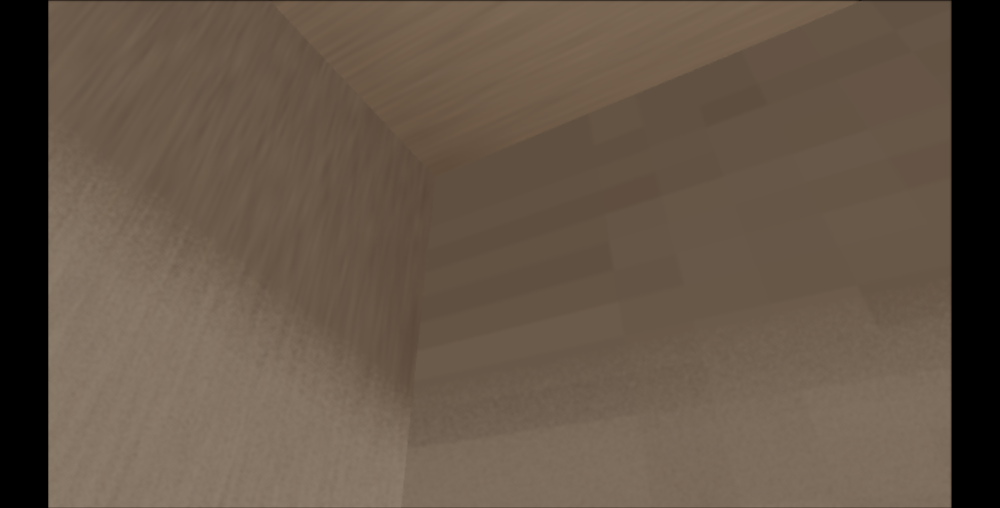
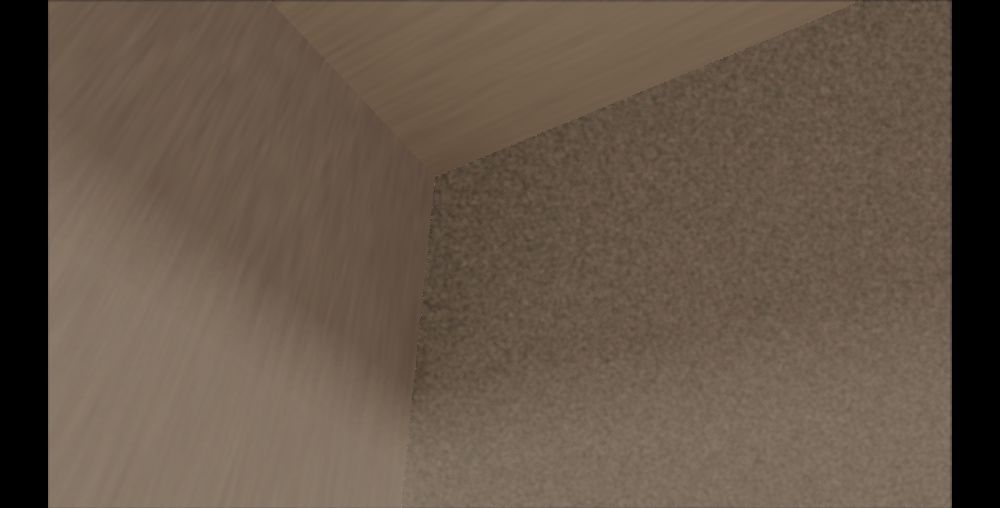
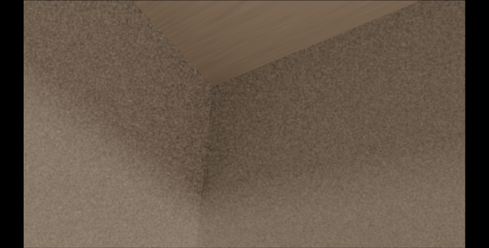
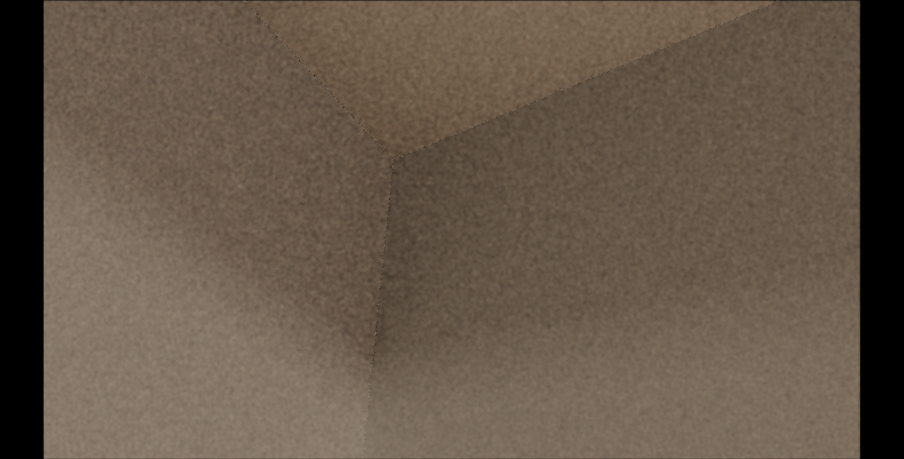
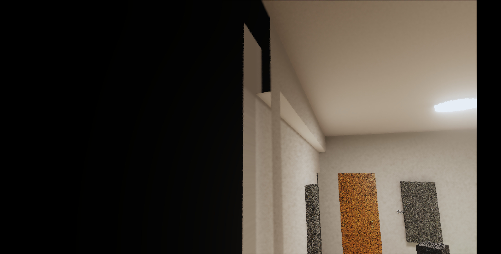
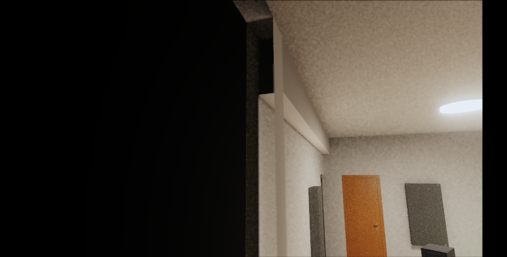

<section>
  <h2>目的</h2>
  
這份頁面是後續 debug 地圖。它只整理目前共識、使用者回報、兩組 cameraState、重現截圖、正常目標、待查路線。此頁不代表已經開始修 renderer。

  

    
核心共識：修完後黑邊、縫隙、拉長馬賽克都要消失；柱面在應該可見時要正常顯示；牆邊只允許自然陰影與材質紋理，不能留下補洞痕跡。

  

</section>

<section>
  <h2>共識原文</h2>
  <pre><code>1.  西牆邊邊的正常樣子

    西牆靠西南柱的交界可以有接觸陰影、角落暗度、材質自然變化。
    但不能出現一格一格被水平或垂直拉長的馬賽克。
    也不能像把牆面末端某幾個 texel 複製成一大片條紋。

2.  西南柱的正常樣子

    從南方室外往北看，如果視線能看到西南柱的南面或北面，
    這兩個柱面就應該正常顯示柱子的材質與光影。
    智慧透視可以讓阻擋視線的大牆透明，但不能把應該可見的柱面一起藏掉。

3.  烘焙取樣的正常規則

    牆面邊界附近如果沒有有效 atlas texel，應該轉交給正確的相鄰面、
    dedicated hybrid 面，或回到 live 光追。
    不能用「最後一格有效像素」硬拉過整段邊界。
    你看到的拉長馬賽克，很像這類 clamp / guard-fill / ownership 補洞造成的副作用。

4.  東牆對稱位置的正常樣子

    東牆對稱位置要套同一個標準。
    牆邊可以有自然暗角，但不能有被拉長的方塊紋。
    若東牆與東南柱交界也有同樣紋路，就代表這不是單一西牆貼圖瑕疵，
    而是牆邊 ownership 或 atlas 邊界處理的共同問題。

5.  我接下來會查的根因方向

    第一優先查西牆 / 東牆邊界的 runtime route：
    這些像素到底命中 full wall、beam-shadow overlay、column face、structural slot，
    還是掉到某個 guard texel。

    第二優先查智慧透視：
    南方室外視角下，西南柱南面與北面為什麼被隱藏。
    這可能讓原本被柱面遮住的錯誤牆邊取樣暴露出來。

    第三優先查之前修縫隙的補 texel 邏輯：
    如果當時把西牆南端或東牆對稱端用鄰近 texel 延伸，
    那就符合你說的「黑邊沒了，但馬賽克被拉長」。</code></pre>
</section>

<section>
  <h2>使用者回報</h2>
  
目前西牆與西南柱交界已經沒有黑邊與縫隙，但西牆邊緣出現馬賽克被拉長的視覺。南方室外往北看的視角中，西南柱南面與北面被智慧透視隱藏，因而暴露出西南柱左側那面附近的同類拉長馬賽克。

  
使用者推測：之前為了修縫隙，可能把西牆南端的有效 texel 直接拉長補洞，造成像素被延展。東牆對稱位置也有類似問題。

  
CODEX 目前判讀：這個問題需要同時查牆邊 atlas 取樣、相鄰面 ownership、guard-fill / clamp 補洞策略，以及智慧透視對西南柱南面與北面的隱藏判斷。

</section>

<section>
  <h2>正常目標定義</h2>
  <h3>西牆邊緣</h3>
  
西牆靠西南柱的交界可以有接觸陰影、角落暗度、材質自然變化。它不能出現一格一格被水平或垂直拉長的馬賽克，也不能像把牆面末端某幾個 texel 複製成一大片條紋。

  <h3>西南柱</h3>
  
從南方室外往北看，如果視線能看到西南柱的南面或北面，這兩個柱面就應該正常顯示柱子的材質與光影。智慧透視可以讓阻擋視線的大牆透明，但不能把應該可見的柱面一起藏掉。

  <h3>烘焙取樣</h3>
  
牆面邊界附近如果沒有有效 atlas texel，應該轉交給正確的相鄰面、dedicated hybrid 面，或回到 live 光追。它不能用最後一格有效像素硬拉過整段邊界。

  <h3>東牆對稱位置</h3>
  
東牆對稱位置要套同一個標準。牆邊可以有自然暗角，但不能有被拉長的方塊紋。若東牆與東南柱交界也有同樣紋路，代表這是牆邊 ownership 或 atlas 邊界處理的共同問題。

</section>

<section>
  <h2>證據 A：西牆與西南柱交界近距離</h2>
  
使用者提供 cameraState，CODEX 以本機 diagnostic helper 重現。重現 package：<code>.omc/r7-3-10-west-wall-mosaic-diagnostic/20260521-030029/</code>。

  <pre><code>cameraState={&quot;position&quot;:{&quot;x&quot;:-1.877334,&quot;y&quot;:2.484875,&quot;z&quot;:2.819378},&quot;yaw&quot;:2.0756,&quot;pitch&quot;:0.611,&quot;fov&quot;:55,&quot;forward&quot;:{&quot;x&quot;:-0.716911,&quot;y&quot;:0.573687,&quot;z&quot;:0.396134}}
forward={&quot;x&quot;:-0.716911,&quot;y&quot;:0.573687,&quot;z&quot;:0.396134}
view={&quot;facing&quot;:&quot;西(-X)&quot;,&quot;config&quot;:1,&quot;samples&quot;:1,&quot;paused&quot;:true,&quot;sppCap&quot;:1000}
viewport={&quot;innerWidth&quot;:1458,&quot;innerHeight&quot;:741,&quot;canvasCssWidth&quot;:1318,&quot;canvasCssHeight&quot;:741,&quot;drawingBufferWidth&quot;:1280,&quot;drawingBufferHeight&quot;:720,&quot;devicePixelRatio&quot;:3.5,&quot;aspect&quot;:1.777778}</code></pre>
  <h3>All ON</h3>
  
目標現象：西牆邊緣與西南柱交界附近有拉長馬賽克感。

  
  <h3>關閉 west wall full</h3>
  
用來判斷問題是否來自主西牆 full bake。

  
  <h3>West special only</h3>
  
用來判斷 dedicated west / southwest column hybrid targets 是否仍能重現拉長馬賽克。

  
  <h3>All OFF live</h3>
  
用來分辨 live 幾何 / 材質本身與烘焙取樣補洞痕跡。

  
</section>

<section>
  <h2>證據 B：南方室外往北看入房間</h2>
  
使用者提供第二組 cameraState，CODEX 以本機 diagnostic helper 重現。重現 package：<code>.omc/r7-3-10-west-wall-mosaic-diagnostic/20260521-030204/</code>。

  <pre><code>cameraState={&quot;position&quot;:{&quot;x&quot;:-1.419464,&quot;y&quot;:2.018216,&quot;z&quot;:4.273416},&quot;yaw&quot;:0.3536,&quot;pitch&quot;:0.187,&quot;fov&quot;:55,&quot;forward&quot;:{&quot;x&quot;:-0.34024,&quot;y&quot;:0.185912,&quot;z&quot;:-0.921777}}
forward={&quot;x&quot;:-0.34024,&quot;y&quot;:0.185912,&quot;z&quot;:-0.921777}
view={&quot;facing&quot;:&quot;北(-Z)&quot;,&quot;config&quot;:1,&quot;samples&quot;:1,&quot;paused&quot;:true,&quot;sppCap&quot;:1000}
viewport={&quot;innerWidth&quot;:1458,&quot;innerHeight&quot;:741,&quot;canvasCssWidth&quot;:1318,&quot;canvasCssHeight&quot;:741,&quot;drawingBufferWidth&quot;:1280,&quot;drawingBufferHeight&quot;:720,&quot;devicePixelRatio&quot;:3.5,&quot;aspect&quot;:1.777778}</code></pre>
  <h3>All ON</h3>
  
目標現象：西南柱南面與北面被智慧透視隱藏，並露出後方牆邊拉長馬賽克區。

  
  <h3>All OFF live</h3>
  
用來判斷柱面消失是否與烘焙 runtime 開關直接相關。

  
  <h3>Only structural</h3>
  
用來隔離西南柱與樑柱相關 target 是否會單獨暴露可疑區域。

  
</section>

<section>
  <h2>待查假說</h2>
  <h3>H1：牆邊 guard-fill / clamp 補洞拉長 texel</h3>
  
現象符合「為了消黑邊或縫隙，把邊界附近的有效 texel 延伸到無效區」的副作用。要查西牆南端與東牆對稱端的 atlas fill 函式、invalid texel region、runtime UV clamp。

  <h3>H2：牆面 ownership 沒有正確轉交相鄰柱面</h3>
  
牆邊像素可能仍由 full wall 或 beam-shadow overlay 接管，卻應該轉交西南柱 / 東南柱 dedicated hybrid target。要用 probe 確認可疑像素命中的 targetId、surfaceName、route。

  <h3>H3：智慧透視隱藏柱面範圍過大</h3>
  
南方室外視角下，西南柱南面與北面被隱藏。要查 transparency / cutaway 判斷是否只看 face normal、wall-side、camera-facing，導致柱面被誤判為應隱藏。

  <h3>H4：東西牆對稱邊界共用同類規則</h3>
  
東牆對稱位置也有拉長馬賽克，代表修正需要抽出共通邊界規則，避免只補西牆後讓東牆保留同一類 bug。

</section>

<section>
  <h2>後續 debug 路線</h2>
  <ol>
    <li>用兩組 cameraState 重跑 probe，記錄可疑像素的 targetId、surfaceName、routeKind、UV、texel 座標。</li>
    <li>對比 all-on、no-west-wall-full、west-special-only、all-off-live，先找出拉長馬賽克來自哪個 runtime slot。</li>
    <li>檢查西牆南端、東牆對稱端、柱面交界的 atlas guard-fill 與 invalid texel 補值。</li>
    <li>檢查智慧透視 cutaway 對西南柱南面與北面的 visibility 判斷。</li>
    <li>修正前先補一個同 cameraState 的回歸測試，成功標準同本頁「正常目標定義」。</li>
  </ol>
</section>

<section>
  <h2>目前不可走歪的邊界</h2>
  
這次不能只把黑邊或縫隙壓掉。畫面要回到自然牆面與柱面交界：材質紋理連續、陰影自然、沒有條紋化補洞痕跡。若智慧透視造成柱面消失，需把透明規則修準，不應讓錯誤牆面取樣變成可見替代面。

</section>
