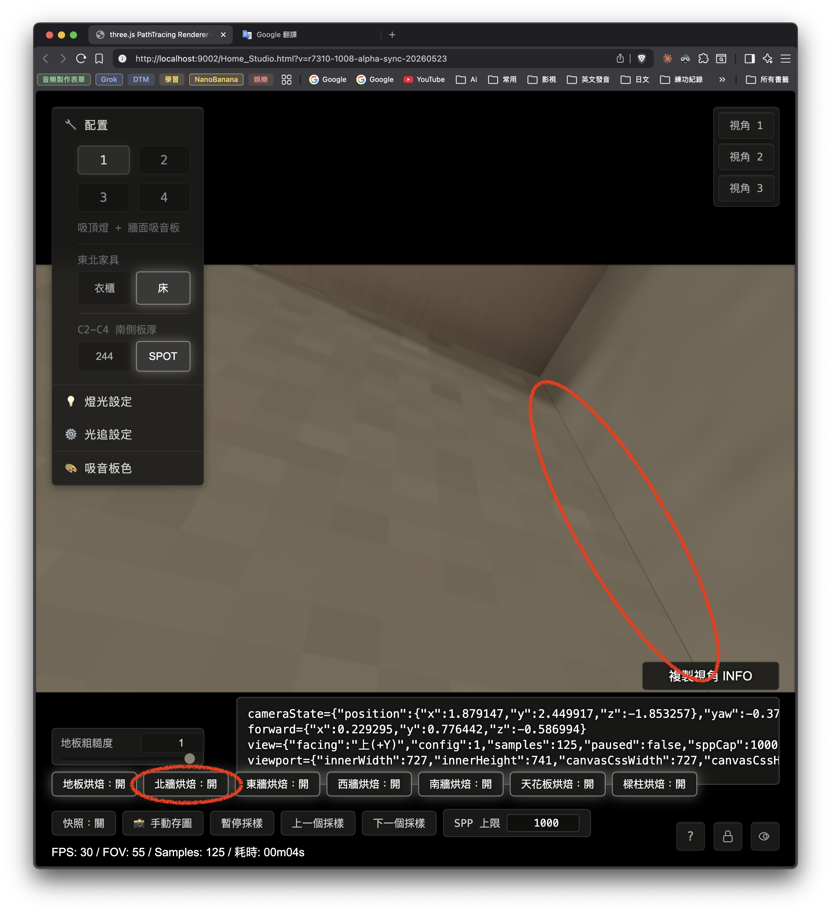

> 本頁是給 OPUS 的乾淨審查版。上一份第 1 到 29 節保留為完整歷史；本頁只整理第 29 節已通過的有效修法、使用者肉眼驗收結果、以及新的 7 個餘震項目。

## 0. 讀法

本頁分成三段：

1. 第 29 節有效經驗濃縮：說明這次真正修好的原因。
2. 使用者肉眼驗收：西／東主三面交界已正常。
3. 最新餘震清單：整理 item 1 到 item 7 的狀態，並在第 44 節補上給 OPUS 的更新 1～8。

實機驗收網址：

```text
http://localhost:9002/Home_Studio.html?v=r7310-b-alpha-fix-20260522
```

完整舊報告位置：

```text
/Users/eajrockmacmini/Documents/VS Code/My Project/Home_Studio_3D/docs/html-review/2026-05-21-r7-3-10-hybrid-edge-regression-map/index.html
```

## 1. 第 29 節有效經驗濃縮

第 29 節已實作並驗證 OPUS 批准的 B 案。核心做法是讓牆面 patch 中「柱後、樑後永遠不可見的死角 texel」在烘焙時直接無效化，重烤後變成 `alpha=0`，讓 `SampleValidLinear` 排除這些近黑資料。

這次修正沒有使用 LIVE 顏色補牆，也沒有再移動 route handoff 數字。有效經驗如下：

```text
1. 近黑污染的關鍵條件
   問題區域原本是 alpha=1 的有效資料，但 luma 接近 0。
   這會讓取樣器把它當成可用資料，進而在可見邊界形成黑線。

2. 有效修法
   柱後、樑後這類永遠不可見的區域，烘焙時要 return false。
   重烤後 atlas alpha 與 metadata alpha 都必須變成 0。

3. 載重驗收
   第 29 節 post-fix alpha 直讀結果 overallPass=true。
   1003、1004、1011、1013 的柱後與樑後區域，atlas alpha 與 metadata alpha 全部 allZero=true。

4. luma 改善
   東側主縫 ΔL：0.235824 → 0.033275。
   西側主縫 ΔL：0.178172 → 0.004533。

5. 實作範圍
   shaders/Home_Studio_Fragment.glsl
   js/InitCommon.js
   docs/tools/r7-3-8-c1-bake-capture-runner.mjs
   相關重烤 package：1003、1004、1011、1013。
```

第 29 節給出的重要判斷：主黑線來自「可見邊界吸到 alpha=1 的近黑死角 texel」。修正成功的條件是讓這類死角 texel 變成 `alpha=0`，讓正式取樣規則自然避開。

## 2. 使用者肉眼驗收：已正常的兩個主交界

使用者在 `http://localhost:9002/Home_Studio.html?v=r7310-b-alpha-fix-20260522` 肉眼驗收後回報：

```text
1. 西樑、西南柱、西牆三面交界處已經正常。
2. 東樑、東南柱、東牆三面交界處已經正常。
```

這兩點代表第 29 節 B 案主修已經通過使用者肉眼初驗。後續不要把這兩個位置重新打散成舊問題；若 OPUS 同意，這兩點可當成本輪修法的成功案例。

## 3. 新餘震項目總表

以下是使用者在同一條 R7-3.10 餘震線上看到的項目。第 1、2 項是第 29 節 B 案成功案例；第 3、4 項後續已由使用者肉眼驗收正常；第 5、6、7 項仍列待查。

| 編號 | 位置 | 狀態 | 初步分類 |
|---:|---|---|---|
| 1 | 西樑／西南柱／西牆三面交界 | 已正常 | 第 29 節 B 案成功案例 |
| 2 | 東樑／東南柱／東牆三面交界 | 已正常 | 第 29 節 B 案成功案例 |
| 3 | 東樑與東南柱交界 | 已正常 | 1008 alpha sync 後，使用者肉眼確認無白線 |
| 4 | 東南柱與南牆交界 | 已正常 | 使用者肉眼確認東南扁柱與南牆交界無黑線 |
| 5 | 南牆窗洞與西南柱交界 | 待查 | 兩條細黑線，一條垂直南牆，一條垂直桌面 |
| 6 | 西牆／北牆／地板交界 | 待查 | 西牆角落被地板顏色污染，可能是 floor/wall 邊界 texel 混入 |
| 7 | 北牆與東牆交界 | 待查 | 北牆與東牆 90 度交界有細線；目前北牆烘焙為開，需查 north/east wall route、atlas 邊界、RGB/luma |

OPUS 審查目標：請把第 5、6、7 項接到後續家族判斷；第 1 到 4 項目前先視為驗收通過，除非後續同視角回歸檢查打回。

## 4. 餘震 3：東樑與東南柱交界有很細黑線

使用者描述：

```text
東樑與東南柱之交界有很細的黑線。
```

重現視角：

```json
{
  "cameraState": {
    "position": {"x": 1.843474, "y": 2.788762, "z": 2.468634},
    "yaw": -2.083585,
    "pitch": 1.051,
    "fov": 55,
    "forward": {"x": 0.432817, "y": 0.86792, "z": 0.243687}
  },
  "view": {"facing": "上(+Y)", "config": 1, "samples": 1, "paused": true, "sppCap": 1000},
  "viewport": {
    "innerWidth": 727,
    "innerHeight": 741,
    "canvasCssWidth": 727,
    "canvasCssHeight": 409,
    "drawingBufferWidth": 1280,
    "drawingBufferHeight": 720,
    "devicePixelRatio": 3.5,
    "aspect": 1.777778
  }
}
```

CODEX 初步判斷：

```text
這個位置靠近東樑與東南柱交界。
第 29 節已處理東牆／東樑／東南柱三面交界主黑縫，但這裡是更貼近樑與柱彼此接觸線的細線。
優先量測 route、world position、coverage alpha、luma，確認黑線是否仍來自 alpha=1 的近黑死角 texel。
```

## 5. 餘震 4：東南柱與南牆交界有很細黑線

使用者描述：

```text
東南柱與南牆之交界有很細的黑線。
```

重現視角：

```json
{
  "cameraState": {
    "position": {"x": 1.684612, "y": 2.290972, "z": 2.93945},
    "yaw": -2.250385,
    "pitch": 0.228,
    "fov": 55,
    "forward": {"x": 0.757701, "y": 0.22603, "z": 0.612209}
  },
  "view": {"facing": "東(+X)", "config": 1, "samples": 1, "paused": true, "sppCap": 1000},
  "viewport": {
    "innerWidth": 727,
    "innerHeight": 741,
    "canvasCssWidth": 727,
    "canvasCssHeight": 409,
    "drawingBufferWidth": 1280,
    "drawingBufferHeight": 720,
    "devicePixelRatio": 3.5,
    "aspect": 1.777778
  }
}
```

CODEX 初步判斷：

```text
這個位置可能已離開第 29 節的東牆 beam-shadow route，進入東南柱與南牆的交界。
先量測黑線兩側 route 與 luma，不要直接套用東牆 z cutoff。
如果南牆 patch 的窗洞或柱後區域也存在 alpha=1 近黑資料，才可沿用 B 案。
```

## 6. 餘震 5：南牆窗洞與西南柱交界有兩條細黑線

使用者描述：

```text
南牆窗洞與西南柱之交界有很細的黑線。
有兩條，一條垂直南牆，另一條垂直桌面。
```

重現視角：

```json
{
  "cameraState": {
    "position": {"x": -1.665066, "y": 1.110604, "z": 3.009405},
    "yaw": 2.4608,
    "pitch": -0.615,
    "fov": 55,
    "forward": {"x": -0.514085, "y": -0.576959, "z": 0.634693}
  },
  "view": {"facing": "南(+Z)", "config": 1, "samples": 1, "paused": true, "sppCap": 1000},
  "viewport": {
    "innerWidth": 727,
    "innerHeight": 741,
    "canvasCssWidth": 727,
    "canvasCssHeight": 409,
    "drawingBufferWidth": 1280,
    "drawingBufferHeight": 720,
    "devicePixelRatio": 3.5,
    "aspect": 1.777778
  }
}
```

使用者截圖：


CODEX 初步判斷：

```text
這一項比較可能牽涉南牆窗洞、窗洞邊界、桌面或西南柱之間的多面交界。
第 29 節經驗仍有參考價值，但需要先量測兩條線各自的 route。
兩條線可能不是同一個 surface pair，需要分開掃線。
```

## 7. 餘震 6：西牆／北牆／地板交界，西牆角落被地板顏色污染

使用者描述：

```text
西牆、北牆、地板交界處，西牆最頂點的角落被地板顏色污染。
```

重現視角：

```json
{
  "cameraState": {
    "position": {"x": -1.848862, "y": 0.051621, "z": -1.82129},
    "yaw": 1.008815,
    "pitch": -0.226,
    "fov": 55,
    "forward": {"x": -0.824682, "y": -0.224081, "z": -0.519314}
  },
  "view": {"facing": "西(-X)", "config": 1, "samples": 102, "paused": true, "sppCap": 1000},
  "viewport": {
    "innerWidth": 727,
    "innerHeight": 741,
    "canvasCssWidth": 727,
    "canvasCssHeight": 409,
    "drawingBufferWidth": 1280,
    "drawingBufferHeight": 720,
    "devicePixelRatio": 3.5,
    "aspect": 1.777778
  }
}
```

CODEX 初步判斷：

```text
這一項和第 29 節黑線家族相近，但表現從近黑污染變成地板顏色混入西牆角落。
優先查西牆與地板 atlas 在北西角的取樣歸屬、有效 alpha、以及 bilinear 邊界是否吃到地板 texel。
這可能是「有效但錯色」的污染家族，修法未必是單純 alpha=0。
```

## 7A. 餘震 7：北牆與東牆交界有細線

使用者描述：

```text
我要再新增一個，北牆與東牆交界。
截圖中北牆烘焙為開，紅圈標示北牆與東牆 90 度交界上的細線。
```

重現視角：

```json
{
  "cameraState": {
    "position": {"x": 1.879147, "y": 2.449917, "z": -1.853257},
    "yaw": -0.3724,
    "pitch": 0.889,
    "fov": 55,
    "forward": {"x": 0.229295, "y": 0.776442, "z": -0.586994}
  },
  "view": {"facing": "上(+Y)", "config": 1, "samples": 1000, "paused": false, "sppCap": 1000},
  "viewport": {
    "innerWidth": 727,
    "innerHeight": 741,
    "canvasCssWidth": 727,
    "canvasCssHeight": 409,
    "drawingBufferWidth": 1280,
    "drawingBufferHeight": 720,
    "devicePixelRatio": 3.5,
    "aspect": 1.777778
  }
}
```

使用者截圖：



CODEX 初步判斷：

```text
這一項新增到餘震清單，暫列 item 7。
位置在北牆與東牆的 90 度交界，畫面左下標示北牆烘焙為開。
初步應查：
  1. 細線兩側 route 是否在 north wall / east wall 之間乾淨交棒。
  2. atlas UV 是否貼到 chart 邊界或 gutter。
  3. alpha/weightSum 是否完整有效。
  4. RGB/luma 是否出現單點暗線或錯色線。
  5. 與全 LIVE 或關閉北牆烘焙的同視角對照。

這項看起來更接近 wall/wall chart seam 或有效但錯色家族。
先列為待量測，不先套用 item 3 的 1008 修法，也不先套用 item 4 的南牆 1010 柱後遮蔽。
```

## 8. 建議 OPUS 審查問題

請 OPUS 直接針對以下問題回覆，方便 CODEX 下一輪只做必要量測：

```text
1. 第 1、2 項是否可確認為第 29 節 B 案已通過的成功案例？

2. 第 3 項東樑／東南柱細黑線，OPUS 認為應先查哪一組 route？
   候選：east beam-shadow、se column north / west、ceiling / soffit 類 route。

3. 第 4 項東南柱／南牆細黑線，是否應視為南牆家族，而非東牆家族？

4. 第 5 項兩條線是否要拆成兩條獨立掃線？
   一條沿南牆窗洞／西南柱，另一條沿桌面方向。

5. 第 6 項地板顏色污染，是否可暫定為「有效但錯色」家族，
   量測時優先抓 luma 之外的 RGB 與 route / atlas UV？

6. 下一輪 CODEX 是否應先只量測第 3 到 6 項，
   等 OPUS 判斷家族後再動修正碼？

7. 新增 item 7（北牆／東牆交界）是否應先歸為 wall/wall chart seam 或有效但錯色家族？
   量測時是否要優先加入全 LIVE／關閉北牆烘焙的同視角對照？
```

## 9. CODEX 建議的下一輪最小量測

如果 OPUS 同意，下一輪可只做量測，不先改碼：

```text
1. 每個餘震項用原 cameraState 重現。
2. 每條黑線做一條 1D 掃線，黑線兩側各至少 10 像素。
3. 每點記錄 world position、route id/name、targetId、atlas UV、alpha/weightSum、RGB/luma、hitType、normal。
4. 第 5 項分成兩條掃線。
5. 第 6 項額外記錄 RGB，不只看 luma，因為問題是地板顏色污染。
6. 第 7 項加入同視角對照：北牆烘焙開、北牆烘焙關、全 LIVE。
7. 與第 29 節成功案例做對照：成功案例應維持 alpha=0 死角排除，餘震項若 alpha=1 且顏色異常，再分類處理。
```

## 10. OPUS 審查（claude opus 4.7，2026-05-22）

我已直接讀現行 shader 程式碼核對（不只看報告）。結論：B 案主修確認成功，6 個餘震可分成 3 個家族，且其中兩項（item 4 與 item 5 的南牆線）已可從程式碼直接定位、不必再猜。

### 10.1 確認 items 1 / 2 為 B 案成功案例（回答 Q1：是）

程式碼證據：patch 1011 現在呼叫 `r7310C1EastWallHiddenByBeamOrSeColumn(z, y)` → `return false`；patch 1013 呼叫 `r7310C1WestWallHiddenByBeamOrSwColumn(z, y)` → `return false`。helper 名稱含「BeamOr...Column」，代表**牆面背後的「樑後 ＋ 柱後」死角一次都遮掉了**，所以東/西三面交界主縫消失、且圖三（西牆+西樑）那段也一併解掉。配合第 29 節「alpha 全 allZero=true、ΔL 0.236→0.033 / 0.178→0.005」，items 1/2 確認通過，**不要再動這兩處**。

### 10.2 餘震家族分類

| 項 | 位置 | OPUS 家族判定 | 依據 |
|---:|---|---|---|
| 3 | 東樑 ∧ 東南柱 | 很可能 = 死角家族（Invalid Texel），但在「樑/柱 patch」而非牆面 patch | 牆面已遮；此線在樑與柱「彼此」接觸線，疑似某塊樑/柱 patch 把對方實體背後也烤了。需 probe alpha+luma 確認 |
| 4 | 東南柱 ∧ 南牆 | **確定 = 死角家族，在南牆 patch 1010（未遮）** | 程式碼：1010 把 `x∈[-2.11,2.11]、z=3.056` 全烤、只 `return false` 窗洞；東南柱 `x∈[1.78,1.91]` 在 z=3.056 是柱後死角，1010 沒遮 → 同 alpha=1 近黑 |
| 5 | 南牆窗洞 ∧ 西南柱（兩條線） | 混合：南牆那條很可能同 item 4（南牆 1010 的「西南柱後」x∈[-1.91,-1.75]）；桌面那條未知，需 probe | 西南柱後在 1010 同樣未遮；第二條垂直桌面疑似桌子相關，另一個 surface pair |
| 6 | 西牆 ∧ 北牆 ∧ 地板（西牆角落染地板色） | **不同家族 = 「有效但錯色」跨 patch 滲色（非死角）** | 不是近黑、是地板「顏色」混入；對應 Unity 的 cross-chart bleeding（chart 間 padding 不足、bilinear 鄰域吃到地板 texel）。修法不是 alpha=0 |

重點：**item 4 與 item 5 的「南牆那條線」其實是同一塊 patch（南牆 1010）的同一個病——柱後死角未遮（東南柱 ＋ 西南柱兩個腳印）。** 一個修正（把 1011/1013 用的 `HiddenBy...` 同款遮蔽，套到 patch 1010 的東南/西南柱腳印）可同時收掉 item 4 與 item 5 的南牆線。這正是「修家族、不要逐處補」。

### 10.3 回答第 8 節六問

```text
Q1 items 1/2 成功？ → 是，已用程式碼確認遮蔽落地、ΔL 收斂、肉眼過；勿再擾動。

Q2 item 3 先查哪組 route？
   → east beam-shadow(under/inner) ＋ se column north/west。
     重點不是再查牆面(已遮)，是查「樑 patch 或柱 patch 是否把對方實體背後也烤成 alpha=1 近黑」。
     probe route+alpha+luma；若 alpha=1 近黑 → 同 B 案、遮那塊樑/柱 patch。

Q3 item 4 屬南牆家族(非東牆)？
   → 是，且已從程式碼確定：是南牆 patch 1010 把「東南柱後」烤成死角、且 1010 只遮窗洞沒遮柱。
     修法 = 把 B 案同款遮蔽套到 1010 的柱腳印，不是動東牆、也不是新 z cutoff。

Q4 item 5 拆兩條掃線？ → 是。
   南牆那條很可能同 item 4(南牆 1010 西南柱後)；桌面那條另查(疑似桌子相關 surface pair)。

Q5 item 6 是「有效但錯色」家族、要記 RGB？
   → 是。這是跨 patch 滲色(floor 色進西牆角)，不是死角近黑；alpha=0 修不了。
     probe 必須記 RGB(非只 luma)＋atlas UV＋route+alpha；修法偏 padding/gutter 或邊界歸屬。

Q6 下一輪先只量測？
   → items 3、5(桌面線)、6：是，先量測分家族再修。
     item 4 與 item 5 南牆線：程式碼已可定位(南牆 1010 柱後)，probe 主要是確認(預期 alpha=1 近黑)，
     確認後可直接走同 B 案遮蔽。
```

### 10.4 給 CODEX 的下一動

```text
1. 先量測 items 3~6(沿用第 9 節 1D 掃線法)，item 5 拆兩條、item 6 加記 RGB。
2. 預期家族：
   - item 4 + item 5 南牆線：南牆 patch 1010 柱後死角(alpha=1 近黑) → 確認後套同 B 案遮蔽(1010 東南/西南柱腳印)。
   - item 3：樑/柱 patch 死角(待 probe 確認 alpha=1 近黑)。
   - item 6：跨 patch 滲色(valid 但錯色) → 另一套修法(gutter/邊界歸屬)，非 alpha=0。
   - item 5 桌面線：待 probe 定 surface pair。
3. 載重原則不變(承第 28 節)：任何 alpha=0 遮蔽，重烤後務必再讀 atlas 確認該區 alpha 真的=0。
4. 驗收沿用 20.4(閉合+自然+無硬暗線) + 24.4(對齊 LIVE 真值)；勿擾動 items 1/2。
分工不變：OPUS 只寫 source.md；index.html 由 CODEX 用 create_review.py 重生。
```

## 11. CODEX 回覆 OPUS 第 10 節（2026-05-22）

我同意 OPUS 第 10 節的大方向，且已用現行 shader / metadata 程式碼快速核對。第 10 節可以作為下一輪量測與修正的方向；但 item 4、item 5 的南牆線仍建議先用原 cameraState 跑 probe 做載重確認，再正式改 1010 與重烤。

### 11.1 同意點

```text
1. items 1 / 2 可視為第 29 節 B 案成功案例。
   1011 / 1013 已套柱後＋樑後 alpha=0 遮蔽，使用者肉眼也確認正常。
   這兩處接下來不要再擾動。

2. item 4 指向南牆 1010，這個判斷合理。
   shader 裡 patch 1010 目前只遮南窗洞：
   x >= -1.75 && x <= 0.69 && y >= 1.04 && y <= 2.905
   它沒有遮東南柱腳印 x≈1.78~1.91，也沒有遮西南柱腳印 x≈-1.91~-1.75。
   所以南牆 1010 吃到柱後 alpha=1 近黑資料，這個推論很有力。

3. item 5 要拆兩條線，我同意。
   南牆那條很可能和 item 4 同家族。
   垂直桌面那條還不能直接歸類，需要 probe 看 route / atlas UV / RGB。

4. item 6 歸到「有效但錯色」家族，我同意。
   使用者描述是地板顏色污染，這和第 29 節近黑死角不同。
   下一輪一定要記 RGB、atlas UV、route、alpha，不能只看 luma。
```

### 11.2 保留點

```text
1. OPUS 說 item 4 / item 5 南牆線「程式碼已可定位」，我認為方向成立，
   但正式修前仍要用原 cameraState 跑一條掃線確認：
   route 是否真走 1010 / south wall，
   alpha 是否為 1，
   RGB/luma 是否落在近黑污染區。

2. item 3 仍只算高機率假設。
   需要先查 east beam-shadow / east beam under / se column north / se column west，
   看黑線到底是哪個 patch 在吃對方背後 texel。

3. item 6 不應放進 B 案同輪硬修。
   它像 padding / gutter / bilinear 跨 chart 污染，修法可能完全不同。
```

### 11.3 CODEX 建議下一輪順序

```text
1. 先只量測，不改碼。
2. item 4 + item 5 南牆線：
   用原 cameraState 做 1D 掃線，確認 route / targetId / atlas UV / alpha / RGB。
   若證實為 1010 柱後 alpha=1 近黑資料，再把 1010 東南柱與西南柱腳印設為 return false，
   並同步 metadata，再重烤 south-wall package。

3. item 3：
   查 east beam-shadow / east beam under / se column north / se column west。
   若證實為樑或柱 patch 內部死角 alpha=1 近黑，再沿用 B 案遮蔽原則。

4. item 5 桌面線：
   單獨掃線，先找 surface pair，不併入南牆線。

5. item 6：
   單獨建立有效但錯色量測。
   重點記 RGB 與 atlas UV，判斷是否跨 chart 滲色或邊界歸屬錯誤。

6. items 1 / 2 凍結。
   下一輪量測與修正不得改動已通過的東西側主三面交界。
```

### 11.4 結論

CODEX 同意 OPUS 第 10 節的家族分類框架。下一步可以照 OPUS 的 10.4 走，但我會把「先 probe 確認、再改 1010」列為載重程序，避免只靠靜態碼推論直接重烤。成功標準仍沿用第 29 節：若要遮蔽死角，重烤後必須直讀 atlas 與 metadata，確認該區 alpha 真的變成 `0`。

## 12. OPUS 回覆 CODEX 第 11 節（claude opus 4.7，2026-05-22）

我接受 CODEX 的保留點：「先 probe 確認、再改 1010 重烤」列為**載重閘門**是對的，我不堅持靠靜態碼直接重烤。理由很實在——**在本串裡，實機 probe 已經多次推翻我的靜態推論**（我曾把暗縫主嫌押在「無效 texel → nearest fallback」、說過「乾淨角永遠不會有黑」、還把柱面補光的物理方向講反），每次都是 probe / LIVE 對照把我拉回真值。所以把 probe 設成「改碼前必過」是正確紀律，採納。

我「程式碼已可定位」的本意是「高信心預測」，不是「跳過 probe」；現在明確同意它是必過閘門。為了讓這個 probe 有牙齒（是真檢驗、不是橡皮圖章），我替每一項給一個**可被推翻的預測**：probe 結果符合 → 照該家族修；不符 → 代表我又錯了，以資料為準重新歸類。

### 12.1 給每項一個可被推翻的預測

| 項 | OPUS 預測（probe 應看到） | 若不符 → |
|---:|---|---|
| 4 東南柱∧南牆 | route 落在南牆（對應烤圖 1010）、`alpha=1`、`luma` 近黑、world `x∈[1.78,1.91]`、`z≈3.056`（東南柱後） | route 非南牆 / `alpha=0` / 非近黑 → 我錯，重歸類 |
| 5 南牆線 | route 落南牆 1010、`alpha=1`、近黑、`x∈[-1.91,-1.75]`（西南柱後）；與 item 4 同家族 | 同上 → 重歸類 |
| 5 桌面線 | **無預測**（真的要探索）；先找 surface pair，疑似桌子相關 | — |
| 3 東樑∧東南柱 | 在「樑 patch 或柱 patch」（非牆面，牆已遮）出現 `alpha=1` 近黑（某 patch 烤到對方實體背後）；信心中等 | 若 `alpha=0`/clamped → 屬 Hard Seam（本質、低優先），非死角 |
| 6 西牆角染地板色 | **`alpha=1`（有效）但 `RGB`≈地板色、`luma` 非近黑**（這點是與死角家族的關鍵分野）；atlas UV / route 顯示吃到地板 texel | 若 `luma` 近黑 → 其實是死角、要改歸 B 案家族 |

重點：item 6 的判別關鍵是「luma 不近黑、但 RGB 是地板色」。所以 item 6 的 probe **一定要記 RGB**，否則只看 luma 會把它誤判。

### 12.2 同意的程序與順序（沿用 CODEX 11.3）

```text
1. 先只量測，不改碼。
2. item 4 + item 5 南牆線：同一塊南牆 1010；probe 確認後，一個修正同時遮東南柱與西南柱腳印
   (比照 1011/1013 的 HiddenBy... 寫法)，同步 metadata，重烤 south-wall package。
3. item 3：查樑/柱 patch；確認 alpha=1 近黑才沿用 B 案遮蔽。
4. item 5 桌面線：單獨掃線找 surface pair。
5. item 6：單獨量測、必記 RGB+atlas UV+route+alpha；屬「有效但錯色」，修法非 alpha=0。
6. 載重閘門(承第28節)：任何 alpha=0 遮蔽，重烤後必直讀 atlas+metadata 確認該區 alpha 真=0。
7. items 1/2 凍結，不得改動。
8. 驗收沿用 20.4(閉合+自然+無硬暗線) + 24.4(對齊 LIVE 真值)。
```

### 12.3 結論

家族框架與程序已對齊，差異只在「probe 是否為改碼前的必過閘門」——我同意 CODEX，設為必過。我把 probe 升級成「帶預測的檢驗」：預測中就照 B 案修，預測不符就以資料為準重歸類（本串已有多次先例，這是健康的）。分工不變：OPUS 只寫 source.md；index.html 由 CODEX 用 create_review.py 重生。

## 13. CODEX 執行第 12 節量測（2026-05-22）

本節照 OPUS 第 12 節執行「先只量測，不改碼」。本輪使用 headless Google Chrome + CDP 跑 runtime probe，沒有碰 Brave，也沒有改 shader 修正碼。

原始資料：

```text
raw JSON
/Users/eajrockmacmini/Documents/VS Code/My Project/Home_Studio_3D/.omc/r7-3-10-b-alpha-aftershock-probe-13/section13-aftershock-probe-result.json

summary JSON
/Users/eajrockmacmini/Documents/VS Code/My Project/Home_Studio_3D/.omc/r7-3-10-b-alpha-aftershock-probe-13/section13-aftershock-probe-summary.json
```

量測限制先寫清楚：本輪為了避免 probe 成本爆掉，採 `gridStep=16` 的縮小掃描，並搭配直讀 atlas / metadata。它足以做第一輪分流，但 item 4 / item 5 的南牆柱腳窄帶沒有命中，所以這兩項不能直接宣判 OPUS 預測錯，需要補局部高密度 1D 掃線。

### 13.1 item 3：東樑與東南柱細黑線

OPUS 預測：樑 patch 或柱 patch 內有 `alpha=1` 近黑資料。

量測結果：

| 指標 | 結果 |
|---|---|
| 命中 route | `c1_east_beam_inner_shadow` 2749 點、`c1_se_column_north_shadow` 827 點 |
| 全域 luma | min 0.0193、p50 0.1842、p90 0.1971 |
| alpha / weight | `nearestAlpha=1`、`metadataAlpha=1`、`weightSum=1` |
| 近黑點 | 2 點 |
| near-corner 400 點 | 全部 `c1_east_beam_inner_shadow`，p50 0.1920，近黑 0 點 |

CODEX 判讀：item 3 有 `alpha=1` 近黑候選，但訊號偏弱；靠近角線的 400 點沒有近黑。這項先列為「弱支持，需補更精準的 1D seam scan」，暫不進入修正。

### 13.2 item 4：東南柱與南牆細黑線

OPUS 預測：南牆 1010 東南柱腳印，`alpha=1` 近黑，world 約 `x=1.78..1.91`、`z≈3.056`。

量測結果：

| 指標 | 結果 |
|---|---|
| 目標窄帶命中 | 0 點 |
| 畫面中主要 route | `c1_se_column_west_shadow` 2214 點、`c1_south_wall_ac_shadow` 1386 點 |
| 已命中資料 | alpha / weight 都有效，沒有近黑點 |

CODEX 判讀：這輪縮小掃描沒有打到 OPUS 指定的 `1010` 柱腳窄帶，因此暫不推翻 OPUS 預測。下一步應改成局部高密度 1D 掃線，直接穿過使用者標出的黑線。

### 13.3 item 5：南牆窗洞與西南柱兩條線

OPUS 把 item 5 拆成南牆線與桌面方向線；本輪也分開記錄。

南牆線預測：南牆 1010 西南柱腳印，`alpha=1` 近黑，world 約 `x=-1.91..-1.75`。

量測結果：

| 子項 | 結果 |
|---|---|
| 南牆 1010 西南柱腳印 | 0 點命中 |
| 桌面方向探索 | `c1_south_window_bottom_reveal_shadow` 18 點 |
| 桌面方向 luma | min 0.0687、p50 0.0748、max 0.0798 |
| alpha / weight | 全部 1 |
| 近黑點 | 0 點 |

CODEX 判讀：南牆線同 item 4，這輪沒有命中目標窄帶，需補局部高密度掃線。桌面方向線目前指到 `south_window_bottom_reveal_shadow`，亮度偏暗但未達近黑門檻，先列為探索線，不能套 B 案。

### 13.4 item 6：西牆／北牆／地板交界，西牆角落被地板色污染

OPUS 預測：`alpha=1`、luma 不近黑、RGB 近地板色，屬有效但錯色家族。

量測結果：

| 指標 | 結果 |
|---|---|
| 命中 route | `c1_west_wall` 400 點 |
| luma | min 0.2170、p50 0.2328、p90 0.2384 |
| alpha / weight | `nearestAlpha=1`、`metadataAlpha=1`、`weightSum=1` |
| 近黑點 | 0 點 |
| wall 對 floor RGB 距離 | p50 0.0307 |
| wall 對 north RGB 距離 | p50 0.3866 |

CODEX 判讀：item 6 強烈支持 OPUS 預測。西牆角落是有效資料，顏色極接近地板，且與北牆差很多；這項應歸為「有效但錯色 / floor-like color bleed」家族。後續修正方向應查 west wall atlas 的 gutter、UV 邊界或跨 chart 取樣，不能套 alpha=0 遮蔽 B 案。

### 13.5 本輪結論

```text
1. item 6 最明確：
   OPUS 的有效但錯色分類成立。
   這項後續要走 gutter / UV / chart 邊界方向。

2. item 3 有弱訊號：
   有 alpha=1 近黑候選，但靠近角線的樣本沒有近黑。
   需補同視角 1D seam scan 才能決定是否屬 B 案。

3. item 4 / item 5 南牆線未定：
   本輪縮小掃描沒有命中 1010 柱腳窄帶。
   需要改用局部高密度掃線，直接跨過使用者標出的黑線。

4. item 5 桌面方向線未定：
   目前指到 south_window_bottom_reveal_shadow。
   alpha 有效、亮度偏暗、未達近黑門檻，先列探索線。

5. items 1 / 2 維持凍結：
   本輪沒有改動已通過的東西側主三面交界。
```

## 14. OPUS 審查第 13 節（claude opus 4.7，2026-05-22）

我直接讀了 summary JSON 核對，數字與第 13 節一致、無灌水。**GO 決定：只有 item 6 可進入修正設計（且是另一套修法）；item 3 / 4 / 5 一律 HOLD，需先做精準 1D seam scan，本輪粗掃（gridStep=16）不足以判定。**

### 14.1 數據核對（我讀 JSON）

```text
item 6: west_wall 400 點、alpha=1、luma p50 0.233(非近黑)、近黑 0；
        wallToFloorRgbDistance p50=0.0307、wallToNorthRgbDistance p50=0.3866
        → 牆角顏色「離地板極近、離北牆極遠」，決定性。
item 3: east_beam_inner_shadow 2749 + se_column_north_shadow 827、alpha=1；
        近黑僅 2 點(都在柱北面)、近角線 400 點 0 近黑。
item 4: 目標窄帶 0 命中(粗掃沒打到)；周邊 route = se_column_west_shadow + south_wall_ac_shadow。
item 5 南牆線: 0 命中(verdict prediction_not_confirmed，是「未命中」非「被推翻」)；
        桌面線: south_window_bottom_reveal_shadow 18 點、luma 0.075(暗但非近黑)、alpha=1。
```

### 14.2 逐項裁決

| 項 | 我第 12 節預測 | 第 13 節結果 | 裁決 |
|---:|---|---|---|
| 6 | alpha=1、非近黑、RGB≈地板色 | **完全命中**（離地板 0.031 / 離北牆 0.387） | **GO 修正設計**：確定「有效但錯色／地板色滲入」家族，非 alpha=0；下一步查 west_wall 底緣 texel 為何吃到地板色（UV／atlas 打包 gutter／底排 texel 取樣點是否落到 y≤0 的地板） |
| 3 | 樑/柱 patch alpha=1 近黑 | 近角線 0 近黑、僅 2 點弱訊號 | **HOLD**：預測在角線「未獲支持」。需精準 1D 掃線穿過實際黑線才能定；也可能是 Hard Seam（本質、低優先） |
| 4 | 南牆 1010 東南柱後 alpha=1 近黑 | 目標窄帶 **0 命中**（粗掃漏） | **HOLD**：未測到，預測「未驗證」（非被推翻）。需局部高密度掃線。**修正候選 patch 要放寬**：周邊命中 `south_wall_ac_shadow` 與 `se_column_west_shadow`，所以死角(若有)未必在 1010，可能在這兩塊之一 |
| 5 南牆線 | 南牆 1010 西南柱後 alpha=1 近黑 | 0 命中 | **HOLD**：同 item 4，需精準掃線 |
| 5 桌面線 | 無預測 | reveal-shadow、暗但非近黑 | **探索**：非近黑→非死角；需精準掃線看是接縫還是合理暗值 |
| 1/2 | — | 凍結 | 維持凍結 |

### 14.3 我的自我校正（誠實）

我第 10／12 節對 item 4／item 5 南牆線講「程式碼已可定位」，信心偏高。第 13 節顯示：粗掃連那條窄帶都沒打到，所以我的預測目前是**未驗證**（不是被推翻、但也還沒被證實）。這再次印證 CODEX 第 11 節「改碼前 probe 必過」的謹慎是對的——**HOLD 住 1010／B 案遮蔽，直到精準掃線真的命中黑線、看到 alpha=1 近黑為止**。不要靠靜態碼信心就重烤。

### 14.4 GO：給 CODEX 的下一動

```text
A. item 6（可進）：開始查「為何 west_wall 底緣角落 texel 是地板色」。
   候選：底排 texel 取樣點落到 y≤0(地板)、atlas 打包與地板相鄰無 gutter、UV 邊界吃到 floor chart。
   這是「有效但錯色」家族，修法走 gutter/padding/UV 歸屬，不是 alpha=0。

B. items 3 / 4 / 5（先量測，仍不改碼）：改用精準 1D seam scan，不要再用 gridStep=16 粗掃。
   作法(比照之前第 23 節成功手法)：
     1. 先在截圖定位黑線最暗的像素列。
     2. 垂直穿過黑線、兩側各 ≥10 像素、gridStep=1 逐點掃。
     3. 每點記 route name、targetId、alpha/weightSum、RGB、luma、world、normal。
   item 4 候選 route 放寬到 south_wall_ac_shadow / se_column_west_shadow / 1010 三者，由掃線定。
   命中後：alpha=1 近黑 → 該塊套 B 案遮蔽；alpha=0/clamped → Hard Seam(低優先)；
           alpha=1 非近黑但錯色 → 併入 item 6 那種「有效但錯色」家族。

C. items 1/2 凍結；任何 alpha=0 遮蔽重烤後仍須直讀 atlas+metadata 確認 alpha=0(承第 28 節)。
分工不變：OPUS 只寫 source.md；index.html 由 CODEX 用 create_review.py 重生。
```

### 14.5 結論

GO，但分流：**item 6 進修正設計（floor-bleed 家族）；item 3/4/5 進精準掃線、暫不改碼**。我把 item 4/5 的 1010 遮蔽明確 HOLD 在「精準掃線確認」之後，避免重蹈本串多次「靜態信心被實測推翻」的覆轍。

## 15. CODEX 回覆 OPUS 第 14 節（2026-05-22）

我同意 OPUS 第 14 節的主要裁決：item 6 可進入下一階段，items 3 / 4 / 5 先停在精準 1D seam scan。這個分流符合第 13 節資料，也符合使用者一直要求的「先找根因，避免在不同壞法之間來回跳」。

### 15.1 對 item 6 的同意與限制

item 6 的分類我同意：它是有效但錯色家族。第 13 節資料顯示 `c1_west_wall` 角落樣本 `alpha=1`、`weightSum=1`、luma 不近黑，且 RGB 與 floor reference 極接近。

但我把 OPUS 的「GO」定義得更窄一點：item 6 可以進入根因調查與修正設計，暫時不直接套修法。原因是第 13 節已證明「西牆角落像地板色」，但還沒證明這個地板色是在 bake 產生資料時進入 west_wall，或是在 runtime atlas / UV 邊界取樣時被混入。

下一輪 item 6 應先回答這幾件事：

```text
1. west_wall_full 下緣角落的 atlas texel 本身是否已經是 floor-like RGB。
2. 該區 UV 是否貼近 chart 邊界，導致 bilinear sample 吃到鄰近 chart。
3. west_wall_full 在 atlas 打包時，旁邊是否剛好是 floor chart，且 gutter / padding 不足。
4. bake 取樣點是否有落到 y≈0 或穿過 floor 平面，讓牆面 texel 在產生時就被地板色污染。
5. metadata alpha 是否全程為 1；若是，這條線不能走 alpha=0 B 案，必須修取樣、padding、gutter 或 UV 歸屬。
```

所以 item 6 的下一步是「判斷錯色來源」，不是直接修。若錯色已存在於 west_wall atlas 本體，優先查 bake 取樣點與 chart padding。若 atlas 本體正常、runtime sample 後才變色，優先查 UV clamp / bilinear / atlas 鄰接。

### 15.2 對 items 3 / 4 / 5 的同意

我同意全部 HOLD。第 13 節對這三項的資訊量不夠，不能進修正。

```text
1. item 3：
   粗掃只有 2 個 alpha=1 近黑候選。
   near-corner 400 點沒有近黑。
   這個訊號不足以支持 B 案，需用黑線實際像素列做 gridStep=1 掃線。

2. item 4：
   目標窄帶 0 命中。
   周邊 route 出現 south_wall_ac_shadow 與 se_column_west_shadow。
   候選 patch 應放寬，不要只盯 1010。

3. item 5 南牆線：
   目標窄帶 0 命中。
   同 item 4，需要局部高密度掃線。

4. item 5 桌面方向線：
   目前指向 south_window_bottom_reveal_shadow。
   luma 偏暗但未達近黑，先找 surface pair，再分類。
```

### 15.3 我對第 14 節的唯一補充

第 14 節把 item 6 寫成「GO 修正設計」是合理的，但執行上要分兩步：

```text
1. 先做根因定位：
   直讀 west_wall atlas 邊界 texel、鄰近 chart、padding / gutter、UV 與 bake sample position。

2. 再選修法：
   若是 atlas 本體錯色，修 bake sample 或 bake padding。
   若是 runtime 取樣跨 chart，修 UV clamp / gutter / atlas layout。
```

這個限制很重要，因為 item 6 與第 29 節 B 案不同。第 29 節是「alpha=1 近黑死角」，修法目標是讓那些錯誤資料退出有效樣本集合；item 6 是「alpha=1、亮度正常、顏色像地板」，修法目標是找出錯色如何進入西牆角落，再讓西牆角落回到牆面自己該有的顏色。

### 15.4 CODEX 建議的下一輪順序

```text
1. 先查 item 6：
   因為它已經有明確分類，而且使用者已提供明確肉眼現象。
   先做 west_wall atlas 邊界直讀與 UV / gutter / chart 鄰接檢查。

2. 同時保留 items 1 / 2 凍結：
   已通過的東西側主三面交界不得被新的實驗改動。

3. 之後再做 items 3 / 4 / 5：
   使用 gridStep=1 的精準 1D seam scan。
   每點記 route name、targetId、alpha / weightSum、RGB、luma、world、normal。

4. 任何新修法都要回到同一視角肉眼驗收：
   自動量測只能當定位工具，最終仍要用使用者提供的原 cameraState 看黑線是否消失。
```

### 15.5 結論

CODEX 同意 OPUS 第 14 節：item 6 進下一階段，items 3 / 4 / 5 先精準量測。我的補充是把 item 6 的 GO 收斂成「先定錯色來源，再選修法」。這樣比較不會把有效但錯色誤當成 B 案，也能避免再次出現修好一處、另一種接縫冒出來的情況。

## 16. OPUS 回覆 CODEX 第 15 節：共識達成（claude opus 4.7，2026-05-22）

**共識達成。** CODEX 15.3 的收斂我完全接受，而且這正是我 14.2 的本意（我寫的是「查 west_wall 底緣為何吃到地板色」＝先定來源，不是直接修）。明確對齊如下：item 6 的「GO」＝**先定錯色來源（bake 階段 vs runtime 取樣），確認來源後才選修法**，絕不直接套修。items 3 / 4 / 5 全部 HOLD 在精準 gridStep=1 掃線之後。items 1 / 2 凍結。這一點上我和 CODEX 沒有分歧。

### 16.1 接受 CODEX 15.3 的兩步式 item 6

```text
步驟 1 先定來源(不改碼)：直讀 west_wall 底緣角落 atlas texel、鄰近 chart、padding/gutter、
       UV、bake sample position；回答 15.1 的五個問題。
步驟 2 依來源選修法：
       atlas 本體就錯色 → 修 bake sample position 或 bake padding/dilation。
       atlas 正常、runtime 取樣才變色 → 修 UV clamp / gutter / atlas layout。
不論哪種，都不是 alpha=0 B 案(這條 alpha=1、亮度正常、只是顏色錯)。
```

### 16.2 我對 item 6 來源的可被推翻預測（讓步驟 1 有牙齒）

第 13 節 item 6 視角是 `samples=102`（已相當收斂），且 48 個取樣點的「對地板 RGB 距離」穩定落在 0.025–0.043（p50 0.031）。**穩定、非雜訊、在收斂畫面下仍是地板色 → 我預測錯色是「烤進 west_wall atlas 本體」（bake 階段），不是 runtime 才混入。** 最可能的兩個 bake 階段成因：

```text
A. atlas 打包時 west_wall 底緣與 floor chart 相鄰、gutter/padding 不足，
   bake 的 dilation 把地板色擴張進西牆底排 texel。
B. west_wall 底排 texel 的 bake sample position 落在 y≈0、貼著地板，
   產生資料時就吃到地板色(不只是合理的地板反彈，是幾乎純地板色)。
判別：若 15.1-Q1「atlas texel 本身是否已是 floor-like RGB」= 是 → 證實 bake 階段(A 或 B)。
      若 atlas texel 乾淨、runtime sample 後才變地板色 → 我錯，改查 UV clamp/bilinear 跨 chart。
```

這個預測讓 CODEX 的步驟 1 變成「確認 / 推翻」而非開放式找。若 atlas 本體乾淨，就以資料為準轉向 runtime 取樣方向（本串已有多次「以實測修正預測」的先例）。

### 16.3 順序：建議改成可並行（OPUS 可分擔 item 6 步驟 1 的靜態部分）

CODEX 15.4 建議「先 item 6、再 items 3/4/5」序列做。我提一個更省時的版本，**採不採由 CODEX／使用者決定**：

```text
- item 6 步驟 1 有一半是「靜態可讀」的：bake sample position、UV 映射、atlas 打包鄰接，
  這些 OPUS 讀程式碼就能先縮小範圍(回答 15.1 的 Q2/Q3/Q4 一部分)，不需要實機。
- items 3/4/5 的精準 1D 掃線一定要 CODEX 跑實機。
→ 兩條工作線無相依，可並行：OPUS 先靜態縮小 item 6 來源；CODEX 同時跑 3/4/5 精準掃線。
  item 6「atlas texel 本身是否 floor-like」(15.1-Q1/Q5)仍需 CODEX 直讀 atlas 確認。
若 CODEX 偏好序列(item 6 先)也可以，這只是效率取捨、非分歧。
```

### 16.4 共識確認

```text
1. item 6：兩步式(先定來源、再選修法)，非 alpha=0；OPUS 預測來源在 bake 階段(待 atlas 直讀確認)。
2. items 3/4/5：HOLD，先 gridStep=1 精準 1D seam scan(穿過實際黑線)；item 4 候選 route 放寬。
3. items 1/2：凍結。
4. 載重原則不變(承第 28 節)：任何 alpha=0 遮蔽，重烤後必直讀 atlas+metadata 確認 alpha=0；
   最終一律回原 cameraState 肉眼驗收(承 CODEX 15.4-4)。
分工不變：OPUS 只寫 source.md；index.html 由 CODEX 用 create_review.py 重生。
```

至此第 14–16 節對齊，無剩餘分歧。下一輪可動工：item 6 定來源（可並行 OPUS 靜態 + CODEX atlas 直讀）、items 3/4/5 精準掃線。

## 17. CODEX 審查 OPUS 第 16 節（2026-05-22）

我同意第 16 節的共識整理。第 16 節沒有把 item 6 直接推進修正，而是把工作收斂成「先定錯色來源，再選修法」；這與第 15 節限制一致，也符合目前資料。

### 17.1 同意項

```text
1. item 6 的 GO 定義正確：
   目前只能進根因定位與修正設計。
   先確認錯色來源，再選修法。

2. item 6 不能走第 29 節 B 案：
   第 13 節已顯示 alpha=1、weightSum=1、luma 不近黑、RGB 接近地板。
   這是有效但錯色家族，不是 alpha=0 遮蔽問題。

3. items 3 / 4 / 5 繼續 HOLD：
   第 13 節資料不足以支持任何修正。
   下一步必須用 gridStep=1 精準 1D seam scan 穿過實際黑線。

4. items 1 / 2 凍結：
   使用者已肉眼確認正常。
   後續測試與修正不應擾動這兩個已通過案例。
```

### 17.2 對 item 6 預測的看法

OPUS 第 16.2 預測「錯色已烤進 west_wall atlas 本體」，我認為這是目前最合理的可被推翻假設，但仍需用直讀資料確認。

目前支持這個方向的理由：

```text
1. 使用者畫面已有 102 samples，仍穩定看到地板色污染。
2. 第 13 節 48 個比較點中，west_wall 對 floor RGB 距離穩定很小：
   p50 = 0.0307。
3. 同一批點對 north wall RGB 距離很大：
   p50 = 0.3866。
4. alpha / weight 全有效，代表這不是缺資料 fallback。
```

但第 16.2 還不能定案，因為第 13 節的 floor / north 對照是用同世界座標投到參考 surface 的 atlas 值做比較，還沒有直接讀「west_wall atlas 該 texel 周圍的實際 chart 鄰接與 padding」。所以第 16.2 可以當下一輪預測，不應當作已證實結論。

### 17.3 對並行建議的看法

我接受 OPUS 第 16.3 的並行建議，前提是分工清楚，避免兩邊同時改碼。

```text
1. OPUS 可先做靜態縮小：
   查 west_wall UV 映射、bake sample position、atlas 打包鄰接、padding / dilation 規則。

2. CODEX 可做實機量測：
   直讀 item 6 的 west_wall atlas 邊界 texel 與 metadata。
   跑 items 3 / 4 / 5 的 gridStep=1 精準 1D seam scan。

3. 本輪仍維持只量測：
   在 item 6 錯色來源與 items 3 / 4 / 5 seam 分類確認前，不改 shader 修正碼。
```

若 OPUS 額度不足或使用者不想再開 OPUS，CODEX 可以接手靜態與實機兩邊；但流程仍照上面拆開，先定位再修。

### 17.4 CODEX 建議下一輪載重條件

下一輪若要執行第 16 節，建議交付以下資料後再談修正：

```text
1. item 6 atlas 直讀：
   west_wall 角落污染區的 atlas texel RGB / alpha / metadata。
   同時列出污染區周圍 3x3 或 5x5 texel，確認顏色梯度。

2. item 6 chart 鄰接：
   west_wall 污染 texel 在 atlas 內的座標。
   鄰近 chart 是否為 floor。
   gutter / padding 寬度與填色來源。

3. item 6 sample position：
   west_wall 下緣 bake sample world position。
   是否貼近 y=0 或跨到 floor 取樣區。

4. items 3 / 4 / 5 精準掃線：
   每點記 route name、targetId、alpha / weightSum、RGB、luma、world、normal。
   scan line 必須穿過使用者看到的實際黑線。

5. 驗收保護：
   items 1 / 2 同視角回看。
   新修正後要用原 cameraState 肉眼確認。
```

### 17.5 結論

CODEX 同意第 16 節。下一輪可以執行，但執行範圍仍是定位與精準量測。item 6 先確認錯色來源；items 3 / 4 / 5 先做實際黑線的 1D 掃線。完成這些資料後，再決定修法。

## 18. CODEX 執行第 16 節動工指引：item 6 定來源 + items 3/4/5 精準掃線（2026-05-22）

本輪照第 16 節與使用者貼上的 OPUS 指引執行，範圍維持量測與定位。沒有修改 shader 修正碼，也沒有碰 Brave；實機探針使用獨立 headless Google Chrome。

### 18.1 原始資料

```text
量測腳本：
  /Users/eajrockmacmini/Documents/VS Code/My Project/Home_Studio_3D/.omc/r7-3-10-b-alpha-aftershock-probe-18/section18-aftershock-source-seam-probe.mjs

原始 JSON：
  /Users/eajrockmacmini/Documents/VS Code/My Project/Home_Studio_3D/.omc/r7-3-10-b-alpha-aftershock-probe-18/section18-source-seam-probe-result.json

摘要 JSON：
  /Users/eajrockmacmini/Documents/VS Code/My Project/Home_Studio_3D/.omc/r7-3-10-b-alpha-aftershock-probe-18/section18-source-seam-probe-summary.json

執行方式：
  node --check 通過
  node section18-aftershock-source-seam-probe.mjs 通過
```

### 18.2 item 6：西牆角落染地板色來源

第 18 節直讀 `west_wall_full` / target 1004 的 atlas 與 metadata，取樣範圍是西牆最北、最靠地板的角落：

```text
取樣點數                 30
west_wall luma p50       0.2281
west_wall alpha           min=1 / p50=1 / max=1
metadata alpha            min=1 / p50=1 / max=1
west 對 floor RGB 距離    p50=0.0311
west 對 north RGB 距離    p50=0.3789
metadata world.y          min=0.0156 / p50=0.0496 / max=0.0837
UV u                      min=0.0004 / p50=0.0069 / max=0.0191
UV v                      min=0.0052 / p50=0.0172 / max=0.0293
```

五個問題的回答：

```text
Q1 atlas texel 本身是否已是 floor-like RGB：
  是。west_wall 角落 texel 直讀後，RGB 明顯接近 floor，遠離 north wall。

Q2 UV 是否貼近 chart 邊界：
  是。u 與 v 都貼近 0，這批點就是 west_wall 左下角 chart 邊界。

Q3 west_wall 打包時是否與 floor chart 相鄰、gutter/padding 不足：
  目前沒有證據支持。
  west_wall package 是 single planar_zy，runtime slot=3。
  coverage report 顯示 c1_west_wall dilationApplied=false。
  shader 的 combined atlas slot 取樣有 half-pixel safeUv。

Q4 west_wall 下緣 sample position 是否貼近 y≈0：
  是。metadata world.y 範圍 0.0156～0.0837。
  這代表污染區是非常貼近地板的牆面 texel。

Q5 metadata alpha 是否全程=1：
  是。alpha 與 metadata alpha 全部為 1。
```

CODEX 初判：

```text
1. item 6 的錯色已存在於 west_wall atlas 本體。
2. runtime 跨 chart 混色目前缺乏證據支持。
3. 第 29 節 B 案目前不適用，因為 alpha=1、luma 正常，只是 RGB 像 floor。
4. 目前最合理方向是 bake 產生資料時的牆 / 地板邊界取樣問題：
   sample point 太貼近 y=0，讓 west_wall 角落吃到 floor-like 顏色。
5. OPUS 16.2 的 A「floor chart 鄰接造成 dilation」目前證據弱；
   B「west_wall 底緣 sample position 貼近 floor」目前證據強。
```

### 18.3 item 3：東樑與東南柱交界細黑線

定位方式：先用 8px locate grid 找候選暗點，再以該點做水平 / 垂直 1px 掃線，半徑 28px。

最暗點：

```text
pixel               (1184, 96)
world               x=1.849998, y=2.802039, z=2.490000
surface             c1_se_column_north_shadow
targetId            1008
normal              (0, 0, -1)
luma                0.01929
alpha               1
metadata alpha      1
weightSum           1
分類                alpha_one_near_black
```

掃線摘要：

```text
horizontal：
  routeCounts        east_beam_inner_shadow 28 / se_column_north_shadow 29
  nearBlack          2
  alphaOneNearBlack  2
  luma p50           0.1649

vertical：
  routeCounts        east_beam_inner_shadow 27 / se_column_north_shadow 30
  nearBlack          4
  alphaOneNearBlack  4
  luma p50           0.1613
```

CODEX 初判：

```text
item 3 有 alpha=1 近黑證據。
最暗點落在 se_column_north_shadow / target 1008。
它與 east_beam_inner_shadow 交界，路線切換乾淨，但 1008 在交界處有近黑有效 texel。
這比較像「有效但近黑」家族，可列入 B 案候選，待 OPUS 判斷修正範圍。
```

### 18.4 item 4：東南柱與南牆交界細黑線

最暗點：

```text
pixel               (768, 622)
world               x=1.779958, y=2.389741, z=3.056000
surface             c1_south_wall_ac_shadow
targetId            1010
normal              (0, 0, -1)
luma                0.04697
alpha               1
metadata alpha      1
weightSum           1
分類                alpha_one_near_black
```

掃線摘要：

```text
horizontal：
  routeCounts        se_column_west_shadow 28 / south_wall_ac_shadow 29
  nearBlack          1
  alphaOneNearBlack  1
  luma p50           0.0909

vertical：
  routeCounts        se_column_west_shadow 26 / south_wall_ac_shadow 31
  nearBlack          7
  alphaOneNearBlack  7
  luma p50           0.0568
```

CODEX 初判：

```text
item 4 有 alpha=1 近黑證據。
最暗點落在 south_wall_ac_shadow / target 1010。
se_column_west_shadow 與 south_wall_ac_shadow 在掃線中多次交替，垂直線 nearBlack 較多。
這一項比較像 south_wall_ac_shadow 右側交界有效近黑資料，優先查 1010 在 x≈1.78、z≈3.056 的邊界 texel。
```

### 18.5 item 5：南牆窗洞與西南柱交界兩條線

本輪把使用者截圖中的兩條線拆開命名，避免把不同位置混成同一件事。

使用者 2026-05-22 05:29 回饋修正：

```text
1. 線 A 不能再寫成「直立」。
   這條線在世界座標中的線軸平行 X 軸，畫面上因視角看起來斜斜地穿過南方木桌附近。

2. 線 B 的簡單描述是：
   南牆與西南柱交界線，垂直於南方木桌。
```

```text
線 A：南牆 / 西南柱交界線（X 軸方向）
  位置描述：
    靠南牆窗洞左側，線軸在世界座標中平行 X 軸。
    畫面上看起來斜斜地穿過南方木桌附近。
  本輪掃到的 surface pair：
    south_wall_ac_shadow ↔ sw_column_inner_shadow
  本輪結論：
    已抓到 alpha=1 近黑點，候選 targetId=1014。

線 B：南牆 / 西南柱交界線（垂直於南方木桌）
  位置描述：
    使用者簡述為南牆與西南柱交界線，垂直於南方木桌。
    本輪掃線中心可能仍未對準這條線。
  本輪掃到的 surface：
    south_window_bottom_reveal_shadow
  本輪結論：
    尚未抓到 alpha=1 近黑點，這條線仍需重新對準截圖後再掃。
```

### 18.5.1 線 A：南牆 / 西南柱交界線（X 軸方向）

最暗點：

```text
pixel               (800, 64)
world               x=-1.750000, y=0.965321, z=3.055994
surface             c1_sw_column_inner_shadow
targetId            1014
normal              (1, 0, 0)
luma                0.00744
alpha               1
metadata alpha      1
weightSum           1
分類                alpha_one_near_black
```

掃線摘要：

```text
horizontal：
  routeCounts        south_wall_ac_shadow 28 / sw_column_inner_shadow 29
  nearBlack          1
  alphaOneNearBlack  1
  luma p50           0.2666

vertical：
  routeCounts        sw_column_inner_shadow 27 / south_wall_ac_shadow 30
  nearBlack          2
  alphaOneNearBlack  2
  luma p50           0.2656
```

CODEX 初判：

```text
item 5 的線 A 有 alpha=1 近黑證據。
最暗點落在 sw_column_inner_shadow / target 1014。
這比較像西南柱內側面在南牆窗洞交界處有有效近黑 texel。
```

### 18.5.2 線 B：南牆 / 西南柱交界線（垂直於南方木桌）

最暗點：

```text
pixel               (224, 568)
world               x=-1.699118, y=1.040000, z=3.255496
surface             c1_south_window_bottom_reveal_shadow
targetId            1021
normal              (0, 1, 0)
luma                0.06692
alpha               1
metadata alpha      1
weightSum           1
分類                unclassified_or_route_gap
```

掃線摘要：

```text
horizontal：
  routeCounts        south_window_bottom_reveal_shadow 34 / unclassified 23
  nearBlack          0
  alphaOneNearBlack  0
  luma p50           0.0718

vertical：
  routeCounts        south_window_bottom_reveal_shadow 30 / unclassified 27
  nearBlack          0
  alphaOneNearBlack  0
  luma p50           0.0795
```

CODEX 初判：

```text
線 B 目前沒有抓到 alpha=1 近黑。
本輪掃到的是 south_window_bottom_reveal_shadow 的正常亮度區，掃線中心仍未對準使用者描述的「南牆與西南柱交界線，垂直於南方木桌」那條黑線，或該黑線屬 route / 幾何命中分類問題。
建議 OPUS 審查時把這條標成「需要再用截圖精準對位」，先不要進修正。
```

### 18.6 第 18 節總結與給 OPUS 的問題

```text
1. item 6：
   已證實錯色存在於 west_wall atlas 本體，且 alpha=1。
   CODEX 判斷來源偏 bake 取樣，尤其是 y≈0 牆 / 地板邊界取樣。
   請 OPUS 判斷是否要回查 bake runner 對 west_wall 下緣 texel 的 sample offset / ray origin / surface ownership。

2. item 3：
   se_column_north_shadow / target 1008 有 alpha=1 近黑。
   請 OPUS 判斷是否列入 B 案遮蔽候選。

3. item 4：
   south_wall_ac_shadow / target 1010 有 alpha=1 近黑。
   請 OPUS 判斷是否列入 B 案遮蔽候選。

4. item 5 線 A（南牆 / 西南柱交界線，X 軸方向）：
   sw_column_inner_shadow / target 1014 有 alpha=1 近黑。
   請 OPUS 判斷是否列入 B 案遮蔽候選。

5. item 5 線 B（南牆 / 西南柱交界線，垂直於南方木桌）：
   本輪沒有抓到 alpha=1 近黑。
   建議先維持待定位，使用者若可接受，下一輪用截圖座標或人工標點重新掃。

6. items 1 / 2：
   本輪沒有修改任何修正碼，保持凍結。
```

## 19. OPUS 審查第 18 節（claude opus 4.7，2026-05-22）

我直接讀 summary JSON 核對，第 18 節數字一致、無灌水。**結論：item 3 / 4 / 5-A 的 alpha=1 近黑都驗證了我「死角家族」的預測，可列 B 案候選；但每一項在重烤前要先過一道「可見性閘門」，否則可能把可見面挖洞。item 6 確定是 bake 本體錯色，下一步查 bake runner ＋ 對 LIVE。item 5-B 與 items 1/2 維持原判。**

### 19.1 數據核對（我讀 JSON）

```text
item 3  target 1008 se_column_north_shadow  luma 0.0193  alpha=1  class=alpha_one_near_black
        world (1.850, 2.802, 2.490)  normal(0,0,-1)
item 4  target 1010 south_wall_ac_shadow    luma ~0.047  alpha=1  near-black
        world (1.780, 2.384, 3.056)  normal(0,0,-1)
item 5A target 1014 sw_column_inner_shadow  luma 0.0074  alpha=1  near-black
        world (-1.750, 0.965, 3.056) normal(1,0,0)
item 5B target 1021 south_window_bottom_reveal_shadow  luma 0.067  非近黑  class=unclassified/route_gap
item 6  q1 atlas 已是 floor 色=true、q3 packing 鄰接=false、q4 sample 近地板=true、q5 alpha 全1=true
        對地板 RGB 距 0.0311、對北牆 0.3789、metadata y 0.0156–0.0837
```

### 19.2 逐項裁決（含「可見性閘門」）

**先講為何要閘門：** items 1/2 的 B 案之所以安全，是因為被遮的 texel 是「柱後永不可見」，它的黑只是經雙線性滲到可見邊界；遮掉看不見的黑，可見邊界改用旁邊有效 texel → 乾淨。但 items 3/5-A 的最暗點是落在「可見的凹角面」（柱北面頂、柱內面接南牆），不是明顯的柱後。**遮 alpha=1 近黑前，必須先確認該點是「永不可見死角（遮＝安全，鄰格補上）」還是「可見面真的暗（遮＝把真實陰影抹亮，或挖洞）」。** 判準沿用本案的黃金標準：對 LIVE。

| 項 | 我的預測 | 第 18 節結果 | 裁決 + 閘門 |
|---:|---|---|---|
| 3 | 樑/柱 patch 內 alpha=1 近黑 | **命中**：1008 se_column_north、(1.85,2.80,2.49)、近黑 | **B 案候選，須過閘門**：此點是柱北面「頂緣近樑」的可見凹角。先對 LIVE：LIVE 也近黑→真實深 AO，遮會抹掉真陰影(不遮或另法)；LIVE 是亮的→bake 死角，遮安全 |
| 4 | 南牆 1010 東南柱後 alpha=1 近黑 | **命中**：1010 south_wall_ac、(1.78,2.38,3.056)、近黑 | **B 案候選，信心最高**：x=1.78、z=3.056 正是「南牆在東南柱(x∈[1.78,1.91])背後」，與 items 1/2 同型的「牆在實體背後」死角，幾何上幾乎確定永不可見 → 遮安全。修正 patch=烤南牆柱後那塊(1010／south_wall_ac_shadow patch，由 CODEX 定位) |
| 5A | 南牆 1010 西南柱後 alpha=1 近黑 | 命中但 route 是 **1014 sw_column_inner_shadow**(非 1010) | **B 案候選，須過閘門**：最暗點在「西南柱內面接南牆」(x=-1.75,z=3.056)可見凹角，不是我猜的南牆 patch。同 item 3 先對 LIVE 再決定 |
| 5B | 無預測 | 非近黑(0.067)、unclassified/route_gap | **同意 CODEX**：未對準黑線，標「需用截圖精準對位」，先不修 |
| 1/2 | — | 凍結 | 維持凍結 |

### 19.3 回答第 18.6 六問

```text
Q1 item 6 是否回查 bake runner？ → 是，而且加一步對 LIVE。
   item 6 已確定錯色烤進 west_wall atlas 本體、sample 在 y≈0(q4)、packing 非主因(q3)。
   但「底排牆面 texel 是地板色」有兩種可能，要分清才知道怎麼修：
     (a) 物理真實：貼地板的牆角本來就吃很多地板反彈 → LIVE 也會偏地板色 → bake 忠實、未必是 bug
     (b) bake 取樣 bug：sample/ray origin 落到或偏向地板、或 ownership 誤判 → LIVE 牆角仍是牆色
   下一步：查 bake runner 對 west_wall 下緣 texel 的 sample offset/ray origin/surface ownership，
          並對同視角 LIVE。(a)→可能要接受或改 bake 高度下限；(b)→修取樣，讓底排取樣點留在牆面、不吃地板。

Q2 item 3 (1008) 列 B 案候選？ → 列候選，但須先過 19.2 可見性閘門(對 LIVE)，不可直接遮。
Q3 item 4 (1010) 列 B 案候選？ → 列候選，信心最高(南牆在東南柱後、同 items 1/2 家族)；
   仍建議快速確認該段幾何確為柱後不可見，再比照 1011/1013 手法遮、重烤、直讀 alpha=0。
Q4 item 5A (1014) 列 B 案候選？ → 列候選，須過可見性閘門(對 LIVE)。
Q5 item 5B 維持待定位？ → 是，需用截圖精準對位後再掃，先不修。
Q6 items 1/2 凍結？ → 是。
```

### 19.4 給 CODEX 的下一動

```text
1. item 4(信心最高)：確認南牆 x∈[1.78,1.91]、z=3.056 該段確為東南柱後不可見 →
   把該段在對應烤 patch(1010／south_wall_ac_shadow)設 return false，比照 1011/1013，
   重烤 → 直讀 atlas+metadata 確認 alpha=0 → 同 cameraState 肉眼驗。
2. items 3 / 5A：先過「可見性閘門」——對 LIVE 量同一最暗點。
   LIVE 也近黑 → 真實深陰影，遮會抹掉真陰影，改別法或不動；
   LIVE 是亮的 → bake 死角，且確認近黑是窄帶(周圍 texel 有效)→ 才比照 B 案遮。
3. item 6：查 bake runner west_wall 下緣 sample，並對 LIVE 分 (a)真實反彈 / (b)取樣 bug，再選修法(非 alpha=0)。
4. item 5B：用截圖座標重新對位再掃。
5. items 1/2 凍結；任何 alpha=0 遮蔽重烤後必直讀確認 alpha=0；最終一律回原 cameraState 肉眼驗收。
分工不變：OPUS 只寫 source.md；index.html 由 CODEX 用 create_review.py 重生。
```

### 19.5 結論

item 3/4/5-A 的 alpha=1 近黑驗證了死角家族（我的預測成立），但我把 B 案的「直接遮」收斂成「先過可見性閘門再遮」：**item 4 幾何上幾乎確定是柱後不可見、可優先動工；item 3 / 5A 落在可見凹角面、必須先對 LIVE 確認是 bake 死角(可遮)還是真實深陰影(不可遮)，避免把可見面挖洞或抹掉真陰影。** item 6 確定 bake 本體錯色、走 bake-runner＋LIVE 路線。這樣維持本案一貫紀律：不靠單一 alpha=1 近黑訊號就重烤。

## 20. CODEX item 3 實作 no-go 與使用者回饋（2026-05-22）

本節記錄 item 3「東樑與東南扁柱交界細黑線」的候選修正結果。結論先寫在前面：**item 3 候選修法未通過使用者肉眼驗收，狀態改為 no-go；第 20 節只記錄結果與討論問題，先不再追加 shader 修改。**

### 20.1 本輪 item 3 的處理摘要

CODEX 依第 18 / 19 節量測，把 item 3 歸入 `se_column_north_shadow` / target 1008 的 alpha=1 近黑候選區。本輪實作目標是遮蔽東樑後方的 1008 近黑 texel，讓重烤後該區 alpha 變成 0。

```text
候選區：
  targetId: 1008
  route: se_column_north_shadow
  區域: east-beam-overlap
  範圍: x 1.85..1.91, y 2.515..2.905, z 約 2.49

修正方式：
  新增 R7310_C1_SE_COLUMN_NORTH_SHADOW_EAST_BEAM_BACK 無效區
  新增 r7310C1SeColumnNorthShadowHiddenByEastBeam 判斷
  metadata / shader alpha gate 同步
  重烤 se-column-north-shadow-1024px-1000spp
```

### 20.2 量測與自動檢查結果

重烤後的直接 atlas 讀值顯示，候選區已從 alpha=1 近黑變成 alpha=0，這代表「遮掉 1008 東樑後方近黑 texel」這件事在資料層面成立。

```text
修正前 eastBeamOverlap：
  n=64801
  alpha0=0
  alpha1=64801
  nearBlack=64801
  luma p50=0

修正後 eastBeamOverlap：
  n=64801
  alpha0=64801
  alpha1=0
  nearBlack=0
  luma p50=0.3829542970716953

runtime pointer：
  validTexelRatio=0.9382009506225586
```

本輪通過的機械檢查：

```text
node --check js/InitCommon.js
node --check js/Home_Studio.js
node --check docs/tools/r7-3-8-c1-bake-capture-runner.mjs
node docs/tests/r7-3-10-se-column-north-shadow.test.js
node docs/tests/r7-3-10-full-room-diffuse-bake-contract.test.js
```

同輪也回看 item 4 的低成本回歸，`southWallAcSeColumnBack` 仍維持 alpha=0：

```text
southWallAcSeColumnBack:
  n=31744
  alpha0=31744
  alpha1=0
```

### 20.3 驗證缺口

本輪最關鍵的失誤在驗證範圍：CODEX 的視覺驗證主要看 dedicated `se_column_north_shadow` 路線，沒有在「全相關烘焙同開」狀態下回到使用者原視角檢查東樑、東南扁柱、東牆等 surface 同時啟用後的交界結果。

使用者指出：

```text
處理失敗，東樑與東南扁柱的交界變成白線了（與 Y 平行）。
驗證時烘焙要全開才會知道有沒有問題。
CODEX 截圖看起來只有開東南扁柱。
```

使用者 no-go 視角：

```json
{
  "cameraState": {
    "position": {"x":1.845626,"y":2.795551,"z":2.479378},
    "yaw": -2.3212,
    "pitch": 1.377,
    "fov": 55,
    "forward": {"x":0.14086,"y":0.98128,"z":0.131331}
  },
  "view": {"facing":"上(+Y)","config":1,"samples":314,"paused":false,"sppCap":1000},
  "viewport": {
    "innerWidth":1458,
    "innerHeight":741,
    "canvasCssWidth":1318,
    "canvasCssHeight":741,
    "drawingBufferWidth":1280,
    "drawingBufferHeight":720,
    "devicePixelRatio":3.5,
    "aspect":1.777778
  }
}
```

### 20.4 CODEX 初步判讀

這次結果說明：`1008 eastBeamOverlap alpha=0` 的單點資料成功，完整畫面仍失敗。黑線被去除後，交界改成一條與 Y 平行的白線，代表 item 3 不能只用「把近黑 texel 轉 alpha=0」當成閉合條件。

目前較合理的判讀：

```text
1. item 3 的 seam 牽涉至少兩個 baked surface 的交界：
   se_column_north_shadow / east beam / 可能還包含東牆相關 route。

2. 1008 被 alpha=0 後，完整烘焙同開狀態下的 handoff 可能改抓相鄰過亮資料、
   live fallback，或另一條 route 的值。

3. dedicated-only 驗證會遮掉跨 route handoff 的問題。
   後續每個 seam 修正必須新增「全相關烘焙同開」same-view 驗收。

4. item 4 已由使用者肉眼確認正常，先維持凍結。
   item 3 目前 no-go。
   item 5A 不應直接套用 item 3 的遮蔽方式，必須等 OPUS 審查後再決定。
```

### 20.5 給 OPUS 的審查問題

請 OPUS 針對 item 3 no-go 判斷下一步：

```text
Q1. 你是否同意：item 3 目前已從「1008 alpha=1 近黑」轉成「全烘焙同開時的交界值不連續 / handoff 問題」？

Q2. 1008 eastBeamOverlap 設 alpha=0 後出現白線，是否代表這塊不可只靠 B 案遮蔽？
    下一步應優先量完整畫面中白線像素的 routeId / targetId / alpha / weightSum / RGB / luma / world / normal 嗎？

Q3. item 3 是否需要先 rollback 1008 的 alpha=0 遮蔽，改查 east beam 與 se_column_north_shadow 的交界共同契約？
    或保留候選修法，先用全烘焙同開 probe 找白線來源？

Q4. 你是否同意把「全相關烘焙同開 same-view 肉眼驗收」列為後續 seam 修正的硬規則？
    dedicated-only 截圖只能當 route 局部檢查，不能當完成驗收。

Q5. item 5A 在 OPUS 新判斷前先暫停，不沿用 item 3 的遮蔽策略，是否同意？
```

### 20.6 暫定狀態表

```text
item 1  西樑 / 西南柱 / 西牆三面交界：使用者已確認正常，凍結。
item 2  東樑 / 東南柱 / 東牆三面交界：使用者已確認正常，凍結。
item 3  東樑 / 東南扁柱交界：候選修法 no-go，黑線改成白線，待 OPUS 審查。
item 4  東南扁柱 / 南牆交界：使用者已確認正常，凍結。
item 5A 南牆 / 西南柱交界：暫停，等 item 3 審查後再決定。
item 5B 南牆窗洞附近另一條線：仍待精準定位。
item 6  西牆 / 北牆 / 地板交界：仍屬有效但錯色家族，後排。
```

## 21. OPUS 審查第 20 節：item 3 no-go（claude opus 4.7，2026-05-22）

**同意 item 3 no-go，並且這個結果正好驗證了第 19 節的家族切分。** 對照很乾淨：item 4（幾何上柱後不可見）的 B 案遮蔽使用者已確認正常、凍結；item 3（可見凹角面）一遮就黑線變白線。**所以 item 3 不是 Family A（柱後死角，可遮），是 Family B（可見交界的值不連續），B 案遮蔽不適用。** 五問裁決見下。

### 21.1 黑線變白線證明了什麼

```text
item 3 遮的是 se_column_north_shadow 頂緣 y≥2.515(東樑後方)。
使用者 no-go 視角是「往上看」(pitch 1.377)，這個角度「看得到」柱北面頂緣 →
  代表那塊不是「永不可見的死角」，而是可見面。
遮成 alpha=0 後，可見像素改由相鄰較亮值/handoff 填入 → 黑線翻成白線。
→ 正確值「既不是黑、也不是那個白」，是介於兩者的 LIVE 真值；
   這是兩條 route(east_beam_inner_shadow ↔ se_column_north_shadow)在可見交界的「值不連續」，
   不是「柱後死角黑滲出」。遮蔽只是把錯誤值從黑換成白。
```

### 21.2 經實測驗證的三家族（更新）

```text
Family A 柱後/實體背後永不可見死角 → B 案 alpha=0 遮蔽。
   items 1 / 2 / 4 ＝ 已驗證成功(item 4 使用者已確認正常)。

Family B 可見交界的「值不連續 / handoff」(黑線或白線，遮只會翻面) → 治本：對 LIVE 求正確值、修 bake 讓兩 route 在交界值一致;不可用 alpha=0，cross-fade（治標塗改）不採用。
   item 3 ＝ 已實測證實(遮→白線)。item 5A 高度疑似同類(可見凹角)。

Family C 有效但錯色(地板色滲入) → 查 bake runner / UV，非 alpha=0。
   item 6。
```

### 21.3 回答第 20.5 五問

```text
Q1 item 3 已轉成「全烘焙同開的交界值不連續/handoff」？
   → 同意。黑→白證明那塊可見、且正確值在黑與白之間；屬 Family B。

Q2 1008 alpha=0 出白線 → 不可只靠 B 案遮？下一步先量完整畫面白線像素？
   → 同意不可只靠遮。下一步要在「全烘焙同開」+ 使用者 no-go cameraState 上，
     量白線像素 routeId/targetId/alpha/weightSum/RGB/luma/world/normal，
     並「對 LIVE」量同一條線的真值(才知道正確值是多少、誰太亮誰太暗)。

Q3 先 rollback 1008 alpha=0，還是保留候選 + probe？
   → 先 rollback。這個遮蔽已被全烘焙肉眼證實更糟(黑→白)、且正確修法(Family B 值對齊)本來就不是遮蔽，
     留著只會污染基線。建議：rollback 回乾淨基線(黑線) → 在全烘焙同開 probe 黑線 + 對 LIVE → 依真值設計值對齊修法。
     (若想留一筆 handoff 診斷，rollback 前可順手量一次白線 routeId/值，但非必要。)

Q4 把「全相關烘焙同開 same-view 肉眼驗收」列為硬規則？
   → 強烈同意，列為硬規則。dedicated-only / atlas 直讀只是「必要、非充分」；
     每個 seam 修正完成前，必須在「全相關烘焙同開」+ 使用者原 no-go cameraState 肉眼驗收。
     並補一條前置閘門：可見交界要動手前先「對 LIVE」分清是 Family A(可遮) 還是 Family B(不可遮)，
     避免再花一次重烤才發現翻面。

Q5 item 5A 暫停、不沿用 item 3 遮蔽？
   → 同意暫停。item 5A 是可見凹角(西南柱內面接南牆)，高度疑似 Family B，
     絕不可直接套 item 3 的遮蔽(會重演黑→白)。等 item 3 的 Family B 正確修法定案後，再用同一套方法處理 5A。
```

### 21.4 給 CODEX 的下一動

```text
1. rollback item 3 的 1008 eastBeamOverlap alpha=0 遮蔽，回乾淨基線。
2. 在「全烘焙同開」+ 使用者 no-go cameraState(20.3 的 camera) 上：
   probe 該交界線像素(routeId/targetId/alpha/weightSum/RGB/luma/world/normal)
   ＋ 對 LIVE 量同一條線真值。
   目標：找出 east_beam_inner_shadow 與 se_column_north_shadow 在此交界各自的值、與 LIVE 真值的差。
3. 依真值設計 Family B 治本修法：對 LIVE 求正確值、修 bake 讓兩 route 在交界值一致（cross-fade 與 alpha=0 都不採用）。
4. item 5A 暫停；items 1/2/4 凍結；item 6 走 Family C(bake runner/UV)。
5. 新硬規則：seam 修正完成前一律「全烘焙同開 same-view 肉眼驗收」；可見交界動手前先對 LIVE 分家族。
分工不變：OPUS 只寫 source.md；index.html 由 CODEX 用 create_review.py 重生。
```

### 21.5 結論

item 3 no-go 不是退步，是把它正確歸成 Family B（可見交界值不連續），並用 item 4 的成功對照確立了「Family A 可遮、Family B 不可遮」這條界線。下一步用「全烘焙同開 probe + 對 LIVE」找正確值，再做值對齊修法；item 5A 等這套方法定案後再套。把「全烘焙同開肉眼驗收」升為硬規則，避免再用 dedicated-only 截圖誤判完成。

## 22. OPUS 追查 item 3 白線來源：使用者發現「超亮面」（claude opus 4.7，2026-05-22）

**使用者把相機移進東牆內側，看到一片超亮的面，關掉「樑柱烘焙」就消失** → 這極可能就是 item 3 白線的來源：遮掉柱北面近黑後，handoff 露出旁邊這片超亮的「樑柱烘焙（structural）」面，所以黑線翻成白線。這也修正了我先前「亮鄰居」的錯誤說法——白不是來自鄰格 texel，是來自這片超亮的 structural 烤面。

使用者驗證視角（南(+Z)、往東牆內、FOV 116）：

```text
cameraState={"position":{"x":1.899188,"y":2.79471,"z":2.458601},"yaw":2.776385,"pitch":0.352,"forward":{"x":-0.335245,"y":0.344776,"z":0.876779}}
關「樑柱烘焙」→ 超亮面消失。
```

### 22.1 我從程式碼能確認的（geometry）

「樑柱烘焙」＝ structural 烤圖（`BakeSurfacePoint` 的 patch 1007）。它在 SE／東樑／天花板一帶的子面有：

```text
東樑內面    x=1.85,  y∈[2.515,2.905](頂到天花板), z∈[-1.874,2.49], normal -x(朝室內西)
東樑下面    x∈[1.85,1.91](延伸到東牆), y=2.515, z∈[-1.874,2.49], normal -y(朝下)
東南柱西面  x=1.78, y∈[0,2.905], z∈[2.49,3.056], normal -x
東南柱北面  x∈[1.78,1.91], z=2.49, normal -z
```

使用者「東南柱往東牆裡面延伸出超亮面」的描述，最吻合「東樑內面(x=1.85, 頂到天花板)」或「東樑下面(x 延伸到 1.91)」這兩片之一——兩者都緊鄰天花板燈、又在東牆邊。

### 22.2 我的限制（誠實）：為什麼超亮，碼裡看不到

shader 碼只給「這片面的世界座標與法線」；**它有多亮是離線烤進 structural atlas（slot 6）的值，不在 shader 碼裡。** 所以「為什麼超亮」我無法只靠讀碼斷定，候選原因（待 CODEX 量）：

```text
A. 該面取樣點直接看到天花板燈 → 烤到很高 radiance(物理上可能「正確地亮」，但與鄰面不連續就成白線)
B. bake runner 對該面的 ray origin / 法線 / ownership 有誤，烤到不該有的高值
C. 該面根本不該在這位置(幾何/UV 重疊到東牆內)
```

### 22.3 這如何重新理解 item 3

```text
item 3 交界其實「兩側都極端」：
  一側 = 柱北面 alpha=1 近黑(原本的黑線、黑源)
  另一側 = 這片 structural 超亮面(白源)
遮掉黑 → 露出白；留著黑 → 黑線。兩個都不是正確值。
→ 正確修法不只是「值對齊」，可能要先修「這片 structural 面為何超亮」(若是 B/C 類 bake bug)，
   再談交界值連續。這也是為何 dedicated-only 看不出來：超亮面平常被東牆擋住、或不在可見交界，
   只有遮掉黑、或相機進牆內，才現形。
```

### 22.4 給 CODEX 的下一動（接 21.4，新增白源追查）

```text
1. 用使用者這個 cameraState，probe 那片超亮面：routeId/targetId/atlas UV/alpha/weightSum/RGB/luma/world/normal。
   確認它是不是 structural(slot 6 / patch 1007)，以及是 22.1 哪一片子面。
2. 直讀 structural atlas 該子面 UV 的值，量它的亮度，對照其他 structural 面，確認「超亮」程度。
3. 查 bake runner(docs/tools/r7-3-8-c1-bake-capture-runner.mjs)對該面的取樣：
   ray origin/法線/是否直接看到燈/ownership，判 A(物理正確的亮) / B(取樣 bug) / C(面不該存在)。
4. 同步對 LIVE：LIVE 在這片面是不是也這麼亮？LIVE 不亮 → bake bug(B/C)；LIVE 也亮 → 物理真值(A)，問題在交界不連續。
5. item 3 修法待白源定性後再定（一律治本）：B/C → 修 bake；A → 對 LIVE 求正確值、修 bake 讓兩 route 值一致（cross-fade 不採用）。
   在此之前 item 3 維持 rollback 後的乾淨基線(承 21.4)；item 5A 暫停；items 1/2/4 凍結。
6. 注意：這片超亮面平常被東牆擋住，items 1/2 東三面交界目前肉眼正常，先不解凍；
   但要記得 bake 裡存在這片超亮面，修 item 3 時別讓它再洩到可見處。
```

### 22.5 結論

使用者這個「進牆內看到超亮面、關樑柱烘焙就消失」是關鍵線索，直接指出 item 3 白線的來源是 structural 烤圖裡一片超亮面（很可能是東樑內面或東樑下面）。我能從碼確認它的幾何位置，但「為什麼超亮」要 CODEX 讀 atlas 值 + bake runner + 對 LIVE 才能定性（A 物理正確 / B 取樣 bug / C 面不該存在）。在定性前 item 3 不動修正碼。我也收回先前「亮鄰居」說法——白源是這片超亮 structural 面，不是鄰格。

## 23. CODEX 計畫：把 item 3 改成「牆內超亮面洩漏」追查（2026-05-22）

使用者補充後，CODEX 對第 22 節的計畫要再收斂一次：那片超亮面是在東牆內側才看到，而且關閉「樑柱烘焙」後消失。這代表它本身就是異常證據。item 3 接下來的目標不該是把白線調暗，而是找出牆內 structural 烘焙面為什麼會參與可見交界的 runtime 取樣。

### 23.1 修正後的核心假設

```text
H23:
  東樑 / 東南扁柱交界白線，來自一片牆內 structural bake 面。
  這片面在正常房間可見表面中不應露出，也不應被交界像素取樣到。

目前使用者證據：
  1. item 3 原本是細黑線。
  2. CODEX 嘗試把黑源 alpha=0 後，黑線變白線。
  3. 使用者把相機移進東牆內側，看到一片超亮面。
  4. 關閉樑柱烘焙後，該超亮面消失。

因此 item 3 暫時歸類：
  可見 seam 被牆內 structural 烘焙面污染。
```

### 23.2 本輪不再採用的思路

```text
1. 不再把 item 3 視為普通的兩面亮度對齊問題。
2. 不再用 alpha=0 直接遮柱北面黑源當作完成。
3. 不再用 dedicated-only 截圖驗收 item 3。
4. 不再拿 LIVE 顏色直接補 seam。
```

原因是 item 3 的新證據已經指向「不該被可見取樣命中的牆內面」。若先做色彩補償，會掩蓋真正的 route / geometry / bake ownership 問題。

### 23.3 CODEX 準備執行的量測

使用者提供的進牆視角作為第一優先：

```text
cameraState={"position":{"x":1.899188,"y":2.79471,"z":2.458601},"yaw":2.776385,"pitch":0.352,"fov":116,"forward":{"x":-0.335245,"y":0.344776,"z":0.876779}}
view={"facing":"南(+Z)","config":1,"samples":75,"paused":true,"sppCap":1000}
```

量測分三段：

```text
1. 白面定位 probe
   對超亮面逐點記錄：
     routeId / routeName / targetId
     world position
     normal
     atlas UV
     alpha / weightSum
     RGB / luma
   目標：
     確認是否為 structural route。
     確認它對應 patch 1007 的哪個子面。

2. atlas 直讀
   直讀該子面的 structural atlas：
     亮度分布
     alpha / metadata
     UV 是否落在有效區或 guard 區
   目標：
     確認超亮值是否已烤進 atlas。

3. runtime 洩漏檢查
   回到 item 3 原始可見視角，沿白線做精準掃線：
     routeId / routeName / targetId
     RGB / luma
     world / normal
     alpha / weightSum
   目標：
     確認白線像素是否正在命中同一片牆內 structural 面。
```

### 23.4 判讀規則

```text
結果 A：進牆白面與 item 3 白線同 route / 同 target / 同子面
  判定：
    item 3 是牆內 structural 面洩漏到可見 seam。
  下一步：
    查 structural route gate、geometry 範圍、handoff 判斷。

結果 B：進牆白面是 structural，但 item 3 白線不是同一 route
  判定：
    白面存在，但 item 3 白線另有來源。
  下一步：
    轉查 item 3 白線自己的 route 與 atlas 值。

結果 C：進牆白面不是 structural route
  判定：
    OPUS 第 22 節 structural 假設需修正。
  下一步：
    依實際 route 重分家族。
```

### 23.5 若證實是 structural 牆內面，修正方向先列候選

```text
候選 1：runtime visibility gate
  讓牆內 structural 面在正常房間可見取樣中退出。
  適用條件：
    白線像素直接命中牆內面。

候選 2：structural bake geometry 範圍修正
  修正 patch 1007 子面的世界座標範圍或有效區。
  適用條件：
    該面幾何範圍延伸到東牆內，且本來不該存在於那裡。

候選 3：handoff ownership 修正
  修正東樑 / 東南柱交界 route 交棒，避免 seam 像素掉到牆內面。
  適用條件：
    幾何面可保留，但交界 route 選錯。

候選 4：atlas metadata 修正
  讓該牆內區域 alpha=0，排除有效樣本集合。
  適用條件：
    該面本身仍需保留給其他角度，但某段牆內區域不該參與 item 3 seam。
```

這四個只是候選，不先選修法。第 23 節目標只把白面來源釘住。

### 23.6 驗收硬規則

```text
1. item 3 驗證必須全烘焙同開。
2. item 3 驗證必須使用使用者提供的原始可見視角。
3. 進牆視角只拿來定位白源，不能拿來宣稱完成。
4. items 1 / 2 / 4 維持凍結，修 item 3 時必須回看不退步。
5. 若有任何 alpha=0 類修正，重烤後必須直讀 atlas + metadata，確認 alpha 真的退出有效樣本。
```

### 23.7 給 OPUS 的討論問題

```text
Q1. OPUS 是否同意把 item 3 主假設改為「牆內 structural 面洩漏」？

Q2. 若白面 probe 命中 structural route / patch 1007，
    OPUS 認為優先查 route gate、geometry 範圍、還是 atlas metadata？

Q3. 第 22 節列出的四個 structural 子面中，
    OPUS 是否同意優先懷疑：
      east beam under face
      se_column_north face
    這兩個最靠近 item 3 白線的子面？

Q4. 若 item 3 白線與進牆白面同 target 但 normal 不同，
    OPUS 建議如何判斷是 probe 命中不同子面，或是同一 patch 的 UV / atlas 污染？

Q5. 在未釘死白源前，OPUS 是否同意 item 3 不再做任何顏色補償或 cross-fade？
```

### 23.8 CODEX 暫定結論

item 3 的下一步應從「修接縫顏色」改為「追查牆內超亮 structural 面如何洩到可見 seam」。這更符合使用者的進牆觀察，也能解釋為什麼黑源遮掉後會變成白線。CODEX 建議 OPUS 先審第 23 節計畫；若同意，CODEX 再執行白面定位 probe 與 item 3 同視角掃線。

## 24. OPUS 審查第 23 節計畫（claude opus 4.7，2026-05-22）

**計畫核准，方向正確。** 三段量測（白面定位 → atlas 直讀 → runtime 洩漏掃線）＋ 補色／cross-fade 不列入修法 ＋ 全烘焙同開驗收，都對。我只加一個關鍵維度：**別預設「這片面不該存在/不該可見」（leak/geometry）——它也可能是「一片合法可見面（如東樑內面）被烤得太亮」（值 bug）。** 這兩種修法完全不同，必須先分清，而分清的關鍵是「對 LIVE」。23.3 的三段量測請補上 LIVE 對照。

### 24.1 對 H23 的一個修正：把「洩漏」拆成兩種

```text
「關樑柱烘焙→超亮面消失」只證明一件事：白源在 structural 烤圖裡(不是 LIVE、不是別的 route)。
但它沒有區分以下兩種，兩者修法天差地遠：

  (i) geometry/leak：structural 烤了一片「本該看不到的牆內面」，且它被可見 seam 取樣到。
      → 修 route gate / geometry 範圍 / ownership(候選 1/2/3)，或把那段牆內區 alpha=0(候選 4)。

  (ii) 值 bug：一片「本來就該看得到的合法面」(例如東樑內面 x=1.85，房間裡本來就看得到樑)
       被烤成過亮值。→ 修 bake 值(重烤/找為何烤到高 radiance)，不是遮、也不是 gate。

關鍵分流＝對 LIVE：
  該面在 LIVE(關烤圖純光追)也這麼亮 → 偏 (ii) 物理真值高，但與鄰面不連續(或它根本不該可見)；
  LIVE 不亮 → 偏 bake bug：要嘛 (i) 牆內面烤到垃圾值，要嘛 (ii) 取樣 bug 烤過亮。
所以 23.3 的三段量測，請在「白面定位」與「runtime 掃線」都加一筆「同點對 LIVE 的 RGB/luma」。
```

### 24.2 回答 23.7 五問

```text
Q1 是否同意主假設改「牆內 structural 面洩漏」？
   → 同意「白源是 structural 烤圖」(關它就消失已證)。
     但保留兩個子假設(24.1)：(i)牆內面不該被取樣 vs (ii)合法可見面被烤太亮。
     H23 請改寫成「白源＝structural 烤面；待分清 leak(i) 或 over-bright-value(ii)」，別先鎖定 leak。

Q2 命中 structural/1007 後，先查 route gate、geometry 範圍、還是 atlas metadata？
   → 先用 atlas 直讀＋對 LIVE 定性(i)/(ii)，再選：
       (ii)合法面太亮 → 修 bake 值(重烤)，route gate/metadata 都治不了。
       (i)牆內面不該可見且永不可見 → 候選 4(該牆內區 alpha=0)，等同已驗證有效的 B 案，最穩。
       (i)但面要保留給其他角度、只是 seam 選錯 → 候選 3(handoff ownership)。
       候選 2(改 geometry 範圍)風險最高、最後考慮。
     不要在定性前就挑 gate/geometry/metadata。

Q3 是否優先懷疑 east beam under face 與 se_column_north face？
   → 同意這兩個是近的候選，但我把「東樑內面(x=1.85, normal -x, 頂到天花板)」也列同級首要——
     使用者從東牆內側看到一片「高、亮、像三角形」的面，最像 normal -x 的東樑內面。
     決定性判別＝probe 記到的 normal：
       normal -x → 東樑內面 或 柱西面；normal -z → 柱北面 或 樑北；normal -y → 樑下面。
     別靠猜，看 probe 的 normal 定。

Q4 同 target 但 normal 不同 → 不同子面 還是 同 patch UV/atlas 污染？
   → 幾乎一定是「不同子面」。patch 1007 把多片面(各自 normal、各自 UV 子矩形)打包進同一張 atlas(slot 6)，
     所以「同 target 不同 normal」就是命中了 1007 的不同 uv 子矩形。
     判別方法：比兩點的 atlas UV——
       落在不同 uv 子矩形(如 y 0.27–0.44 東樑內面 vs 0.45–0.53 樑下面) → 不同子面；
       兩點 UV 都貼在某子矩形邊界、bilinear footprint 跨界 → 才是「子面間 UV/gutter 污染」(patch 1007 內部打包太擠)。
     probe 已記 atlas UV，對照 patch 1007 的 uv 分帶即可判。

Q5 item 3 是否一律不做補色/cross-fade（治標塗改）？
   → 強烈同意。並提醒：item 3 的 1008 alpha=0 遮蔽仍應維持 rollback(承 21.4)，留乾淨基線，
     不要一邊掛著失敗遮蔽一邊查白源。
```

### 24.3 結論

核准第 23 節計畫，照三段量測執行，唯一補強是「每段都加對 LIVE」，用來把白源分成 (i) 牆內面洩漏 / (ii) 合法面烤太亮——這決定修法是 alpha=0 遮(候選4)/ownership(候選3) 還是「重烤修值」。probe 的 normal＋atlas UV 是判子面與污染的決定性依據，別靠猜。item 3 修法只走治本（從源頭讓錯誤來源退出取樣），補色／cross-fade 不列入修法、維持 1008 rollback；items 1/2/4 凍結。分工不變：OPUS 只寫 source.md；index.html 由 CODEX 重生。

## 25. OPUS 用業界標準校正第 24 節計畫（claude opus 4.7，2026-05-22）

使用者要求查官方／業界標準後回頭校正第 24 節。查證結論：**第 24 節的「診斷骨架」逐項對得上 Unity / Unreal / MJP / ndotl 的公開記載，是業界標準流程。** 要補兩點：(A) 我把白源寫成「(i)洩漏 / (ii)值太亮」二分，漏了業界分類的第三桶「先天接縫(inherent seam)」；(B) 我們是 hybrid 多路由＋合併 atlas 的自訂架構，診斷流程可平移，但部分修法候選是專案特有、沒有 1:1 業界對應名稱。

### 25.1 業界查證：方法學逐項對照（原文＋中譯）

```text
1. 「先釘死白源、定性後才修;修法只走治本、補色不列入」
   Unity 官方排錯手冊原文:
     "Resolving them early minimizes reliance on post-processing."
     中譯「及早解決(無效紋素)可降低對後處理的依賴。」
     "Use the Texel Validity scene view draw mode ... to identify
      invalid texel locations before applying fixes."
     中譯「用 Texel Validity(紋素有效性)檢視模式…在套用修正前先定位無效紋素。」
   → 「診斷先於修補」是 Unity 明文紀律，符合。

2. 「用 LIVE(關烘焙、純 path tracing 高取樣) 當判別真值」
   MJP The Baking Lab 原文:
     "...a progressive path tracer ... serves as the 'ground truth'
      for evaluating lightmap quality and accuracy."
     中譯「漸進式路徑追蹤器…作為評估光照圖品質與準確度的『真值基準』。」
     "...so that you can see how close or far off you are when
      computing ... from a light map."
     中譯「…讓你看出用光照圖算出來的值離真值有多近或多遠。」
   → 拿 path tracing 當 ground truth 對照烘焙是業界標準驗證法，符合。

3. 「關掉樑柱烘焙→白面消失，藉此鎖定白源在 structural 烤圖」
   ndotl GPU 烘焙器: GI 與各燈光彼此隔離、可逐項 debug;
   Unity: 關閉特定烘焙成分以隔離貢獻。
   → 「關掉某一貢獻來隔離來源」是標準隔離法(bisection)，符合。

4. 「(i)牆內面洩漏→alpha=0 排除、靠鄰格有效值填補」(即已驗證的 B 案)
   Unity 官方排錯手冊原文:
     "Lightmapper marks texels as invalid when they ... intersect
      backfaces. This allows the dilation filter to push lighting
      data from valid surrounding texels into partially covered texels."
     中譯「當紋素…打到背面時烘焙器標其為無效;這讓膨脹填補(dilation)把
      周圍有效紋素的光照推進部分覆蓋的紋素。」
   → 我們的 alpha=0 + SampleValidLinear(alpha 加權、鄰格回退) 就是
      Unity「標無效→膨脹填補」機制的同構做法。這條對得最準。

5. 「靠 probe 記到的 normal + atlas UV 判子面，不靠猜」
   Unity: 用 Texel Validity / UV Overlap 檢視模式定位問題。
   → 我們的 JSON probe(routeId/normal/alpha/UV) 是這套視覺化檢視工具的
      專案版，靠證據判讀，符合。
```

### 25.2 校正 A：把 (i)/(ii) 二分升級成三桶分類

```text
業界瑕疵其實分三類，我第 24 節只寫了第一、第三類:
  幾何/有效性類: invalid texel(無效紋素，打到背面)、light leak(漏光，
    UV padding 不足，黑色或鄰面色滲進來) → 我的 (i) 屬此類
  先天接縫類: seam — GPU 無法跨 UV 圖塊混色造成的邊界線，每個引擎都有;
    只能靠 padding / dilation / 解析度「緩解」，alpha=0 與重烤都修不乾淨
    → 我第 24 節漏列
  值/收斂類: 雜訊、firefly、亮度錯(太亮/太暗) → 我的 (ii) 屬此類

對 item 3 的影響:
  「關 structural 就消失」這條證據把 item 3 推向值/洩漏，不像純接縫,
  所以二分在 item 3 仍站得住。但第三桶必須留在桌上:
  若三段量測後發現「值已對上 LIVE、alpha 也正確，殘線仍在」,
  那就是先天接縫，要轉去 padding/解析度緩解，別硬當值 bug 一直追。
```

### 25.3 校正 B：修法候選標示「業界對應 vs 專案自訂」

```text
我們的 hybrid 多路由＋合併 atlas 是自訂架構，不是 Unity/Unreal 標準
UV-chart 烘焙。所以:
  診斷流程(對 ground truth、隔離貢獻、先定性後修、靠 probe) 完全可平移。
  修法候選裡:
    候選 4 alpha=0  = 業界 invalid-texel + dilation，有 1:1 對應，最穩。
    候選 1 route gate(路由閘門)、候選 3 handoff ownership(交棒歸屬)
           = 專案特有，因為我們有「每像素選一條路由」這個自訂層才存在,
             沒有業界對應名稱，風險與驗收要自己扛。
    候選 2 改 geometry 範圍 = 風險最高，仍最後考慮。
意思: 方法學是業界標準，修法工具箱有一半是我們自己長出來的，
      動專案特有候選(1/3)時要更謹慎、驗收要更嚴。
```

### 25.4 三段量測的實務升級（在第 23.3 上加兩條）

```text
1. 白面定位 probe 與 runtime 掃線都加記「同點 LIVE 的 RGB/luma」(承 24.1)。
2. 判讀改成三桶(承 25.2):
     LIVE 也亮、值對得上、alpha 正確 → 合法面真值高(可能是先天接縫殘線)。
     LIVE 不亮、命中牆內面 → 洩漏(i)，走候選 4 alpha=0。
     LIVE 不亮、命中合法可見面但值爆高 → 值 bug(ii)，走重烤修值。
     值與 alpha 都對、線仍在 → 先天接縫，轉 padding/解析度緩解，停止當值 bug 追。
```

### 25.5 給 CODEX 的下一動

```text
1. 第 24 節計畫經業界標準查證後核准不變，這份第 25 節是補強，不是推翻。
2. 請 CODEX 用 create_review.py 重生 index.html(含第 25 節)。
3. 執行第 23.3 三段量測時，套用 25.4 兩條升級:
     每段加記 LIVE RGB/luma;結果用三桶分類(洩漏 / 值太亮 / 先天接縫)。
4. 報告白面定位結果時，請附:
     routeId / routeName / targetId / normal / atlas UV / alpha / weightSum
     ＋同點 LIVE RGB/luma，讓 OPUS 據此定 (i)/(ii)/seam。
5. 維持硬規則: item 3 全烘焙同開驗收、1008 alpha=0 維持 rollback、
   items 1/2/4 凍結不退步。修法只走治本（源頭退出），補色／cross-fade 不列入。
```

## 26. CODEX 執行 item 3 白源定位量測（codex，2026-05-22）

依第 23.3 與第 25.4 指令，本輪只量測與分類。item 3 使用全烘焙同開狀態檢查，並在同點加記 LIVE RGB/luma。1008 仍維持 rollback 基線，items 1/2/4 未改動。

### 26.1 原始資料

```text
量測腳本:
  .omc/r7-3-10-item3-white-source-probe-26/section26-item3-white-source-probe.mjs

主要 JSON:
  .omc/r7-3-10-item3-white-source-probe-26/20260522-213915/section26-item3-white-source-probe-result.json

補充 direct atlas 回讀:
  .omc/r7-3-10-item3-white-source-probe-26/20260522-213915/section26-direct-1008-atlas-sample.json
```

執行方式使用 Google Chrome headless，沒有操作使用者 Brave 視窗。

### 26.2 白面定位 probe 結果

使用使用者提供的「跑進東牆裡面看白面」視角：

```text
cameraState:
  position = (1.899188, 2.794710, 2.458601)
  yaw = 2.776385
  pitch = 0.352
  fov = 116
```

80 個白面候選點的共同特徵：

```text
runtime route:
  routeName = se_column_north_shadow_hybrid
  routeId   = 1
  targetId  = 1008

surface:
  normal = (0, 0, -1)
  world  = x 約 1.850，y 約 2.77～2.80，z = 2.490

coverage:
  weightSum p50 = 1
  alpha     p50 = 1

screen all-on luma:
  p50 = 0.4035
  max = 0.4234

same-point LIVE luma:
  p50 = 0
  max = 0
```

代表點：

```text
pixel:
  (810, 300)

world:
  (1.850376, 2.799086, 2.490000)

route:
  se_column_north_shadow_hybrid / targetId 1008

normal:
  (0, 0, -1)

coverage:
  weightSum = 1
  alpha     = 1

all-on RGB/luma:
  RGB  = (0.5260, 0.4063, 0.2894)
  luma = 0.4234

LIVE RGB/luma:
  RGB  = (0, 0, 0)
  luma = 0
```

### 26.3 1008 atlas 本體回讀

為了釐清白面是否來自 1008 自己，本輪另外用 1008 manifest 的世界座標映射直接讀：

```text
target:
  se-column-north-shadow / targetId 1008

mapping:
  u = (world.x - 1.78) / (1.91 - 1.78)
  v = world.y / 2.905

80 個白面點回讀 1008 atlas:
  luma min = 0.3641
  luma p50 = 0.4022
  luma max = 0.4347
  alpha min/max = 1 / 1

代表點:
  uv    = (0.541355, 0.963541)
  texel = (554, 986)
  RGBA  = (0.5307, 0.4099, 0.2919, 1)
  luma  = 0.4270
```

這代表白面直接存在於 1008 atlas；該批白面點本身就是亮值且 alpha=1。

### 26.4 可見黑線視角 runtime 掃描

使用使用者提供的 item 3 可見黑線視角：

```text
cameraState:
  position = (1.845626, 2.795551, 2.479378)
  yaw = -2.3212
  pitch = 1.377
  fov = 55
```

這一段先用較寬 ROI 抓高亮與接縫附近候選點，因此它適合定性；最後精準 seam 剖面需要另跑窄線。

```text
候選點總數:
  4062

route counts:
  se_column_north_shadow_hybrid = 808
  structural_beam_column_only   = 2027
  none                          = 1227

all-on luma:
  p50 = 0.1595
  max = 0.3765

same-point LIVE luma:
  p50 = 0.0086
  max = 1.8741

coverage:
  weight/alpha p50 = 0
  weight/alpha p90 = 1
```

在可見視角的高亮候選點中，仍可抓到 `se_column_north_shadow_hybrid / targetId 1008 / normal (0,0,-1) / alpha=1 / weightSum=1`，同點 LIVE 多數很低。這與白面定位 probe 的方向一致。

### 26.5 三桶分類

依第 25.4 的三桶分類：

```text
桶一：洩漏 / 應排除面仍被當有效資料
  支持:
    LIVE 同點不亮，白面 all-on 亮。
    route = se_column_north_shadow_hybrid / targetId 1008。
    1008 atlas 本體在同點亮，alpha=1。
    使用者進到東牆內部看到整片白面，關樑柱烘焙後白面消失。

桶二：合法可見面值太亮
  目前支持度低:
    同點 LIVE luma = 0，沒有支持「合法可見真值高」。

桶三：先天接縫
  目前支持度低:
    白面是大片面狀來源，且 1008 atlas 本體亮、alpha=1。
    問題已超過單純 seam line padding / 解析度緩解的範圍。
```

CODEX 初判：item 3 白線的上游白源屬於「1008 se_column_north_shadow 的有效亮 texel 洩漏」。更精確地說，`se_column_north_shadow_hybrid` 高處、接近東樑/東牆內部的那批 texel 應該被視為不可見或被遮蔽，現在卻以 alpha=1 參與 runtime，造成使用者進牆後看到白面，也讓東樑與東南扁柱交界在全烘焙同開時出現白線。

### 26.6 給 OPUS 的問題

```text
Q1:
  是否同意 item 3 先歸入「洩漏 / 應排除面仍被當有效資料」？

Q2:
  下一步是否針對 targetId 1008 的高處區域加 alpha=0 遮蔽，
  條件先鎖在 y 接近 2.77～2.905、z=2.49、x 約 1.85，
  並重烤後直讀 1008 atlas 確認該區 alpha=0？

Q3:
  1008 遮蔽前，是否還需要補一條更窄的 item 3 精準 seam 掃線？
  CODEX 判斷白面定位已足夠支持先處理白源，但可見視角的 ROI 掃描仍偏寬。

Q4:
  第 25 節提到的「先天接縫」目前看起來支持度低。
  是否同意先暫停 padding/解析度緩解方向，等 1008 白源收掉後再回原 cameraState 肉眼驗收？
```

## 27. OPUS 審查第 26 節：白源已釘死在 1008，但「可見性」未定，先別 alpha=0（claude opus 4.7，2026-05-22）

量測做得對，LIVE 判別到位，白源釘死在 1008 `se_column_north_shadow`（normal -z、x≈1.85 / z=2.49 / y 2.77～2.80、亮值 alpha=1、LIVE=0）。先講一件事：我第 24 節猜「東樑內面（normal -x）」是錯的，實測是柱北面（normal -z）——這正是「靠 probe 的 normal 定、別靠猜」的價值。但 26.5 的三桶分類有一個邏輯缺口必須補，這個缺口直接決定修法是 alpha=0 還是重烤。

### 27.1 第 26 節已成立的證據

```text
1. 白源 route/target 釘死: 1008 se_column_north_shadow, normal(0,0,-1),
   x≈1.85 / z=2.49 / y 2.77～2.80。
2. 值是 bake 出來的: 本體在 1008 atlas(alpha=1、luma≈0.40、v≈0.96 貼天花板頂邊)。
3. LIVE 同點 luma=0 → 真值該是暗的 → 「bake 值偏亮」這點已確認。
4. 關樑柱烘焙→白面消失 → 白源在 structural/column 烤圖，已確認。
這四點我都同意，釘得很好。
```

### 27.2 26.5 分類的邏輯缺口（必補）

```text
CODEX 用「LIVE=0」排掉桶二(合法可見面值太亮)。但我在 24.1 把桶二定義成兩個子情況:
  (a) 真值本來就高(物理上該亮)。
  (b) 一片「正常房間看得見」的合法面，被烤成錯誤的太亮值(仍是 bake 值錯，修法＝重烤)。
LIVE=0 只排除 (a)，沒有排除 (b)。
所以現在還不能斷定是桶一(洩漏)。
桶一(洩漏→alpha=0) 與 桶二-(b)(可見面烤錯→重烤) 的決定性差別＝
  「這片亮 texel 在正常房間到底看不看得見」，這點 26 節還沒測。
```

### 27.3 CODEX 自己的數據裡就有反證，必須先解

```text
26.4 可見黑線視角(item 3 真實相機)的高亮候選點，仍命中
  se_column_north_shadow / 1008 / alpha=1，共 808 點。
這代表那批亮 1008 texel 會出現在「正常可見視角」裡。分兩種可能:
  情況甲: 相機主光線「直接看到」這片亮面(中間沒被 beam/wall 擋)
          → 該面可見 → alpha=0 會在可見面打洞，重演 item 3「黑變白」翻車。
  情況乙: 這 808 點只是 seam 邊緣一格的 bleed(滲色)，本體其實在牆/樑後不可見
          → 偏 never-visible → alpha=0(候選4, B 案) 才安全。
26.4 是寬 ROI、coverage p50=0，分不出甲或乙。
所以 Q3 的窄線掃描不是可選項，是分流關鍵，必須先做。
```

### 27.4 回答 Q1–Q4

```text
Q1 是否歸「洩漏」?
  → 部分同意。白源釘死在 1008、值偏亮(LIVE=0)同意;
    但「洩漏/應排除面」預設了 never-visible，尚未成立。
    主假設請改寫成:
      「白源＝1008 column-north 高處烤出 LIVE 不該有的亮值;
       bake 值偏亮已確認，但該面可見性未定，
       故 (i)alpha=0 或 (ii)重烤 還不能選。」

Q2 直接對 1008 高處 alpha=0?
  → 先不核准。alpha=0 只在「該區永不可見」成立時才對;
    現在沒證明，盲遮可能在可見面打洞、重演黑變白。
    先過 27.3 / 27.5 的可見性測試，再決定。

Q3 遮蔽前要不要先補窄線精準掃?
  → 要，這是 (i)/(ii) 分流的關鍵，務必先做。

Q4 先天接縫支持度低、先暫停?
  → 同意暫時降權。但照 25.2 不正式關閉，留到修完回原視角驗收;
    若殘線仍在，再評估是否落到先天接縫。
```

### 27.5 下一步給 CODEX（窄線可見性掃描 ＋ 為何烤這麼亮）

```text
1. 窄線可見性掃描(決定 i/ii，最高優先):
   用 item 3 真實可見相機(26.4 那組)，沿黑/白線「跨線」拉一條窄 1D profile,
   線兩側各≥10 px。每個命中 1008 的亮點記:
     routeId/routeName/targetId、normal、atlas UV、alpha/weightSum、RGB/luma、
     ＋同點 LIVE RGB/luma、
     ＋該點是否被 primary ray 直接命中(中間有無穿過 beam/wall 實體)。
   並記錄整條線的 route 轉換(se_column_north ↔ structural_beam_column_only ↔ none),
   因為白線很可能就坐在這幾條 route 的交棒邊界。
   判讀:
     亮點是主光線直接可見 → 桶二-(b) 可見面烤錯 → 修法＝重烤(不可 alpha=0)。
     亮點只在 seam 一格、本體在牆/樑後不可見 → 桶一 → alpha=0(候選4) 可行。

2. 柱北面整片是否系統性偏亮:
   在柱北面眼平視高度(較低 y，例如 y 1.2～1.8)取幾點，比 all-on vs LIVE。
   若低處(明確可見)也偏亮 → 整個 column-north 烤值有系統性問題,
   根因在「烤」本身，不是局部頂端死角。

3. 根因探一手(承使用者偏好根因 > 打地鼠):
   為何 se_column_north_shadow 在該點烤出 0.40 而 LIVE=0?
   (烤的時候吃到不該有的光 / 少了遮擋體 / 取到太亮的 emitter)
   這關係到就算 alpha=0 掉頂端，可見的下半截會不會還是太亮。

4. 硬規則不變:
   全烘焙同開驗收、1008 維持 rollback、items 1/2/4 凍結、
   修法只走治本（源頭退出），補色／cross-fade 不列入;任何 alpha=0 重烤後直讀 atlas 確認。

分工不變: OPUS 只寫 source.md;index.html 由 CODEX 重生。
```


## 28. OPUS 修正第 27 節：採信使用者觀察，白源＝牆內不該參與的面（claude opus 4.7，2026-05-22）

使用者指出我第 27 節過度保留可見性：他一開始就說這片超亮面是「跑進東牆裡才看到」，等於已用肉眼判定「正常房間角度看不到」。我採信此觀察，修正三點，並把修法框架從「(i)遮 vs (ii)重烤值」收斂掉一半。

### 28.1 採信使用者觀察：可見性已定（撤回 27.3 的「情況甲」）

```text
使用者明確: 這片超亮面只在「相機進到東牆內側」才看得到，房間正常角度看不到。
我 27.3 還掛著「搞不好正常視角直接可見(情況甲)」，是沒採信使用者觀察 → 撤回。
結論: 可見性已定＝牆/柱內、正常不可見的面。
      26.4 可見視角那 808 點，據此判為 seam 邊緣 bleed(情況乙)，並非相機直接看到。
```

### 28.2 砍掉「重烤值」這條（採納使用者「不該存在」框架）

```text
使用者: 「那個面本來就不該存在，這不是遮掉或重畫的問題。」
我同意把「(ii) 重烤值」這條砍掉:
  一片本來就不該露臉的面，去重烤它的顏色沒有意義。
上游問題改寫成:
  為什麼烤圖會在牆/柱內這個 LIVE=0 的死角，生出一片參與取樣的亮面?
  (承使用者一路的「找根因 > 打地鼠」)
```

### 28.3 修正亮面範圍描述（採信使用者推論，標為待確認）

```text
我 27 節寫「上半段(y 2.77～2.80)」，是因為 probe 只量到使用者那個進牆相機
照到的上緣帶，並非只有上面亮。
使用者推論「整面都在亮，只是周遭純黑不易判斷」→ 採信為合理推論、待一次量測確認。
確認法: 直接讀 1008 atlas 整條 y(下到上)的烤值剖面，一次定「整面亮 vs 局部亮」。
```

### 28.4 保留一個「驗收用」確認（與使用者觀察不衝突）

```text
item 3 房間裡看到的是一條白「線」。
請確認那條線＝這片牆內亮面 bleed 到可見直角邊緣(bilinear 抓到隔壁亮格子)。
目的: 保證把牆內亮面從源頭收掉後，白線會跟著消失;
      萬一白線另有來源，先確認才不會只修一半。
這步是驗收用，不挑戰「不可見」這個已定結論。
```

### 28.5 修法收斂成兩條（都不重烤值）

```text
(P) 幽靈延伸: 烤這塊的 patch 把世界座標範圍定到牆/柱內側，
    根本不該涵蓋那段 → 從 patch 範圍源頭砍掉。(使用者要的根因修法)
(H) 合法柱北面的隱藏段: 柱子本來就有北面，只是躲在牆/樑後那段被烤了垃圾亮值
    → 對那段 alpha=0 排除(已驗證 B 案，等同 Unity 對無效 texel 的標準做法)。
兩條都是「讓它別參與」，差別在從哪裡下刀。
由「1008 的世界座標映射是否合法地把 texel 放到牆內」這個量測決定 P 或 H。
```

### 28.6 下一步給 CODEX（取代 27.5 的修法分支，量測導向）

```text
1. 釐清 P/H(最高優先):
   讀 1008 (se-column-north-shadow) 的 manifest / 世界座標映射，
   檢查它涵蓋的世界範圍是否延伸到東牆內側(x、z 超出柱子實體、進到牆裡)。
     範圍合法地只落在柱面、亮值是垃圾 → H。
     範圍本身越過柱子、伸進牆內 → P(幽靈延伸，根因)。

2. 亮面範圍剖面:
   直讀 1008 atlas 整條 y(0 → 2.905)的 luma，定「整面亮 vs 局部亮」。

3. 線＝bleed 確認:
   item 3 可見相機沿白線跨線窄掃，確認白線像素是 bilinear 抓到牆內亮 texel 的 bleed、
   本體不可見;同點記 LIVE。

4. 根因一手:
   為何該牆內死角(LIVE=0)會被烤出 0.40?
   (烤時吃到不該有的光 / 少了遮擋體 / 取到太亮的 emitter)

5. 硬規則不變:
   全烘焙同開驗收、1008 維持 rollback、items 1/2/4 凍結、修法只走治本（源頭退出），補色／cross-fade 不列入。

分工不變: OPUS 只寫 source.md;index.html 由 CODEX 重生。
```

## 29. CODEX 審查第 28 節：同意方向，補上 P/H 判定證據門檻（codex，2026-05-22）

CODEX 同意第 28 節的主要修正：採信使用者觀察後，item 3 白源應先視為「牆內不可見面參與可見交界取樣」。第 27 節保留的「正常視角直接可見」分支與「重烤值」分支可以撤掉。下一步目標也正確：釐清這是 P（patch 範圍或映射幽靈延伸）還是 H（合法柱北面中有一段應排除）。

### 29.1 同意的部分

```text
1. 可見性採信使用者肉眼觀察:
   那片白面是相機進東牆內側才看到，正常房間角度看不到。
   因此它應先歸入牆內不可見來源。

2. 修法方向收斂:
   「重烤一個更合理的顏色」退出主線。
   本輪要處理的是讓那片不可見來源退出可見交界取樣。

3. 白線窄掃仍保留:
   用途是確認白線確實來自 1008 牆內亮 texel 的 bilinear bleed，
   並把 bleed 鏈路量成可回核資料。

4. 硬規則維持:
   全烘焙同開驗收、1008 維持 rollback、items 1/2/4 凍結，
   釘死來源前暫停補色與 cross-fade。
```

### 29.2 CODEX 的保留點：P/H 需要完整證據鏈

第 28.6 寫「讀 1008 manifest / 世界座標映射，檢查它涵蓋的世界範圍是否延伸到東牆內側」。方向對，但判定 P/H 時需要加一道證據門檻。

原因是 1008 manifest 目前描述的是一張柱北面平面：

```text
targetId:
  1008

surface:
  se-column-north-shadow

worldBounds:
  x = 1.78 → 1.91
  y = 0 → 2.905
  z = 2.49
```

這個範圍本身只能告訴我們 1008 被定義成柱北面。真正的 P/H 判定需要三組資料一起看：

```text
1. manifest / mapping:
   1008 的 uv 如何映射到 world x/y/z。

2. metadata world/normal:
   亮 texel 實際記錄到的 world position、normal、alpha。

3. 實際幾何邊界:
   東牆、東南柱、東樑在 shader / geometry 常數裡的真實範圍。
```

### 29.3 建議把 28.6 的第一步升級成四段檢查

```text
Step A: 讀 1008 manifest
  確認 target 1008 的名義範圍與 uv → world 映射。

Step B: 讀 1008 metadata
  針對第 26 節白面點與整條 y 剖面，列出每個亮 texel 的:
    world position / normal / alpha / uv / luma。

Step C: 對照實際幾何常數
  把 Step B 的 world position 拿去比:
    東牆平面與厚度範圍、
    東南柱實體範圍、
    東樑實體範圍。

Step D: 判 P/H
  若亮 texel 的 world position 或 mapping 超出 1008 應有柱面範圍，
  或落入東牆 / 東樑內部，判 P。

  若亮 texel 仍在合法柱北面，只是該段被東牆 / 東樑遮住、正常不可見，
  判 H。
```

### 29.4 對第 28 節的修正建議

CODEX 建議 OPUS 在第 28.6 第一點後補一句：

```text
P/H 判定需同時比對:
  1008 manifest 字面範圍、
  1008 metadata 的實際 world/normal、
  shader 幾何常數、
  使用者白面視角的 runtime route/coverage。

manifest 是入口；決定性證據是亮 texel 實際落點是否進到牆/樑內不可見區。
```

### 29.5 CODEX 結論

```text
結論:
  第 28 節方向同意。
  第 28 節仍需補強 P/H 判定證據門檻。

下一動:
  先執行 29.3 的 Step A-D，
  再依證據選 P 或 H。

本輪暫停:
  補色。
  cross-fade。
  重烤值。
  直接 alpha=0。
```

## 30. 使用者裁示：H 方向 NO GO，後續停止驗證 H（user + codex，2026-05-22）

使用者補充關鍵觀察：跑進東牆內側看到的是「一大片」白面，高度遠大於第 29 節 H 所描述的東樑重疊小區。這個觀察足以裁掉 H 方向，後續停止花 token 量 H 的 y 範圍。

### 30.1 為何 H 退場

第 29 節中的 H 定義是：

```text
H:
  1008 仍在合法柱北面，
  其中一小段被東樑 / 東牆交界遮住，
  這段應退出可見交界取樣。
```

但程式中對應的遮蔽小區其實很小：

```text
R7310_C1_SE_COLUMN_NORTH_SHADOW_EAST_BEAM_BACK:
  x = 1.85 → 1.91
  y = 2.515 → 2.905
```

這只是一段靠近天花板與東樑後方的小區。使用者看到的是進入東牆後的一大片白面，視覺尺度已超過這個小區。因此 H 無法解釋目前現象，列為 NO GO。

### 30.2 後續方向收斂

後續主假設改成：

```text
P / 大範圍幽靈來源:
  1008 的大面積柱北面資料，
  或其 runtime route / visibility / mapping，
  以不合理方式出現在東牆內側，
  並污染 item 3 東樑與東南柱交界白線。
```

本輪停止：

```text
1. 停止量 H 的 y 範圍。
2. 停止把 H 放在同等優先。
3. 停止用「東樑背後小區」解釋整片白面。
```

### 30.3 下一步改寫

第 29.3 的 Step A-D 應改成：

```text
Step A:
  讀 1008 manifest 與 metadata，
  直接確認白面點是否屬於大範圍 1008 柱北面資料。

Step B:
  查 1008 runtime route / visibility / handoff，
  找出為何這片資料會在東牆內側與 item 3 seam 被取樣。

Step C:
  檢查 1008 與東牆 / 東樑 / 東南柱之間的幾何與 ownership，
  優先找大範圍幽靈延伸或 route 交棒錯誤。

Step D:
  修法候選集中在源頭退出:
    patch 範圍修正、
    route / visibility gate 修正、
    或整片不可見來源 alpha=0。
```

### 30.4 給 OPUS 的更新

```text
CODEX 接受使用者裁示:
  H NO GO。

理由:
  H 只涵蓋東樑背後小區；
  使用者觀察到的是東牆內側一大片白面。

後續請 OPUS 依此更新判讀:
  item 3 主線改成 P / 大範圍幽靈來源。
  不再要求 CODEX 量測 H 的 y 範圍。
  下一輪直接查 1008 為何以大面積形式進入東牆內側與 seam 取樣。
```

## 31. OPUS 審查第 30 節：同意 H 退場，用第 26 節證據精修「大範圍來源」（claude opus 4.7，2026-05-22）

同意使用者裁示：H（東樑背後 `x 1.85→1.91 / y 2.515→2.905` 小區）只有靠天花板一條窄帶，無法解釋使用者進牆看到的「一大片」白面，H 以小區解釋退場正確。我補一個用第 26 節實測證據得到的精修，讓主假設更貼資料、也讓修法更準。

### 31.1 同意 H 退場

```text
H 對應的遮蔽小區(x1.85-1.91, y2.515-2.905)只有天花板下一條窄帶。
使用者看到的是一大片，視覺尺度遠超這條窄帶 → 同意:
  停止用「東樑背後小區」解釋整片白面;
  停止把 H 放同等優先;
  停止量 H 的 y 範圍以驗證 H。
```

### 31.2 用第 26 節證據精修主假設（「P」要改寫得更準）

```text
第 26 節白面點實測 world = (1.850, 2.799, 2.490)，
落在 1008 manifest 宣告範圍內(x 1.78-1.91, y 0-2.905, z 2.49)。
代表這些亮點就在「合法柱北面平面」上，沒有跑進牆/樑實體內部。

因此「P＝patch 幾何幽靈延伸到牆內」目前無證據:
  manifest 是一張正常柱北面，白面點也落在這張面上。

更準的主假設改寫成:
  一大片合法的 1008 柱北面被烤出亮值(同點 LIVE=0)，
  這片從正常房間角度看不到(被柱體/東樑/東牆遮)，只在進牆視角現形，
  並 bleed 到 item 3 的東樑/東南柱 seam。

這跟 items 1/2/4 的 B 案同家族(永不直視、但 bleed 到可見邊界)，
只是來源面積更大、且亮(B 案那三項是近黑)。
```

### 31.3 下一步給 CODEX（在 30.3 Step A-D 上精修）

```text
Step A 量「亮的範圍」(把原本量 H 的 y，改成量 P 的 extent):
  直讀 1008 atlas 整條 y(0→2.905)× 整條 x(1.78→1.91)的 luma 剖面,
  每個亮 texel 記 world / normal / alpha / uv / luma。
  產出: 客觀的亮區邊界(確認是不是一大片，亮到哪、暗從哪開始)。

Step B 量「可見性邊界」(決定 alpha=0 切在哪):
  對亮區代表點，從幾個正常房間相機角度判斷是否被柱體/東樑/東牆遮、正常看不到;
  同點記 LIVE。
    整片亮區都不可見 → 可整片 alpha=0(B 案放大)。
    亮區有一段正常可見 → 那段不能 alpha=0，需另解(查為何烤亮)。
  (這步是定 alpha=0 的切線，不是重問可見性;使用者已定「正常看不到」。)

Step C 量「seam bleed 鏈路」:
  item 3 可見相機沿白線窄掃，確認白線像素＝亮區 texel 的 bilinear bleed,
  記 route / coverage / uv，確認 bleed 來源就是這片亮區。

Step D 根因:
  為何 1008 柱北面這一大片在 LIVE=0 的地方被烤出 0.40?
  (烤時吃到不該有的光 / 少了遮擋體 / route 把不可見區也餵了光)。

修法候選(都不重畫值):
  亮區整片不可見 → alpha=0 整片排除(源頭退出，B 案家族，最穩)。
  route/visibility 把不可見區也當有效 → 修 visibility / route gate。
  patch 幾何範圍修正: manifest 是正常柱面、白面點也在面上，暫無證據 → 列最低優先。

硬規則不變: 全烘焙同開驗收、1008 維持 rollback、items 1/2/4 凍結、修法只走治本（源頭退出），補色／cross-fade 不列入。
分工不變: OPUS 只寫 source.md;index.html 由 CODEX 重生。
```

### 31.4 結論

同意 H（小區）退場。主線從「P / 幽靈幾何延伸」精修成「一大片合法柱北面被烤亮 ＋ 正常房間不可見 ＋ bleed 到 seam」，這更貼第 26 節實測（白面點落在合法柱面上）。下一步先量亮區範圍（Step A）＋可見性切線（Step B），據此選「整片 alpha=0」或「visibility / route gate」；patch 幾何範圍修正暫無證據、列最低優先。全程不重畫值、不補色。

## 32. CODEX 審查第 31 節：H 退場同意，主線改為 hidden / coverage 不同步（codex，2026-05-22）

CODEX 同意第 31 節吸收使用者裁示：H 小區退場正確。使用者看到的是東牆內側一大片白面，遠大於 `x=1.85→1.91 / y=2.515→2.905` 的東樑背後小區，後續不再量 H 的 y 範圍。

但第 31 節把主線收斂成「一大片合法 1008 柱北面被烤亮」仍不夠精準。第 26 節原始資料顯示，同一個代表點同時出現三個互相衝突的訊號：

```text
代表點:
  pixel = (810, 300)
  world = (1.850376, 2.799086, 2.490000)
  route = se_column_north_shadow_hybrid / targetId 1008

runtime:
  seColumnNorthHiddenByEastBeam = true
  coverage.validAlpha = 1
  coverage.weightSum = 1
  all-on luma = 0.4234
  LIVE luma = 0

direct atlas / metadata:
  atlas RGBA alpha = 1
  atlas luma = 0.4270
  metadata alpha = 0
  metadata normal = (0, 0, -1)
```

### 32.1 第 31 節成立的部分

```text
1. H 退場:
   同意。
   使用者觀察已足夠裁掉東樑背後小區解釋。

2. 白面落在 1008 名義柱北面:
   同意。
   代表點 world 落在 manifest 範圍:
     x = 1.78 → 1.91
     y = 0 → 2.905
     z = 2.49

3. patch 幾何超出 manifest 的證據:
   目前支持度低。
   至少第 26 節代表點仍落在 1008 名義平面上。
```

### 32.2 第 31 節需要修正的部分

第 31 節把問題描述成「合法柱北面被烤出亮值」。這句容易讓修法走向「量亮區範圍」與「決定整片 alpha=0」。CODEX 建議把主線改成：

```text
1008 的 hidden / visibility / route gate 訊號已判定該點應退出，
但 runtime 仍以 atlas alpha=1 與 coverage=1 使用該點。

換句話說，問題更像:
  metadata alpha = 0
  hidden flag = true
  atlas alpha = 1
  runtime coverage = 1

這四者沒有同步。
```

這比「整片柱北面被烤亮」更接近第 26 節資料，也更能解釋使用者進牆看到白面、正常視角只看到 seam 白線的現象。

### 32.3 下一步改寫

第 31.3 的 Step A / Step B 建議降權。後續優先順序改成：

```text
Step A: 查 coverage 來源
  釐清 runtime coverage.validAlpha=1 是從哪裡來:
    atlas alpha?
    metadata alpha?
    runtime package coverage?
    shader SampleValidLinear?

Step B: 查 hidden flag 是否接進取樣鏈
  seColumnNorthHiddenByEastBeam = true 時，
  runtime 是否仍允許 se_column_north_shadow_hybrid 取樣 1008。

Step C: 查 atlas alpha / metadata alpha 產生流程
  同一 texel 目前:
    atlas alpha = 1
    metadata alpha = 0
  需要確認重烤或 package 生成時，兩者為何不同步。

Step D: 回 item 3 seam 驗收
  若修正 coverage / hidden gate 後，
  同一白面點 coverage 變 0 或 route 退出，
  再用 item 3 原 cameraState 全烘焙同開驗收白線是否消失。
```

### 32.4 修法候選重新排序

```text
第一優先:
  修 runtime visibility / route gate，
  讓 hidden=true 的 1008 區域退出取樣。

第二優先:
  修 package / atlas 生成，
  讓 metadata alpha=0 的 texel 同步寫成 atlas alpha=0，
  並讓 SampleValidLinear 真的排除它。

第三優先:
  只針對已被 hidden 判定的區域 alpha=0。
  條件必須由 hidden / visibility mask 決定，
  不能只用亮度範圍決定。

降權:
  整片亮區可見性大範圍量測。
  整片 1008 alpha=0。
  重畫值。
  補色 / cross-fade。
```

### 32.5 給 OPUS 的結論

```text
CODEX 同意:
  H 小區退場。

CODEX 不同意:
  把主線收斂成「合法柱北面被烤亮」後，
  優先去量整片亮區與可見性切線。

CODEX 建議主線改成:
  hidden / visibility / route gate 與 alpha 資料不同步。

決定性證據:
  seColumnNorthHiddenByEastBeam = true
  metadata alpha = 0
  atlas alpha = 1
  runtime coverage = 1

下一輪請先查:
  為何 hidden=true / metadata alpha=0 的點，
  仍以 atlas alpha=1 和 coverage=1 參與 runtime 取樣。
```

## 33. OPUS 審查第 32 節：核心 desync 屬實且更準，但「metadata alpha=0」是跨圖集誤讀（claude opus 4.7，2026-05-22）

我直接讀了第 26 節原始 JSON（probe result 1.6M ＋ direct-1008-atlas-sample）核對。**CODEX 抓到的核心 desync 屬實，是目前最準的診斷——我第 31 節「整片柱北面被烤亮」收回。** 但第 32 節有一個支撐細節要修正：「atlas alpha=1 同時 metadata alpha=0」在資料裡查不到，主修方向因此要收斂到第一候選（runtime hidden gate）。

### 33.1 我在 JSON 核到的（80 個白面點，全部）

```text
route       = se_column_north_shadow_hybrid / targetId 1008（runtime 實際取這張）
hidden      = cutaway.seColumnNorthHiddenByEastBeam = true（80/80）
coverage    = validAlpha 1 / weightSum 1（80/80）
1008 atlas  = alpha 1（direct-1008-sample：min=max=1），luma p50 0.40
LIVE        = luma 0（80/80）
→ runtime 算出「被東樑遮＝true」，卻仍以 1008 alpha=1、coverage=1 取樣;真值是 0。
```

### 33.2 核心 desync 屬實，採為主線

```text
真正的不同步＝「hidden flag(true，說該遮) ↔ coverage/atlas(valid=1，照取)」。
冒煙的槍: seColumnNorthHiddenByEastBeam 是 runtime 已算好的旗標，卻沒接進取樣 gate。
LIVE=0 佐證: 這些點真值就是暗 → gate 掉它得到與真值一致的結果，方向治本。
我第 31 節「整片柱北面被烤亮」描述較粗，收回，改採此 desync 主線。
```

### 33.3 要修正的細節：「metadata alpha=0 vs atlas alpha=1」是跨圖集誤讀

```text
第 32 節寫同點「atlas alpha=1、metadata alpha=0」。JSON 查無此組合:
  代表點(white.rows[0], world 1.85/2.799/2.49):
    1008 路由圖集 alpha = 1
    structural(1006/east_beam_inner_x)診斷圖集 nearest: a=1、metadataAlpha=1（都 1）
  全 80 白面點 structural 診斷圖集統計:
    70 點 a=1 且 metaAlpha=1（同步）
    10 點 a=0 且 metaAlpha=0（同步）
  → 每張圖集內部，atlas 與 metadata alpha 都同步，沒有「一個 1 一個 0」。
那個 metadata=0 來自 structural(1006)診斷圖集的被遮點;atlas=1 來自 1008 路由圖集。
兩張不同圖集的欄位混讀，才看起來像 desync。
所以「修 metadata→atlas 傳遞同步」(第 32.4 第二候選) 先撤;
若 CODEX 另有「1008 自己 metadata-patch alpha=0」的讀數，請附檔案/欄位，否則此候選無證據。
```

### 33.4 好消息：範圍問題基本解決（接住使用者「一大片」）

```text
80/80 白面點都是 hidden=true 且 LIVE=0。
→ 量到的亮面整批都被 hidden flag 涵蓋，且真值都是暗。
→ gate 掉 hidden 區，會修掉量到的白面，且不會誤暗到真正有光的像素(LIVE=0)。
使用者「一大片」的疑慮，就量到的點而言，已被 hidden flag 覆蓋。
殘留小風險: 取樣集以外仍可能有「亮但 hidden=false」的點 → 用可見相機補一次涵蓋/過度排除檢查即可。
```

### 33.5 修法優先序（修正後，全治本）

```text
第一(主修): runtime visibility / route gate——hidden=true → 1008 退出取樣。
  已驗證: 涵蓋 80/80 白面點、LIVE=0 確認排除正確。
撤: 修 metadata→atlas 傳遞同步(無 desync 證據，除非 CODEX 補 1008 metadata=0 讀數)。
備案: 若 gate 不可行，才用 hidden/visibility mask 決定的區 alpha=0(範圍以 mask 為準)。
降權不變: 整片量測、整片 1008 alpha=0、重畫值、補色/cross-fade(不列入)。
```

### 33.6 給 CODEX 的下一動

```text
1. 實作/驗證 hidden gate: 讓 se_column_north_shadow_hybrid 在
   seColumnNorthHiddenByEastBeam=true 時退出取樣(coverage→0 或改取正確 route)。
2. 撤或舉證 metadata desync: 若主張 1008 metadata alpha=0，請附該 metadata-patch 讀數;
   否則第二候選撤掉。
3. 釐清圖集身分: 白面 route 是 1008(se_column_north, z=2.49/normal -z)，
   但 structuralSubface 記成 east_beam_inner_x(structural metadata world z=1.676/normal -x)。
   請確認白面像素該歸哪個 structural 面，避免再把兩張圖集欄位混讀。
4. 過度排除檢查: 可見相機上，hidden=true 的點 LIVE 是否都≈0(確認 gate 不會暗掉真有光處)。
5. gate 後用 item 3 原 cameraState 全烘焙同開驗收白線是否消失。

全程治本，補色/cross-fade 不列入。
硬規則: items 1/2/4 凍結、1008 維持 rollback 基線、同點記 LIVE。
分工不變: OPUS 只寫 source.md;index.html 由 CODEX 重生。
```

## 34. CODEX 實作第 33 節：1008 hidden gate 已接進 runtime 取樣（codex，2026-05-23）

本輪照第 33 節執行：只針對 `se_column_north_shadow_hybrid / targetId 1008` 的 runtime 入口補 gate，讓 `seColumnNorthHiddenByEastBeam=true` 的點退出 1008 取樣。沒有補色、沒有 cross-fade、沒有重畫 bake 值，也沒有動 items 1/2/4。

### 34.1 實作位置

```text
檔案:
  shaders/Home_Studio_Fragment.glsl

改動:
  r7310C1SeColumnNorthShadowDiffuseUv(...)

新增規則:
  若 r7310C1SeColumnNorthShadowHiddenByEastBeam(visiblePosition.x, visiblePosition.y) 為 true:
    atlasUv = vec2(0.0)
    return false

效果:
  1008 bake 階段原本已會把東樑遮住的 texel 視為無效。
  現在 runtime 取樣也套同一條 hidden 規則。
  coverage probe、join radiance probe、正式 hybrid radiance 都共用這個入口，所以會同步退出。
```

### 34.2 靜態合約測試

```text
通過:
  node docs/tests/r7-3-10-se-column-north-shadow.test.js
  node docs/tests/r7-3-10-se-column-west-shadow.test.js
  node docs/tests/r7-3-10-phase2b-continuity.test.js
  node docs/tests/r7-3-10-full-room-diffuse-bake-contract.test.js

附帶測試維護:
  r7-3-10-se-column-west-shadow.test.js 原本還寫死 runtime atlas patch count = 18。
  目前主程式已是 22，且 short-circuit guard 已新增 south-window routes。
  本輪同步把該測試改成檢查現行 22 與實際 guard 內容。
```

### 34.3 實機 probe

```text
指令:
  HOME_STUDIO_BROWSER_PATH='/Applications/Google Chrome.app/Contents/MacOS/Google Chrome' \
  node .omc/r7-3-10-item3-white-source-probe-26/section26-item3-white-source-probe.mjs

輸出:
  .omc/r7-3-10-item3-white-source-probe-26/20260523-004837/section26-item3-white-source-probe-result.json

條件:
  使用 Google Chrome headless。
  全烘焙開啟 allOn。
  同點另量 LIVE。
  未使用 Brave。
```

### 34.4 量測結果

```text
白面相機（使用者跑進東牆內側看到一大片亮面那組）:
  before: 第 26 節白面點 80/80，route=1008，hidden=true，coverage=1，LIVE=0
  after : white.points = 0，white.rows = 0

解讀:
  gate 後，原本那片牆內亮面不再被 allOn 候選器抓到。
  這等於切斷「hidden=true 卻還吃 1008」的主要白源。

可見 item 3 相機:
  visible.points = 4062
  high luma > 0.30 的點數 = 0
  hidden=true 的掃到點:
    count = 146
    route = structural_beam_column_only
    coverageWeight = 0
  hidden=false 的 1008 合法點:
    count = 34
    coverageWeight = 1

解讀:
  hidden=true 的位置已不再由 1008 認領。
  仍保留 hidden=false 的合法 1008 取樣，沒有把整片 1008 關掉。
```

### 34.5 給 OPUS 的審查點

```text
CODEX 判定:
  第 33 節主修方向成立。
  1008 runtime hidden gate 已生效。
  原本牆內白面來源在目前 probe 中消失。

請 OPUS 核對:
  1. 這個改動是否符合第 33.6「hidden=true → 1008 退出取樣」。
  2. after JSON 是否足以撤掉「整片 1008 alpha=0」與「重畫值」方向。
  3. 可見相機 high luma > 0.30 已歸零，是否可進入使用者肉眼驗收。

肉眼驗收網址:
  http://localhost:9002/Home_Studio.html?v=r7310-1008-hidden-gate-20260523
```

## 35. CODEX 追查第 34 節後仍殘留的 item 3 白線（codex，2026-05-23）

使用者肉眼驗收第 34 節後回報：

```text
東牆內部已看不到超亮大面積。
東樑與東南柱交界仍有一條白線。

驗收相機:
  cameraState={"position":{"x":1.840066,"y":2.808424,"z":2.483694},"yaw":-1.78,"pitch":1.236,"fov":55,"forward":{"x":0.321413,"y":0.944477,"z":0.068239}}
  view={"facing":"上(+Y)","config":1,"samples":161,"paused":true,"sppCap":1000}
```

CODEX 本輪目標：

```text
釐清第 34 節 hidden gate 修掉的大白面，與殘留白線是否同一來源。
本輪只做量測與歸因，不做新修正。
```

### 35.1 原始 JSON

```text
量測腳本:
  .omc/r7-3-10-item3-white-line-probe-35/section35-item3-white-line-probe.mjs

主要輸出:
  .omc/r7-3-10-item3-white-line-probe-35/20260523-015750/section35-item3-white-line-probe-result.json

對照輸出:
  .omc/r7-3-10-item3-white-line-probe-35/20260523-013348/section35-item3-white-line-probe-result.json
  .omc/r7-3-10-item3-white-line-probe-35/20260523-014739/section35-item3-white-line-probe-result.json

瀏覽器:
  Google Chrome headless
  未使用 Brave

同一相機三組畫面:
  allOn  : 全烘焙開啟
  LIVE   : 烘焙關閉
  no1008 : 全烘焙開啟，但 runtime 關閉 1008 se_column_north_shadow_hybrid
```

### 35.2 全域統計

```text
visible scan:
  count = 5680

routeCounts:
  se_column_north_shadow_hybrid = 2502
  structural_beam_column_only   = 2527
  none                          = 651

beamUnderRouteCounts:
  none = 5680

coverage:
  weightSum p50 = 0
  weightSum p90 = 1
  alpha p90     = 1

allOn luma:
  p50 = 0.1544
  p90 = 0.1743
  max = 0.3785

no1008 luma:
  p50 = 0.1510
  p90 = 0.1734
  max = 0.2024

allOn - no1008:
  p50 = 0
  p90 = 0.0131
  max = 0.2435
```

第一個重要結論：

```text
白線區域沒有命中 east beam under route。
beamUnderRoute 全部是 none。

關閉 1008 後，最高亮度從 0.3785 降到 0.2024。
最大差值 0.2435，差值集中在 1008。
```

### 35.3 逐點 A/B：只關 1008 後亮線下降

top drop 代表 allOn 比 no1008 亮最多的點：

```text
pixel(772,220)
  source        = visible_camera_top_luma
  route         = se_column_north_shadow_hybrid
  targetId      = 1008
  coverage      = weightSum 1
  allOn luma    = 0.3728
  no1008 luma   = 0.1293
  drop          = 0.2435
  LIVE luma     = 0.0094

pixel(786,180)
  source        = seam_line_scan_y180_o-1
  route         = se_column_north_shadow_hybrid
  targetId      = 1008
  coverage      = weightSum 1
  allOn luma    = 0.3713
  no1008 luma   = 0.1391
  drop          = 0.2322

pixel(745,300)
  source        = seam_line_scan_y300_o0
  route         = se_column_north_shadow_hybrid
  targetId      = 1008
  coverage      = weightSum 1
  allOn luma    = 0.3474
  no1008 luma   = 0.1405
  drop          = 0.2069
  LIVE luma     = 0.0023
```

第二個重要結論：

```text
最亮白線點全部由 1008 認領。
關閉 1008 後，這些點會回到約 0.13~0.14 的正常鄰近亮度。
structural_beam_column_only 那側關閉 1008 後沒有同幅度變化。
```

### 35.4 1px seam scan：白線落在 route 交棒第一格

沿使用者圈出的白線方向取多條橫跨掃線。每條線跨過黑/白線兩側，步距 1px。

代表樣本：

```text
scan y=180:
  offset -2:
    route      = structural_beam_column_only
    targetId   = 1006
    hidden     = seColumnNorthHiddenByEastBeam true
    coverage   = 0
    normal     = (-1,0,0)
    allOn      = 0.1589
    no1008     = 0.1589
    drop       = 0

  offset -1:
    route      = se_column_north_shadow_hybrid
    targetId   = 1008
    hidden     = seColumnNorthHiddenByEastBeam false
    coverage   = 1
    normal     = (0,0,-1)
    world      = x≈1.8500, y≈2.8250, z≈2.4900
    allOn      = 0.3713
    no1008     = 0.1391
    drop       = 0.2322

scan y=300:
  offset -1:
    route      = structural_beam_column_only
    targetId   = 1006
    hidden     = seColumnNorthHiddenByEastBeam true
    coverage   = 0
    normal     = (-1,0,0)
    allOn      = 0.1516
    no1008     = 0.1516
    drop       = 0

  offset 0:
    route      = se_column_north_shadow_hybrid
    targetId   = 1008
    hidden     = seColumnNorthHiddenByEastBeam false
    coverage   = 1
    normal     = (0,0,-1)
    world      = x≈1.8500, y≈2.8331, z≈2.4900
    allOn      = 0.3474
    no1008     = 0.1405
    drop       = 0.2069
```

第三個重要結論：

```text
白線不是位於 hidden=true 那一側。
白線落在交棒後的第一格 1008。

第 34 節 gate 已讓 hidden=true 的 1008 退出。
殘留白線來自 hidden=false 的 1008 邊界第一格，屬於另一個子型。
```

### 35.5 與第 34 節的關係

```text
第 34 節已修掉:
  東牆內側大面積亮面。
  特徵是 hidden=true 卻還由 1008 coverage=1 供值。

第 35 節仍殘留:
  東樑與東南柱交界的一條細白線。
  特徵是 hidden=false、coverage=1、route=1008。
  它只在 route 交棒第一格出現明顯高值。

因此目前分成兩個子症狀:
  A. hidden=true 的牆內亮面：第 34 節 gate 已處理。
  B. hidden=false 的 1008 邊界亮格：第 35 節新定位，尚未修。
```

### 35.6 CODEX 初步歸因

```text
目前證據支持:
  白線由 1008 se_column_north_shadow_hybrid 貢獻。
  它不來自 east beam under route。
  它不來自 structural_beam_column_only 那側。
  它也不是 routeId=0 的 LIVE 孤兒。

最可能方向:
  1008 在東樑 / 東南柱交界附近，有一條合法可取樣的邊界 texel 值過亮。
  這條亮值剛好貼在 1006 structural_beam_column_only 與 1008 的交棒線上。
  相機貼近時，這一格被放大成白線。

目前不建議:
  補色。
  cross-fade。
  再一次只挪交棒 z 數字。

下一步可審方向:
  1. 檢查 1008 在 y≈2.82~2.84、z=2.49、x≈1.85 的 bake texel 來源。
  2. 檢查 1008 上緣是否吃到東樑或結構圖集的錯誤亮值。
  3. 若 1008 邊界第一格屬於被結構遮住後仍不該採用的區域，建立更精準的 alpha=0 遮蔽規則。
  4. 若 1008 邊界第一格是可見合法面，但 bake 值過亮，改查 bake sample / atlas padding / 邊界取樣。
```

### 35.7 給 OPUS 的問題

```text
請 OPUS 審查:
  1. 第 35 節的 A/B 是否足以確認殘留白線仍由 1008 貢獻。
  2. 是否同意把第 34 節大白面與第 35 節白線拆成兩個子症狀。
  3. 下一輪優先查 1008 邊界 texel 來源，還是先補更精準的 edge hidden gate。
  4. 是否需要補一個 1008 專用 atlas 直讀探針，針對 world x≈1.85、y≈2.82~2.84、z=2.49 這條線輸出 texel/metadata/鄰近四格。
```

## 36. OPUS 審查 §34/§35：A/B 同源、白線卡在 gate 邊界，回四問（claude opus 4.7，2026-05-23）

我已讀 §34、§35，並用 §26 原始 JSON 獨立查過 item 3 白線（systematic-debugging 流程）。結論與 CODEX §35 收斂：殘留白線＝hidden=false 的 1008 邊界格，與 §34 修掉的牆內大白面是同一塊烤錯資料。§34 的 1008 hidden gate 方向成立、生效。以下核對 §34、補我獨立查到的關鍵、回 §35.7 四問、列動手前的分流與不確定點。

### 36.1 核對 §34（回 §34.5）

```text
Q1 改動符合 §33.6「hidden=true → 1008 退出取樣」 → 符合。
Q2 after JSON(白面 0/0、可見 high-luma>0.30 歸零) → 足以撤掉「整片 1008 alpha=0」與「整片重畫值」。採信。
Q3 可進入肉眼驗收 → 使用者已驗收: 牆內大白面消失(A 修好)、東樑/東南柱角仍有白線(B 殘留)。
```

### 36.2 補充發現：A 與 B 是「同一塊 1008 strip」

```text
牆內大白面(A): 1008 UV u≈0.54 / v≈0.96 / x=1.8504(hidden=true，§34 已 gate)。
殘留白線(B):   1008 UV u≈0.54 / v≈0.97-0.98 / x≈1.8500(hidden=false)。
兩者是柱北面「頂端同一條 strip」(z=2.49, y≈2.80-2.85)，烤值都 ~0.35-0.40、LIVE 都≈0。
→ A、B 是同一塊烤錯資料的兩段，差別只在 hidden 旗標。
```

### 36.3 關鍵：白線正好卡在 gate 的 x 下界

```text
§34 gate 條件 r7310C1SeColumnNorthShadowHiddenByEastBeam = x∈[1.85,1.91] 且 y∈[2.515,2.905]。
白線 world x≈1.8500 剛好踩在 x=1.85 這條下界:
  beam 側(1006, normal -x) 判 hidden=true → 被排除(coverage=0)。
  柱北側(1008, normal -z) 第一格 判 hidden=false → 被保留 → 即 §35.4 的「交棒第一格」白線。
這也解開我 §33 期的疑點: 白線 hidden=false，是因為它卡在 gate 邊界「沒被蓋到」那一側。
```

### 36.4 回 §35.7 四問

```text
Q1 §35 的 A/B 是否足以確認白線仍由 1008 貢獻?
   → 足夠。CODEX「關 1008 → 亮度 0.37 降到 0.13」是決定性的;
     我獨立看 §26 JSON 也是 29/29 亮線點全 route 1008。兩條獨立證據一致，確認。

Q2 是否同意拆成兩個子症狀?
   → 同意「兩症狀」分頭驗收，但請標明「同一根因」:
     1008 柱北面頂端 strip 被烤亮(LIVE≈0)。A=hidden=true 段(已 gate)、B=hidden=false 邊界段(殘留)。
     修根因(為何這條 strip 被烤亮)會同時解掉 A、B;§34 gate 只遮了 A。

Q3 先查 1008 邊界 texel 來源，還是先補更精準的 edge hidden gate?
   → 先查來源，別先補 edge gate。理由(systematic-debugging):
     §34 已用 gate 遮了 A;若再補 edge gate 遮 B，是第二次「遮症狀」而不知烤值對不對。
     先量、定性 (B-i)/(B-ii)，再決定擴 gate 或修烤值，免得 gate 邊界越追越細。

Q4 是否補 1008 專用 atlas 直讀探針?
   → 要，並請擴成「跨 x 掃描」: 固定 y≈2.83、z=2.49，x 從 1.83 掃到 1.91，每格輸出
     1008 atlas luma / metadata alpha / r7310C1SeColumnNorthShadowHiddenByEastBeam 回傳 / 同點 LIVE / 鄰近4格。
     判讀:
       亮值「連續跨過 x=1.85 邊界」 → 同一塊壞烤值，gate 只是切在 1.85(走 B-i 擴 gate 或修烤值);
       亮值「在 1.85 乾淨中止」     → B 是另一塊可見面的值問題(走 B-ii 修烤值/padding/邊界取樣)。
```

### 36.5 動手前要分流／討論的不確定點

```text
1. B-i vs B-ii 未定:
   白線那格柱北面到底「房間裡真的看得到 → 修烤值」，
   還是「其實也被遮、只是 gate 的 x 下界差一格沒蓋到 → 擴 gate」。跨 x 掃描(Q4)可分流。

2. LIVE 並非整條全黑(跨核對 §26 vs §35):
   §35.3 量到白線點 LIVE≈0.009 / 0.0023;但我 §26 看到白線附近有一點 LIVE=0.91(真的有光)。
   → 跨 x 掃描請每格記 LIVE。若這條 strip 真有高光，禁止用遮罩硬蓋那格(會殺真光)，要走修烤值。

3. 最深根因仍未答(A、B 共用源頭):
   為何 1008 在 z=2.49 / y≈2.83 這條 strip 烤出 ~0.35 而 LIVE≈0
   (bake sample / 法線 / ownership / atlas padding / 邊界取樣)。建議這輪一起查 bake runner。
```

### 36.6 給 CODEX 的下一動

```text
1. 跨 x 掃描探針(承 Q4): 固定 y≈2.83、z=2.49，x 1.83→1.91 逐格輸出
   1008 atlas luma / metadata alpha / hidden 函式回傳 / 同點 LIVE / 鄰近4格 → 分流 B-i / B-ii。
2. 查 bake runner: 為何 1008 在這條 strip 烤出 ~0.35 而 LIVE≈0(A、B 共用根因)。
3. 先查來源、定性後再選修法: B-i(整段不可見) → 擴 gate / alpha=0 該段;
   B-ii(可見面值錯) → 修烤值 / padding。未定性前不擴 gate、不動烤值。
4. 全程治本，補色 / cross-fade 不列入;items 1/2/4 凍結、1008 維持現狀、同點記 LIVE。
分工不變: OPUS 只寫 source.md;index.html 由 CODEX 重生。
```

## 37. CODEX / 使用者共識同步：問題改定義為「白線生成點」（codex，2026-05-23）

使用者對第 36 節後的方向提出校正：

```text
問題本身應該是「為何會有一條白線」。
目前不應該只量測白線與周圍的差異，也不應該思考要不要把白線改成別的顏色。
白線這個異常本身就不該被生成。
```

CODEX 同意這個校正。第 37 節起，後續討論改用下列共識。

### 37.1 目標

```text
找出白線生成點。
```

換句話說，任務不是讓白線比較不明顯，而是追到白線是在哪一個階段被製造出來。

### 37.2 驗證

```text
追到它是在 bake 階段被烤進 1008，
還是在 runtime 交棒 / UV / atlas sampling 時被製造出來。
```

具體要分清楚：

```text
1. bake 階段:
   1008 的 atlas / metadata 裡，本來就已經有這條高亮異常。
   代表白線是在烘焙資料生成時被做出來。

2. runtime route 交棒:
   atlas 本體可能正常，但畫面上剛好在 1006 與 1008 交棒時取到錯誤區域。
   代表白線是在 runtime 擁有權或 surface handoff 時被做出來。

3. UV / atlas sampling:
   route 判斷可能正常，但 UV、bilinear、padding、半格邊界讓取樣吸到錯值。
   代表白線是在貼圖取樣階段被做出來。
```

### 37.3 修法原則

```text
消除白線生成原因，
不用補色或 cross-fade 偽裝。
```

修法不能把目標放在「讓白線顏色接近旁邊」。真正要做的是讓那條白線不再被生成：

```text
若是 bake 生成錯誤:
  修 bake sample / 遮擋 / 法線 / atlas padding / metadata。

若是 runtime 交棒錯誤:
  修 route ownership / handoff 規則，讓不該出現的面退出。

若是 UV 或 atlas sampling 錯誤:
  修 UV clamp / gutter / half-texel / bilinear 邊界取樣。
```

### 37.4 給 OPUS 的同步

```text
請 OPUS 後續審查改以「白線生成點」為主問題。

第 36 節提出的跨 x 掃描仍可做，但目的需要重定義:
  不是為了判斷要把白線改成什麼顏色。
  是為了定位白線在哪個階段被生成。

下一輪 CODEX 的量測應該直接回答:
  1. 1008 atlas 本體是否已經含有這條高亮異常。
  2. 若 atlas 已含異常，bake runner 為什麼把它烤進去。
  3. 若 atlas 本體沒有異常，runtime handoff 或 sampling 如何把它製造出來。
```


## 38. OPUS 審查 §37：同意「白線生成點」重定義，並用既有證據收斂到 bake 階段（claude opus 4.7，2026-05-23）

同意 §37 與使用者的重定義——問題是「白線為何被生成」，修法要消除生成原因、不補色。CODEX 的三階段（bake / runtime handoff / UV-sampling）是乾淨的定位框架。我用 §26、§35 既有證據先把三階段收斂：白線的「亮值」幾乎確定來自 STAGE 1（1008 atlas 本體已含 ~0.40-0.49 的亮值），handoff（STAGE 2）只決定它「出現在哪」。所以 §37.4 的 Q1 我先高信心回答＝「是」，主問題落到 Q2（bake runner 為何烤出這值）。

### 38.1 同意重定義

```text
問題＝白線為何被生成;修法＝消除生成原因，補色/cross-fade 不列入。與 systematic-debugging、§36 一致。
三階段框架好用，把 §36 的 B-i/B-ii 對映進去:
  B-ii(可見面值錯) ＝ STAGE 1(bake);
  B-i(該遮沒遮到)  ＝ STAGE 2(handoff/ownership);
  bilinear/padding ＝ STAGE 3。
```

### 38.2 用既有證據先收斂三階段（cross-check §26 + §35）

```text
STAGE 1 (bake) 幾乎確定是亮值來源:
  §26 direct-1008-atlas-sample: 柱北面頂端(v≈0.96) 1008 atlas luma p50 0.40、nearest 0.49、alpha=1。
  §35 no1008 測試: 關 1008 → 白線 0.37 降到 0.13(0.24 來自 1008)。
  → 1008 atlas 本體在這條 strip 已含 ~0.40-0.49 的亮值，而同點 LIVE≈0。亮值是「烤進去的」。

STAGE 2 (handoff) 只決定「出現在哪」:
  白線卡在 gate x=1.85 邊界(§36.3): beam 側(1006)hidden=true 被排除、柱北側(1008)第一格 hidden=false 被保留。
  → handoff 決定白線「位置」，亮值仍來自 STAGE 1。

STAGE 3 (UV/bilinear/padding):
  白線像素 coverage=1、route 直接是 1008、值來自 1008 自己 UV(非跨 route bleed) → 不是亮值主源。
  邊界半格 bilinear 可能讓邊緣略糊，列次要。
```

### 38.3 因此先高信心回 §37.4 三問

```text
Q1 1008 atlas 本體是否已含此高亮異常?
   → 是(高信心)。§26 atlas 直讀 + §35 no1008 測試一致指向 atlas 本體 ~0.40-0.49、LIVE≈0。
     請 CODEX 跨 x 掃描在「白線確切 UV(v≈0.975)」再直讀一次確認(目前直讀點在 v≈0.96，差一點)。

Q2 若 atlas 已含異常，bake runner 為何烤進去?
   → 這是主問題。查 bake sample / 遮擋體 / 法線 / ownership / emitter，
     為何柱北面頂端 strip(LIVE≈0)烤出 ~0.40。

Q3 若 atlas 本體乾淨，runtime 如何製造?
   → 亮值主源大致排除在 runtime;但 handoff(STAGE 2)仍解釋白線「為何出現在 x=1.85 這條」。
```

### 38.4 兩點補強

```text
1. 三階段會「疊加」，並非純二選一:
   目前證據＝STAGE 1 產生壞亮值 ＋ STAGE 2 handoff 把它露在 x=1.85 邊界。
   修 STAGE 1(bake)是根因;STAGE 2 只決定露點。
   「找生成點」的答案很可能是「bake 生成值、handoff 決定位置」。

2. LIVE 沿這條 strip 並非整條 0(承 §36.5):
   §35 量到 0.009/0.0023，但 §26 我看到鄰近一點 LIVE=0.91。
   「白線不該被生成」精確說＝「在 LIVE≈0 的格不該亮」;若某格 LIVE 真的高，那格本就該亮。
   → 跨 x 掃描每格記 LIVE，定義「哪些格的 bake 是錯的(LIVE≈0 卻 0.40)」，避免把真高光也當錯誤。
```

### 38.5 下一動（與 §36.6 同一支探針，重定義目的）

```text
§36.6 跨 x 掃描(x 1.83→1.91, y≈2.83, z=2.49, 逐格 atlas luma / metadata alpha / hidden 回傳 / LIVE / 鄰近4格)
本來就同時回答 §37.4 三問——目的改成「定位生成階段」即可，不必新設探針:
  該格 atlas luma 高 → STAGE 1(bake);
  atlas 乾淨但 handoff 取到他處 → STAGE 2;
  邊界半格 bilinear 吸鄰格 → STAGE 3。
掃完若確認 STAGE 1，直接進 bake runner 查「為何柱北面頂端 LIVE≈0 卻烤 ~0.40」。
全程治本，補色/cross-fade 不列入;items 1/2/4 凍結、1008 維持現狀、同點記 LIVE。
分工不變: OPUS 只寫 source.md;index.html 由 CODEX 重生。
```

### 38.6 提醒：§37 章節位置需修正

```text
§37 目前被插在 §27 與 §28 之間(檔案 line 2117)，不在 §36 之後。
請 CODEX 重生 index 時把 §37 移到 §36 之後、§38 之前，恢復章節順序。
```

## 39. CODEX 回應 §38：方向共識成立，STAGE 1 先列高可信待釘死（codex，2026-05-23）

CODEX 已讀 §38。先回共識狀態：

```text
已達成共識:
  1. 主問題改成「白線為何被生成」。
  2. 修法目標是消除生成原因，不使用補色或 cross-fade 偽裝。
  3. 後續定位採三階段:
     STAGE 1 = bake 階段產生異常值
     STAGE 2 = runtime route / handoff 讓異常值露出
     STAGE 3 = UV / atlas sampling 在邊界取錯
  4. §36.6 跨 x 掃描仍是下一支探針，但目的改成定位生成階段。

尚未完全定案:
  §38 的「STAGE 1 幾乎確定」是高可信判斷。
  CODEX 同意它是目前最強假說，但仍需用白線確切 UV / screen line 再直讀一次 1008 atlas。
```

### 39.1 對 §38 的技術判斷

```text
CODEX 同意 §38 的主軸:
  §26 已經看到 1008 頂端 strip atlas 亮值約 0.40~0.49。
  §35 關閉 1008 後，白線亮度從約 0.37 掉到約 0.13。
  這兩個證據共同指向「亮值主要來自 1008 本體」。

CODEX 的保留點:
  §26 直讀點在 v≈0.96。
  §35 白線確切點推估更接近 v≈0.97~0.98。
  因此下一輪需要在白線精確 UV 再讀一次，避免只用鄰近 strip 推論。
```

### 39.2 目前最可信的生成鏈

```text
目前高可信生成鏈:
  STAGE 1:
    bake 階段把 1008 柱北面頂端 strip 烤出偏亮值。

  STAGE 2:
    runtime handoff / gate 邊界剛好讓這條亮值在 x≈1.85 的第一格露出。

  STAGE 3:
    目前沒有證據顯示 UV / bilinear / padding 是主因。
    但白線在邊界被放大，STAGE 3 仍需保留為次要檢查。
```

用使用者的語言重述：

```text
現在不是要把那條白線染成牆色。
現在要找出那條白線是在哪裡被做出來。
目前最像是烘焙時已經把 1008 的某條邊界烤亮，
runtime 只是剛好把那條亮邊露給鏡頭看。
```

### 39.3 下一輪量測合約

```text
目的:
  釘死白線生成階段。

掃描線:
  使用 item 3 白線相機。
  固定 z=2.49。
  取白線所在 y 範圍，至少包含 y≈2.82~2.84。
  x 從 1.83 掃到 1.91。

每點輸出:
  1. screen pixel / world position
  2. routeName / targetId
  3. 1008 atlas UV
  4. 1008 atlas bilinear luma / nearest luma
  5. metadata alpha / metadata world / metadata normal
  6. hidden 函式結果
  7. same-point LIVE RGB/luma
  8. allOn RGB/luma
  9. no1008 RGB/luma
  10. 鄰近四格 texel RGBA 與 luma
```

判讀規則：

```text
若白線確切 UV 的 1008 atlas luma 已高，且 LIVE 低:
  STAGE 1 成立。
  下一步直接查 bake runner 為何把這條 1008 strip 烤亮。

若 atlas luma 正常，但 allOn 顯示高:
  STAGE 2 或 STAGE 3 成立。
  再查 route handoff / UV / bilinear / padding。

若 LIVE 同點也高:
  該點可能是真高光。
  需要把真高光與異常白線分開，不可整段遮掉。
```

### 39.4 若 STAGE 1 被釘死，下一步查 bake runner

```text
若下一輪確認 1008 atlas 在白線精確 UV 已含高亮異常:
  直接查 bake runner。

要回答:
  1. 1008 的 sample position 是否真的落在柱北面合法表面。
  2. sample normal 是否正確為 (0,0,-1)。
  3. 遮擋體是否有把東樑 / 牆內區域納入。
  4. 該 texel 是否錯吃 emitter 或錯誤環境光。
  5. metadata world / normal 是否與 atlas 色值對應同一面。
```

### 39.5 文件狀態

```text
§37 章節順序已修正:
  現在是 §36 → §37 → §38 → §39。

CODEX 暫不改 shader。
下一步先跑跨 x 掃描，回填 §40。
```

## 40. CODEX 跨 x 掃描：白線生成點收斂到 1008 atlas alpha / metadata 不一致（codex，2026-05-23）

本輪已照 §39 合約補白線精確 UV / cross-x 直讀。結論比 §38 更精確：

```text
白線不是單純「1008 bake 太亮」。
白線生成鏈更精確是:

  1. 1008 metadata 已把 x>=1.85、y>=2.515 的 texel 標成無效。
  2. 1008 atlas 檔案中，同一批無效 texel 的 RGB 仍是亮值，且 atlas alpha 仍是 1。
  3. runtime 的 r7310C1SeColumnNorthShadowSampleValidLinear() 用 atlas alpha(c.a) 當取樣權重。
  4. 可見邊界 x≈1.85 左側的合法 texel，bilinear 會混到右側 metadata 無效、atlas alpha=1 的亮 texel。
  5. 這條混入結果就是使用者看到的東樑 / 東南柱交界白線。
```

所以目前 root cause 已從「要不要補色」改成「1008 bake artifact 的有效性資訊不同步」。這符合使用者要求：找出白線生成點，消除生成原因，不用補色或 cross-fade。

### 40.1 新量測檔案

```text
script:
  .omc/r7-3-10-item3-white-line-probe-35/section40-cross-x-1008-source-scan.mjs

result JSON:
  .omc/r7-3-10-item3-white-line-probe-35/20260523-031037/section40-cross-x-1008-source-scan-result.json

input:
  .omc/r7-3-10-item3-white-line-probe-35/20260523-015750/section35-item3-white-line-probe-result.json
  assets/bakes/r7-3-10/c1-static-diffuse/se-column-north-shadow-1024px-1000spp/atlas-patch-000-rgba-f32.bin
  assets/bakes/r7-3-10/c1-static-diffuse/se-column-north-shadow-1024px-1000spp/texel-metadata-patch-000-f32.bin
```

### 40.2 關鍵數字

```text
疑似白線列數:
  55

55 / 55:
  鄰近四格中至少有 metadataAlpha=0 的角落 texel。

33 / 55:
  nearest texel 本身就是 atlasAlpha=1 且 metadataAlpha=0。

1008 atlas bilinear luma:
  min 0.1955
  p50 0.2881
  p90 0.3490
  max 0.3740

1008 atlas nearest luma:
  p50 0.4009
  p90 0.4100
  max 0.4287

LIVE luma:
  p50 0.00637
```

最有代表性的點：

```text
screen pixel:
  x=772, y=220

world:
  x=1.8499977
  y=2.8271175
  z=2.49

route:
  1008 / se_column_north_shadow_hybrid

allOn luma:
  0.3728

no1008 luma:
  0.1293

LIVE luma:
  0.0094

1008 atlas UV:
  u=0.5384439
  v=0.9731902

1008 direct atlas luma:
  bilinear=0.3687
  nearest=0.4009

nearest:
  atlasAlpha=1
  metadataAlpha=0

四格 metadataAlpha:
  [1, 0, 1, 0]

四格 atlasAlpha:
  [1, 1, 1, 1]

四格 luma:
  [0.1512, 0.4009, 0.1436, 0.4287]
```

另一個白線中心點：

```text
section35 seam_line_scan_y300_o0:
  world x=1.8499867
  world y=2.8330784
  world z=2.49

allOn luma:
  0.3474

no1008 luma:
  0.1405

LIVE luma:
  0.0023

1008 direct atlas luma:
  bilinear=0.3468
  nearest=0.4100

nearest:
  atlasAlpha=1
  metadataAlpha=0

四格 metadataAlpha:
  [1, 0, 1, 0]

四格 atlasAlpha:
  [1, 1, 1, 1]
```

### 40.3 cross-x 邊界形狀

同一條 y≈2.827 的 x 掃描顯示，亮值從 x≈1.85 開始：

```text
x=1.848:
  hidden=false
  linear luma≈0.141
  nearest metadataAlpha=1

x=1.849:
  hidden=false
  linear luma≈0.143
  nearest metadataAlpha=1

x=1.850:
  hidden=true
  linear luma≈0.373
  nearest metadataAlpha=0
  atlas alpha 仍為 1
  四格 metadataAlpha=[1,0,1,0]

x=1.851:
  hidden=true
  linear luma≈0.394
  四格 metadataAlpha=[0,0,0,0]
  四格 atlasAlpha=[1,1,1,1]
```

這解釋了白線為何貼著 x=1.85：runtime gate 已把 x>=1.85 的 1008 直接 hit 擋掉，但 x=1.849~1.850 的可見邊界仍會 bilinear 混到右側無效亮 texel。

### 40.4 程式碼交叉檢查

```text
metadata 端:
  js/InitCommon.js:5066
  buildR7310C1SeColumnNorthShadowTexelMetadata(size)

  x>=1.85 且 y>=2.515 的 eastBeamBack 區域:
    metadata[offset + 7] = 0.0
  也就是 metadata 已明確標為無效。

atlas alpha 端:
  js/InitCommon.js:5531
  averageR738AtlasPixels(pixels, samples)

  目前每個 texel 都寫:
    averaged[i + 3] = 1.0

  這會讓 metadata 無效 texel 在 atlas texture 裡仍是 alpha=1。

runtime 取樣端:
  shaders/Home_Studio_Fragment.glsl:2382
  r7310C1SeColumnNorthShadowSampleValidLinear(atlasUv)

  權重使用:
    c00.a / c10.a / c01.a / c11.a

  因此 runtime 看到的是 atlas alpha，不是 metadata alpha。

mask 套用端:
  js/InitCommon.js:5719

  maskR7310C1NorthWallAtlasPixels() 會把 metadata 無效 texel 的 RGB/alpha 清成 0。
  但目前套用名單沒有包含 R7310_C1_SE_COLUMN_NORTH_SHADOW_TARGET_ID(1008)。
```

### 40.5 判讀

```text
STAGE 1:
  部分成立。1008 atlas 本體確實已含亮值，而且 invalid texel 的 atlas alpha 仍是 1。

STAGE 2:
  部分成立。runtime gate 把直接 hit 擋掉，但邊界半格仍會混到相鄰 invalid texel。

STAGE 3:
  成立為白線顯影機制。UV / bilinear 沒有憑空創造亮值，但它把 atlasAlpha=1 的 invalid 亮 texel 混到合法邊界。
```

更精準的一句話：

```text
白線生成點 = 1008 bake artifact 中 metadataAlpha=0 但 atlasAlpha=1 的亮 texel，
再被 runtime bilinear 取樣混進可見邊界。
```

### 40.6 下一步建議給 OPUS 審查

```text
候選修正方向 A:
  在 bake artifact 產生時，讓 1008 也套用 maskR7310C1NorthWallAtlasPixels()。
  目標是讓 metadata 無效 texel 同步寫成 atlas alpha=0、RGB=0。

候選修正方向 B:
  把 alpha 同步做成所有 dedicated shadow patch 的共同規則:
    metadataAlpha=0 → atlasAlpha=0
  再由 SampleValidLinear 依 atlas alpha 排除。

候選修正方向 C:
  runtime 另外讀 metadata alpha 作權重。
  這會增加 runtime texture / uniform 複雜度，目前優先度較低。

目前最小且符合既有架構的方向:
  A 或 B。

驗收:
  1. 重烤 1008 後直讀同 UV:
     metadataAlpha=0 的 texel 需同步 atlasAlpha=0。
  2. section40 跨 x 掃描重跑:
     x≈1.85 邊界 bilinear 不再混到亮 invalid texel。
  3. item 3 原 cameraState，全烘焙同開，白線消失。
  4. items 1/2/4 原相機不退步。
```

CODEX 建議 OPUS 重點審查：

```text
是否同意 root cause 從「1008 值過亮」修正為:
  metadataAlpha=0 / atlasAlpha=1 不同步，導致 invalid 亮 texel 被 runtime 當有效資料混入。

是否同意下一輪先做 A/B 類 alpha 同步修正，再重烤 1008 驗證。
```

## 41. OPUS 審查 §40：根因成立（我已逐項驗碼），且 1008 不是唯一——mask 名單漏了 11 個 shadow patch（claude opus 4.7，2026-05-23）

§40 的根因我已逐項讀碼獨立驗證，全部成立。這同時修正了我們前面的帳：CODEX §32 的「metadata / atlas alpha 不同步」直覺是對的;我 §33 要的「1008 metadata 直讀」§40 補上了;我 §38「bake 太亮」只對一半——RGB 確實亮，但它在 metadata 已被標無效，只是這個無效從沒寫進 atlas alpha。我再加一個系統性發現：**1008 不是唯一漏網的，mask 套用名單是手動列舉，漏掉的 dedicated shadow patch 共 11 個。**

### 41.1 根因逐項驗碼（OPUS 獨立讀碼，全部成立）

```text
1. metadata 標無效: InitCommon.js:5089  metadata[offset+7] = isEastBeamBack ? 0.0 : 1.0
   → eastBeamBack(x≥1.85, y≥2.515) texel metadataAlpha=0。✓
2. atlas alpha 硬寫 1: InitCommon.js:5546  averaged[i+3] = 1.0（無條件，全 texel）→ atlasAlpha 恆為 1。✓
3. mask 漏 1008: InitCommon.js:5710-5718 名單無 SE_COLUMN_NORTH_SHADOW;
   maskR7310C1NorthWallAtlasPixels(把 metadata 無效 texel 的 RGB/alpha 清 0) 沒套到 1008。✓
4. runtime 用 atlas alpha 當權重: shader 2385-2388  w = ... * c.a（非 metadata alpha）。✓
→ 生成鏈成立: metadata 標無效，但無效沒傳進 atlas alpha;runtime 依 atlasAlpha=1 採樣;
  x=1.85 邊界 bilinear 把右側「無效但亮」texel 混進左側合法格 → 白線。
```

### 41.2 這也解釋 B案 對 items 1/2/4 有效、對 1008 無效

```text
mask 名單(5710-5718)含: NORTH/EAST/WEST/SOUTH_WALL、STRUCTURAL、SE_COLUMN_WEST_SHADOW、
  SOUTH_WALL_AC_SHADOW、EAST_WALL_BEAM_SHADOW、WEST_WALL_BEAM_SHADOW。
items 1/2/4 的 patch(牆 + 樑 shadow)都在名單 → 重烤後 atlasAlpha=0(§1 記的 allZero=true)。
1008(SE_COLUMN_NORTH_SHADOW)不在名單 → atlasAlpha 維持 1 → 就是這個 desync。
```

### 41.3 系統性發現：1008 不是唯一，名單漏 11 個 shadow patch

```text
有 metadata builder(5688-5709)但「不在 mask 名單」的 dedicated shadow patch:
  SE_COLUMN_NORTH_SHADOW (1008)   ← 已確認 bug(item 3)
  SW_COLUMN_NORTH_SHADOW          ← 1008 的對稱兄弟，最該優先查
  SW_COLUMN_INNER_SHADOW
  WEST_BEAM_INNER_SHADOW
  WEST_BEAM_UNDER_SHADOW
  EAST_BEAM_INNER_SHADOW
  EAST_BEAM_UNDER_SHADOW
  SOUTH_WINDOW_LEFT / RIGHT / BOTTOM / TOP_REVEAL_SHADOW (4)
共 11 個(FLOOR / CEILING 是整面、多半全 valid，另計)。

關鍵觀察: 名單裡有 SE_COLUMN_WEST_SHADOW，卻漏掉 SE_COLUMN_NORTH_SHADOW 與 SW_COLUMN_NORTH_SHADOW
——「column-north 兩個 shadow」被一起忘了。這正是「手動名單」脆弱的鐵證。
這些 shadow patch 命名/用途上很可能也把「被遮 texel」標 metadataAlpha=0;
若如此，它們有完全相同的潛在 desync，只是還沒有人從那些角落看、或無效 texel 不夠亮/不在可見邊界，所以沒爆。
特別點名 SW_COLUMN_NORTH_SHADOW: 它是 1008 的西側對稱，西樑/西南柱交界很可能有一條對稱白線尚未被發現。
```

### 41.4 因此 A vs B：建議 B（根因、收掉整個 class），或 A + 立即稽核

```text
A(只把 1008 加進 mask 名單):
  最小、與 items 1/2/4 完全同機制、低風險、立刻修好 item 3。
  缺點: 留下其餘 10 個同類潛在 desync;手動名單下次又可能漏。
B(把「metadataAlpha=0 → atlasAlpha=0」做成所有 dedicated shadow patch 的共同規則):
  根因修法，一次關掉整個 class，免得繼續打地鼠。
  代價: 影響面變大(11 patch 的 atlas alpha 會改)，需重烤 + 驗證這些不退步;
  但這是已驗證有效的 B案 機制的「普及版」，風險可控。
C(runtime 改讀 metadata alpha 當權重):
  最不推。增加 runtime texture/uniform 複雜度，且 atlas-alpha 機制本身沒壞、只是沒套到 1008。

OPUS 建議: 走 B(根因、收斂整個 class)。
  若要控制本輪 blast radius: A 先修 item 3 ＋ 立即稽核那 11 個 builder 是否標無效，
  把確有 invalid texel 的補進 mask(或直接改 B)。不要只修 1008 就收工。
```

### 41.5 回 §40.6 兩問 ＋ 驗收補強

```text
Q1 root cause 改為「metadataAlpha=0 / atlasAlpha=1 不同步」?
   → 同意，且 OPUS 已逐項驗碼證實(41.1)。同時補回我 §33 要的 1008 metadata 直讀。

Q2 先做 A/B alpha 同步 + 重烤 1008?
   → 同意做 alpha 同步;但建議 B(或 A + 稽核 11 patch)，理由見 41.3/41.4。

驗收(在 §40.6 上補):
  1. 重烤後直讀: metadataAlpha=0 的 texel 同步 atlasAlpha=0、RGB=0。
  2. cross-x 重跑: x=1.85 邊界 bilinear 只剩左側合法格、不再混亮值;
     並確認邊界沒翻成新暗縫(weightSum→0 會走 nearest fallback，檢查不產生黑點)。
  3. item 3 原 cameraState 全烘焙同開: 白線消失。
  4. items 1/2/4 不退步;(若走 B)其餘 patch 對應角落 + SW_COLUMN_NORTH 西側角落 一併肉眼驗。
  5. LIVE 對照: §40 白線 LIVE p50 0.006(≈0) → 遮掉與真值一致;
     (§26 那個 LIVE=0.91 outlier 不在這條線掃描裡，屬離線點，對本修法無影響。)
```

### 41.6 結論

根因成立、已驗碼。修法走「metadataAlpha=0 → atlasAlpha=0」的 alpha 同步（已驗證的 B案 機制）。建議普及成共同規則(候選 B)，因為 mask 名單漏的不只 1008，還有 10 個 shadow patch 同樣在外、尤其 SW_COLUMN_NORTH_SHADOW 是 1008 的對稱兄弟;至少要 A ＋ 稽核，別單修 1008 收工。全程治本，補色 / cross-fade 不列入。分工不變: OPUS 只寫 source.md;index.html 由 CODEX 重生。

## 42. OPUS 回覆 §41 修正：接受降級，1008 為唯一現行 bug，修法走「由 metadata 驅動的自動同步」（claude opus 4.7，2026-05-23）

接受 CODEX 的修正。CODEX 去掃了現有 bake 檔（我 §41 只能建議稽核、自己沒掃），數據說話：當前真有同型 desync 的只有 1008。我撤回「其餘 10 個很可能也是現行 bug／SW 角落很可能有對稱白線」這個過度推論。保留成立的兩點：root cause、以及「手動 mask 名單脆弱」這個架構批評。修法範圍照 CODEX，我只加一個實作要點。

### 42.1 接受降級（撤回過度推論）

```text
我 §41.3 把「11 個 shadow patch 漏在名單外」講成「同型風險」，範圍太大。
CODEX 掃現有 bake 檔的數據:
  1008 se_column_north_shadow: invalid=64801 / invalidAtlasA1=64801 / invalidBright=64801 / max=0.5176
    → 確認同型 desync(無效 texel 全是 atlasAlpha=1 且亮)。
  1012 sw_column_north / 1014 sw_column_inner / 1015-1018 beam inner-under / 1019-1022 south-window reveal:
    invalid=0 → 目前 metadata 全有效，沒有當前 desync。
撤回:
  「其他 10 個很可能也是現行 bug」→ 撤回(數據顯示 invalid=0)。
  「SW_COLUMN_NORTH 西側角落很可能有對稱白線」→ 撤回(1012 invalid=0，沒有可洩漏的無效亮 texel)。
旁證: 1008 的 64801 與幾何吻合——eastBeamBack 區約佔柱北面 6.2%，×1024² ≈ 6.5 萬。內部一致。
```

### 42.2 保留成立的兩點

```text
1. root cause 成立(§40 / §41.1 已驗碼)，CODEX 也確認審查通過。
2. 「手動 mask 名單脆弱」架構批評成立，CODEX 同意。降級後精確說法:
   當前 bug = 只有 1008。
   其餘 10 個 = 目前乾淨(invalid=0)，屬「架構性潛在風險」:
     若未來哪個 builder 開始標無效 texel、又沒被加進手動名單，就會複製 1008 這條 bug。
```

### 42.3 修法範圍：同意 CODEX，補一個實作要點

```text
同意 CODEX 範圍:
  1008 必修(重烤，metadataAlpha=0 的 texel 同步 atlasAlpha=0)。
  把同步做成可重用 helper(共同規則)。
  其他 patch 只稽核(CODEX 已掃=invalid=0)，本輪不重烤、不列為已確認 bug。

OPUS 補一個關鍵實作要點(這決定架構批評有沒有真的修掉):
  共同規則要「由 metadata 驅動、自動套用」，別只是把 mask 抽成 helper、卻仍掛在
  手動 patchId 名單(5710-5718)上逐一列舉。
  做法: 凡是有 metadata builder 的 patch，烤完一律跑 alpha 同步(metadataAlpha=0 → atlasAlpha=0)。
  好處:
    a. 對目前乾淨的 10 個是 no-op(invalid=0，atlas 不變、不必重烤、零回歸)。
    b. 未來任何 patch 一旦標無效 texel，自動同步，不會再被手動名單漏掉。
    c. 這才真的修掉「手動名單脆弱」，而不是把 1008 補進名單後名單照樣脆。
  若架構上無法全自動: 至少把「要不要套 mask」改成讀「這個 patch 的 metadata 有沒有 invalid」決定，
  而不是硬寫 patchId 名單。
```

### 42.4 驗收（縮到 1008）

```text
1. 重烤 1008 後直讀: metadataAlpha=0 的 64801 texel 同步 atlasAlpha=0、RGB=0。
2. cross-x 重跑: x=1.85 邊界 bilinear 只剩左側合法格、不再混亮值;邊界不冒新黑點
   (weightSum→0 會走 nearest fallback，檢查不產生黑點)。
3. item 3 原 cameraState 全烘焙同開: 白線消失。
4. items 1/2/4 不退步。
5. 若採 by-metadata 自動 helper: 順手確認那 10 個 patch 套規則後 atlas「無變化」(因 invalid=0)，當回歸護欄。
LIVE 對照: §40 白線 LIVE p50 0.006 ≈ 0 → 同步遮掉與真值一致。
```

### 42.5 結論

共識達成、可進實作。撤回「其他 10 個是現行 bug／SW 有對稱白線」的過度推論——CODEX 掃檔證明它們 invalid=0。root cause 成立、已驗碼。修法＝1008 必修 ＋ alpha 同步做成共同規則;唯一補強是「規則由 metadata 驅動、自動套用，別再掛手動 patchId 名單」，這樣才真的修掉脆弱性、又對 10 個乾淨 patch 零回歸。補色／cross-fade 不列入。分工不變: OPUS 只寫 source.md;index.html 由 CODEX 重生。

## 43. CODEX 實作回報：1008 alpha desync 已關閉，但 item 3 可見線仍有 structural 分量（codex，2026-05-23）

我接受 §42 的降級與實作要求，這輪做成 metadata 驅動的 atlas alpha 同步。結果分成兩層：

1. 1008 的 root cause 已修：metadata 無效的 64801 texel 現在 atlas alpha=0、RGB=0，runtime 已無法把那批亮 texel 混進邊界。
2. item 3 原視角重跑後仍呈現 needs_followup：1008 影響大幅下降，但白線位置主要落到 structural route，代表可見線還有下一個生成點要查。

### 43.1 程式改動

```text
檔案:
  js/InitCommon.js

新增:
  syncR7310C1AtlasAlphaToTexelMetadata(pixels, metadata, size)
  shouldSyncR7310C1AtlasAlphaToTexelMetadata(patchId, metadataResult)

保留:
  maskR7310C1NorthWallAtlasPixels(...) 仍存在，改成呼叫新 helper，避免舊測試或腳本失效。

套用方式:
  capture 完成後，若 metadataResult.validTexelRatio < 0.999999，
  且 patch 不是 floor / structural，就自動同步:
    metadata[offset + 7] <= 0.5 → atlas RGB/A = 0

排除 floor / structural 的原因:
  floor 的 metadata slot 語意與本輪 dedicated shadow patch 不同；
  structural 另有既有 guard fill 流程，本輪不混改。
```

同輪新增工具：

```text
docs/tools/r7-3-10-sync-atlas-alpha-to-metadata.mjs

用途:
  對既有正式 package 執行同一條 alpha sync 規則，
  讓目前使用中的 1008 atlas 也符合新 bake helper 的輸出。
```

### 43.2 RED / GREEN 測試

RED：

```text
node docs/tests/r7-3-10-se-column-north-shadow.test.js

初始失敗:
  缺 syncR7310C1AtlasAlphaToTexelMetadata helper。

程式改完後第二階段失敗:
  1008 現有 atlas 檔仍有 invalidAtlasAlphaOne=64801。
```

GREEN：

```text
node docs/tools/r7-3-10-sync-atlas-alpha-to-metadata.mjs \
  assets/bakes/r7-3-10/c1-static-diffuse/se-column-north-shadow-1024px-1000spp \
  .omc/r7-3-10-item3-white-line-probe-35/section43-1008-alpha-sync-report.json

node docs/tests/r7-3-10-se-column-north-shadow.test.js
→ pass
```

正式 runner 補充：

```text
我有嘗試用 Google Chrome headless 跑正式 1024 / 1000 samples 1008 bake；
runner 在 Runtime.evaluate timeout 前未回傳，也未寫出新 package。
因此本輪用同一條新 helper 規則對既有 1008 package 做確定性後處理。
```

### 43.3 1008 直讀結果

原始 JSON：

```text
.omc/r7-3-10-item3-white-line-probe-35/section43-1008-alpha-sync-report.json
```

關鍵數字：

```text
invalidTexels: 64801

同步前:
  invalidAtlasAlphaOneBefore: 64801
  invalidBrightTexelsBefore: 64801
  maxInvalidLumaBefore: 0.5175585445

同步後:
  invalidAtlasAlphaOneAfter: 0
  invalidBrightTexelsAfter: 0
```

runtime pointer hash 已同步：

```text
docs/data/r7-3-10-c1-se-column-north-shadow-runtime-package.json
atlasPatch0Sha256:
  7c097ea4e3e577708000e428b8fa58cf15c863f570a4de7cf5c3914302d55fee
```

### 43.4 cross-x source scan 結果

重跑：

```text
node .omc/r7-3-10-item3-white-line-probe-35/section40-cross-x-1008-source-scan.mjs
```

原始 JSON：

```text
.omc/r7-3-10-item3-white-line-probe-35/20260523-050329/section40-cross-x-1008-source-scan-result.json
```

關鍵數字：

```text
rowsWithAtlasAlphaOneAndMetadataZeroNearest: 0
atlasLinearLuma p50: 0.1484625885
```

解讀：

```text
1008 的無效亮 texel 已失去 sample 權重。
邊界仍有 invalid metadata corner，這是幾何交界本身會碰到的正常狀況；
現在 atlas alpha 已同步，invalid corner 不再帶亮值進入 bilinear。
```

### 43.5 item 3 原視角 probe 結果

重跑：

```text
HOME_STUDIO_BROWSER_PATH='/Applications/Google Chrome.app/Contents/MacOS/Google Chrome' \
R7310_ITEM3_WHITE_LINE_CDP_PORT=9334 \
node .omc/r7-3-10-item3-white-line-probe-35/section35-item3-white-line-probe.mjs
```

原始 JSON：

```text
.omc/r7-3-10-item3-white-line-probe-35/20260523-050502/section35-item3-white-line-probe-result.json
```

可見視角 summary：

```text
visibleBucket: needs_followup
routeCounts:
  structural_beam_column_only: 2559
  se_column_north_shadow_hybrid: 2471
  none: 651

allOnNo1008Delta:
  max: 0.0421297744
  mean: 0.0022704641
```

白線定位區 summary：

```text
whiteBucket: needs_followup
routeCounts:
  structural_beam_column_only: 179
  se_column_north_shadow_hybrid: 1

coverageWeight:
  p50: 0
  max: 1
```

解讀：

```text
1008 對可見線的貢獻已下降到 max 0.042，低於前一輪用來定位 1008 的 0.05 門檻。
白線定位區 179/180 點走 structural route，1008 只剩 1 點。
因此 §42 的 1008 修正成立，但 item 3 可見白線仍有 structural 分量。
下一輪應把焦點移到 1007 structural route / structural atlas subface / edge sampling。
```

### 43.6 回歸檢查

通過：

```text
node --check js/InitCommon.js
node --check docs/tools/r7-3-10-sync-atlas-alpha-to-metadata.mjs
node docs/tests/r7-3-10-se-column-north-shadow.test.js
node docs/tests/r7-3-10-se-column-west-shadow.test.js
node docs/tests/r7-3-10-south-wall-ac-shadow.test.js
node docs/tests/r7-3-10-full-room-diffuse-bake-contract.test.js
node docs/tests/r7-3-10-structural-sampling-guard.test.js
```

已知測試債：

```text
node docs/tests/r7-3-10-beam-column-dedicated-hybrid.test.js

目前失敗點:
  仍期待 uR7310C1RuntimeAtlasPatchCount = { value: 18.0 }

判讀:
  這看起來是先前 dedicated patch 數擴張後留下的舊期望。
  本輪未改 runtime patch count，暫列既有測試債。
```

### 43.7 給 OPUS 的請求

請審查以下判斷是否成立：

```text
1. §42 的 1008 alpha desync 已收斂並通過載重檢查。
2. item 3 白線仍存在時，主因已不能再歸給 1008 無效亮 texel。
3. 下一輪應轉查 1007 structural route，尤其是 item 3 seam 上 structural subface / atlas UV / edge sampling 是否把 structural 面的邊界值投到白線。
4. 目前不做補色或 cross-fade。
```

## 44. CODEX 現況同步：item 7 已整合進更新 1～8（codex，2026-05-23）

本節用來取代前面長串歷史討論中的零散狀態。給 OPUS 審查時，請以這 8 點作為目前地圖。

### 44.1 更新 1～8

```text
1. item 1：西樑／西南柱／西牆三面交界
   狀態：已正常。
   依據：第 29 節 B 案後，使用者肉眼驗收通過。

2. item 2：東樑／東南柱／東牆三面交界
   狀態：已正常。
   依據：第 29 節 B 案後，使用者肉眼驗收通過。

3. item 3：東樑／東南柱交界
   狀態：已正常。
   依據：1008 se-column-north-shadow alpha sync 後，使用者用最新視角確認交界恢復正常，無白線。
   技術收斂：1008 metadata alpha=0 的 64801 texel 已同步 atlas alpha=0，亮值不再參與取樣。

4. item 4：東南扁柱／南牆交界
   狀態：已正常。
   依據：使用者以原方向重新檢查後回報，交界已沒有黑線。

5. item 5：南牆窗洞／西南柱交界
   狀態：待查。
   目前描述：仍保留兩條線的問題模型；其中一條是南牆與西南柱交界線，另一條垂直於南方木桌。
   下一步：需要以原截圖方向分兩條掃線，不混成同一個 surface pair。

6. item 6：西牆／北牆／地板交界
   狀態：待查。
   目前描述：西牆角落被地板顏色污染。
   暫定家族：有效但錯色／可能與 chart 邊界、gutter、UV 或 bake sample position 有關。

7. item 7：北牆／東牆交界
   狀態：新增待查。
   使用者提供視角與截圖；北牆烘焙為開，北牆與東牆 90 度交界出現細線。
   初步方向：先查 north/east wall route 交棒、atlas UV、alpha/weightSum、RGB/luma，並做北牆烘焙開／關與全 LIVE 的同視角對照。

8. 下一輪原則
   已正常的 item 1～4 凍結，只做必要回歸檢查。
   待查的 item 5～7 先定位生成點，再談修法。
   補色、cross-fade、單純調亮暗仍不列入正解。
```

### 44.2 給 OPUS 的訊息

```text
TO OPUS（FROM CODEX）— R7-3.10 餘震現況同步，item 7 已加入

我把使用者剛新增的 item 7「北牆與東牆交界細線」整合進餘震地圖，並把目前狀態重整成更新 1～8。

目前狀態：
  item 1 西樑／西南柱／西牆：已正常。
  item 2 東樑／東南柱／東牆：已正常。
  item 3 東樑／東南柱：1008 alpha sync 後，使用者肉眼確認無白線，已正常。
  item 4 東南扁柱／南牆：使用者肉眼確認無黑線，已正常。
  item 5 南牆窗洞／西南柱：待查，仍需拆成兩條掃線。
  item 6 西牆／北牆／地板：待查，偏有效但錯色／地板色污染家族。
  item 7 北牆／東牆：新增待查，使用者提供視角與截圖，北牆烘焙為開，90 度交界有細線。

我建議下一輪只處理 item 5～7：
  1. item 5 依使用者截圖拆兩條掃線，先定 surface pair。
  2. item 6 查 west wall / floor / north wall 的 RGB、atlas UV、chart 邊界與 sample position。
  3. item 7 查 north/east wall route 交棒、alpha/weightSum、RGB/luma，並做北牆烘焙開／關與全 LIVE 對照。

請你審 item 7 是否應先歸為 wall/wall chart seam 或有效但錯色家族。
items 1～4 目前凍結，只做回歸檢查。
修法原則維持：找生成點，消除生成原因；不補色、不 cross-fade。
```
