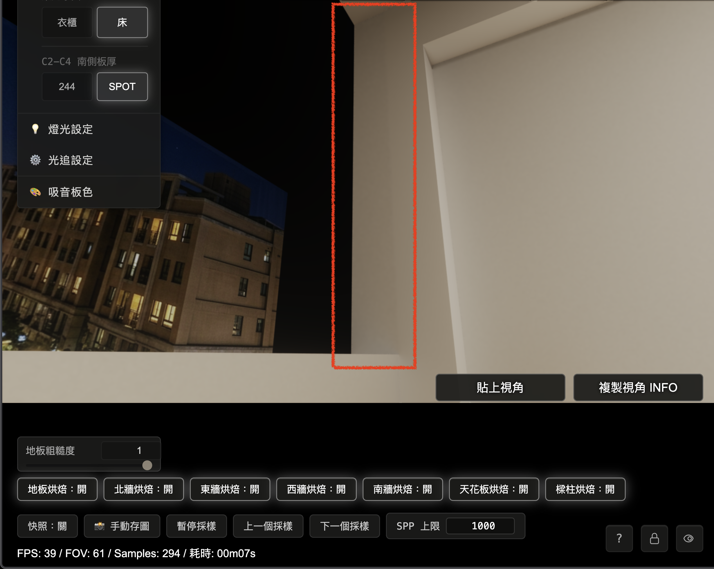
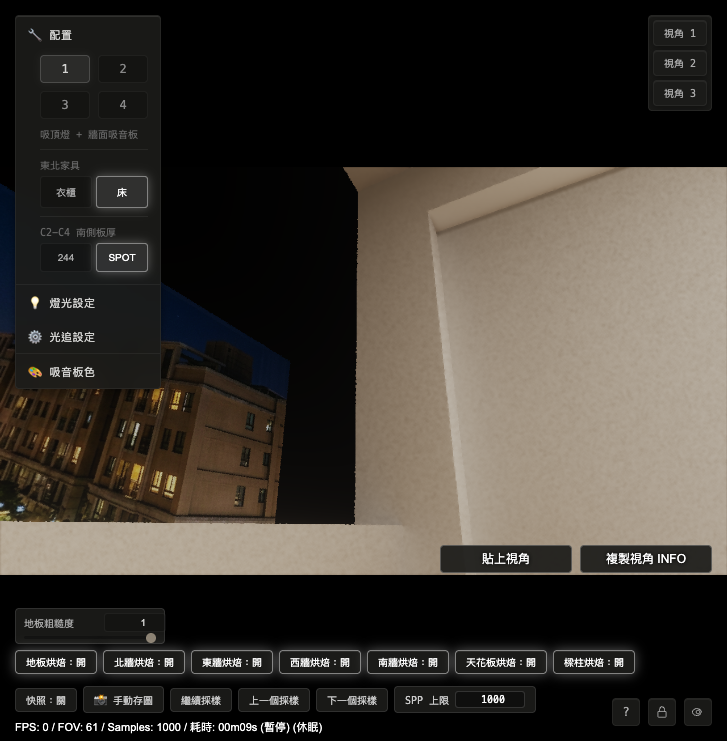

# R7-3.10 南牆窗洞切面與 L柱色差修正報告

## 1. 結論

本輪照 §21 的 A 類 route 錯誤路線執行。根因確認為 1019「南牆窗洞切面（法線朝東）」runtime route 條件矛盾，導致切面沒有接手自己的 dedicated hybrid bake，畫面落到其他路徑，與右側 L柱形成灰色方塊與色差。

修正後：

| 項目 | 結果 |
|---|---|
| 南牆窗洞切面（法線朝東） | 由 1019 `south_window_left_reveal_shadow_hybrid` 全數接手 |
| L柱 | 維持 1014 `sw_column_inner_shadow_hybrid` |
| 使用者指定視角 | 灰色方塊消失，L 型區域回到連續視覺 |
| 修法類型 | route predicate 修正，沒有補色、沒有 cross-fade、沒有回復舊越界 |
| 1000SPP all-on 對 LIVE | 兩側各自貼近 LIVE，未看到先前色差 |

## 2. 使用者證據

使用者提供四組開關觀察，指出南牆 bake 本身已正常，灰色方塊跟樑柱／L柱側路徑有關：

| 狀態 | 使用者觀察 |
|---|---|
| 樑柱烘焙開、南牆烘焙開 | 有色差，南牆較深 |
| 樑柱烘焙開、南牆烘焙關 | 有色差，南牆較深 |
| 樑柱烘焙關、南牆烘焙關 | 無色差 |
| 樑柱烘焙關、南牆烘焙開 | 無色差（1000SPP） |

指定驗收視角：

```json
{
  "cameraState": {
    "position": { "x": -0.445805, "y": 1.035089, "z": 2.54935 },
    "yaw": 2.0444,
    "pitch": 0.423,
    "fov": 61,
    "forward": { "x": -0.811493, "y": 0.410498, "z": 0.415897 }
  },
  "view": { "facing": "西(-X)", "config": 1, "samples": 112, "paused": false, "sppCap": 1000 }
}
```

Before（使用者截圖）：灰色方塊位於南牆窗洞切面與 L柱附近。



## 3. 根因

1019 的 runtime route 函式只寫了 `visibleNormal.x > 0.5` 與 `z` 範圍，後面又呼叫 `r7310C1SouthWindowFrontEdgeNearestReveal()` 當條件。

但 `r7310C1SouthWindowFrontEdgeNearestReveal()` 一開始會要求：

```glsl
if (visibleNormal.z >= -0.5) return 0.0;
```

南牆窗洞切面（法線朝東）的 normal 是 `+X`，也就是 `visibleNormal.z = 0`。因此它永遠被前置條件擋掉，1019 route 進不去。

這和 1020／1021／1022 三個兄弟 route 的寫法不一致。兄弟 route 都有兩條入口：

| 入口 | 用途 |
|---|---|
| 明確幾何條件 | 直接抓該切面本體 |
| front-edge classifier | 處理窗洞前緣近邊補助 |

1019 缺少明確幾何條件，因此成為 A 類 route 錯誤的孤例。

## 4. 修正內容

檔案：

```text
shaders/Home_Studio_Fragment.glsl
docs/tests/r7-3-10-phase2b-continuity.test.js
```

修正方向：

1. 讓 1019 跟 1020／1021／1022 同構。
2. 新增南牆窗洞切面（法線朝東）的明確幾何條件：

```glsl
visibleNormal.x > 0.5 &&
visiblePosition.x >= -1.76 && visiblePosition.x <= -1.74 &&
visiblePosition.y >= 1.04 && visiblePosition.y <= 2.905 &&
visiblePosition.z >= 3.056 && visiblePosition.z <= 3.256
```

3. 保留原本 front-edge classifier 作為第二入口。
4. 補測試，要求 1019 route 不能只靠 front-edge classifier。
5. 同步更新既有測試中 1014 runtime `z <= 3.056` 的現行合約，避免測試還停在舊的越界範圍。

## 5. 量測結果

量測腳本：

```text
.omc/r7-3-10-section22-sw-column-color-fix/section22-sw-column-region-probe.mjs
```

輸出：

```text
.omc/r7-3-10-section22-sw-column-color-fix/section22-sw-column-region-probe-result.json
.omc/r7-3-10-section22-sw-column-color-fix/section22-sw-column-region-probe-summary.json
.omc/r7-3-10-section22-sw-column-color-fix/screenshots/section22-after-measurement-current.png
```

1000SPP 結果：

| 區域 | route | targetId | all-on p50 | LIVE p50 | 差值 |
|---|---|---:|---:|---:|---:|
| L柱 | `sw_column_inner_shadow_hybrid` | 1014 | 276.7166 | 273.0414 | +3.6752 |
| 南牆窗洞切面（法線朝東） | `south_window_left_reveal_shadow_hybrid` | 1019 | 225.7416 | 223.0680 | +2.6736 |

量測解讀：

1. 南牆窗洞切面已由 1019 全數接手，沒有再掉到 none route。
2. L柱仍由 1014 接手，沒有被本次 route 修正打壞。
3. 兩側 all-on 對各自 LIVE 的差值都很小，灰色方塊不再由 hybrid route 製造。
4. 視覺上的亮度差來自幾何位置與受光差異，已回到 LIVE 同方向結果。

## 6. After 截圖

After（CODEX 1000SPP 同視角）：灰色方塊消失，南牆窗洞切面與 L柱恢復連續視覺。



## 7. 驗證

已通過：

```text
node docs/tests/r7-3-10-phase2b-continuity.test.js
node docs/tests/r7-3-10-beam-column-dedicated-hybrid.test.js
node docs/tests/r7-3-10-bake-gap-debug-map.test.js
```

實機驗證：

```text
R7310_SECTION22_RENDER_SAMPLES=1000
R7310_SECTION22_GRID_STEP=2
node .omc/r7-3-10-section22-sw-column-color-fix/section22-sw-column-region-probe.mjs
```

## 8. 給 OPUS 的審查問題

1. 是否同意本輪把 1019 定性為 A 類 route predicate 錯誤？
2. 是否同意 1019 修正採用與 1020／1021／1022 同構的明確幾何條件？
3. 是否同意本輪已把灰色方塊與殘留色差收束，且不需要對 1014 bake 值做補救？
4. 是否同意 §21 A 類孤例可關閉，下一輪回到 remaining aftershock items？
